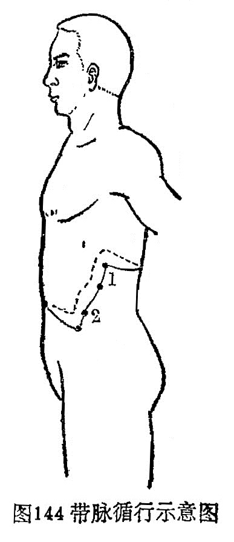

### 四、带脉

（一）循行路线

〔原文〕《灵枢·经别》：“足少阴之正(1)至胸中，别走太阳而合，上至肾，当十四椎(2)，出属带脉。”《难经二十八难》：“带脉者，起于季胁(3)，回身一周。”

〔注释〕(1)足少阴之正：指足少阴经别。

(2)十四椎：指督脉的命门穴处。

(3)季胁：指腋中线第11肋端的章门穴。

〔语译〕1．起于季肋部的下面，斜向下行到带脉、五枢、维道，2．横行绕身一周（图144）。

（二）病候举要  腹满胀痛，腰部觉冷如坐于水中。

（三）交会腧穴  带脉、五枢、维道（均属足少阳胆经)，共三穴。

（四）功能  带脉的“带”字，含有腰带的意思。因带脉横行于腰腹之间，统束全身直行的经脉，状如束带，故称带脉，能“约束诸经”。足部的阴阳经脉都受带脉的约束。由于带脉出自督脉，行于腰腹，腰腹部是冲、任、督三脉脉气所发之处，所以带脉与冲、任、督三脉的关系最为密切。

（五）主治  痿证，月经不调，赤白带下，腰腹胀满，中风手足不举，绕脐痛，阴股痛，胁肋痛等。
