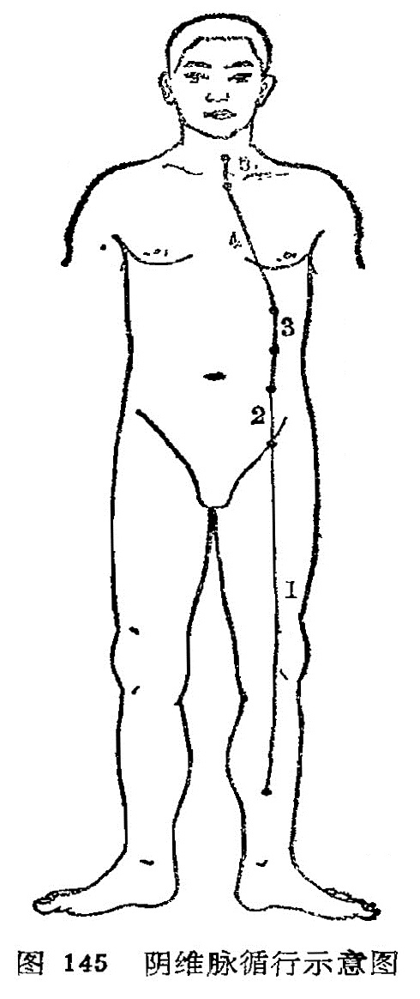

### 五、阴维脉

（一）循行路线

〔原文〕《素问·刺腰痛论》：“刺飞扬之脉，在内踝上五寸(1)，少阴之前，与阴维之会。”《难经·二十八难》：“阴维，起于诸阴之交(2)也”。

〔注释〕(1)内踝上5寸：此指筑宾穴所在，为阴维之郄。

(2)诸阴之交：指阴维脉所交会的胸腹部各穴。张注：“诸阴皆交于胸”，胸字应作腹。

〔语译〕1．起于小腿内侧，2．沿大腿内侧上行到腹部，3．与足太阴经相合，4．过胸部，5．与任脉会于颈部（图145）。

（二）病候举要  心痛，忧郁。

（三）交会腧穴  筑宾（足少阴经）、府舍、大横、腹哀（足太阴经）、期门（足厥阴经）、天突、廉泉（任脉)，共七穴。

（四）功能  维脉的“维”字，含有维系、维络的意思。阴维脉有维系、联络全身阴经的作用。阴维脉维络诸阴经，交会于天突、廉泉。在正常情况下，阴阳经脉互相维系，对气血盛衰起调节溢蓄的作用，而不参于环流。如果功能失常，则出现有关的疾病。

（五）主治  心痛，胃痛，胸腹痛等里证，以及中满，心胸痞胀，肠鸣泄泻，脱肛，食难下膈，腹中积块坚横，胁肋攻撑疼痛，妇女胁痛，结胸里急，伤寒，疟疾等。
