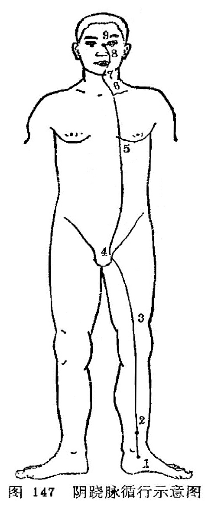

### 七、阴跷脉

（一）循行路线

〔原文〕《灵枢·脉度》：“（阴）跷脉者，少阴之别，起于然骨(1)之后，上内踝之上，直上循阴股，入阴，上循胸里，入缺盆上，出人迎之前，入頄(2)，属目内眦，合于太阳，阳跷而上行。”《难经·二十八难》：“阴跷脉者，亦起于跟中，循内踝上行，至咽喉，交贯冲脉。”

〔注释〕(1)然骨，指足内侧高骨，即舟骨粗隆，下方为然谷穴。

(2)頄：指鼻旁。音求。

〔语译〕1．起于足舟骨的后方，2．上行内踝的上面，3．直上沿大腿内侧，4．经过阴部，5．向上沿胸部内侧，6．进入锁骨上窝，7．上经人迎的前面，8．过颧部，9．到目内眦，与足太阳经和阳跷脉相会合（图147）。

（二）病候举例  多眠，癃闭。

（三）交会腧穴  照海、交信（足少阴经）、睛明（足太阳经)，共三穴。

（四）功能  跷脉的“跷”字，有举足行高和健步的含意。阴跷脉从下肢内侧上行头面，具有交通一身阴阳之气，调节肢体运动的功能，故能使下肢灵活跷捷。卫气的运行主要是通过阴阳跷脉而散布全身，卫气行于阴则阴跷盛，主目闭而欲睡。说明跷脉的功能关系到人的活动与睡眠。

（五）主治  阴跷脉气失调，出现肢体的外侧肌肉弛缓而内侧拘急，这说明与下肢运动功能有关系。咽喉气塞，小便淋沥，膀胱气痛，肠鸣，肠风下血，黄疸，吐泻，反胃，大便艰难，难产昏迷，腹中积块，胸膈嗳气，梅核气等。
