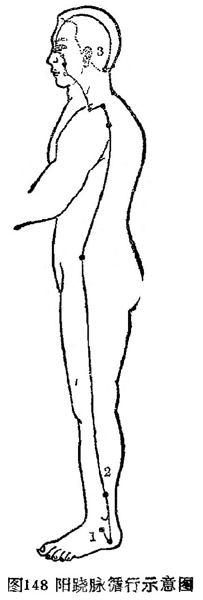

### 八、阳跷脉

（一）循行路线

〔原文〕《灵枢·寒热病》：“足太阳有通项入于脑者，正属目本(1)，名曰眼系(2)。……在项中两筋间，入脑乃别阴跷、阳跷，阴阳相交……交于目锐（应作内）眦。”《难经·二十八难》：“阳跷脉者，起于跟中，循外踝上行，入风池。”

〔注释〕(1)目本：意指眼的根部。

(2)眼系：即目系，指眼与脑的连系。

〔语译〕1．起于足跟外侧，2．经外踝上行腓骨后缘，沿股部外侧和胁后上肩，过颈部上挟口角，进入目内眦，与阴跷脉会合，再沿足太阳经上额，3．与足少阳经合于风池（图148）。

（二）病候举例  目痛从内眦始，不眠。

（三）交会腧穴  申脉、仆参、跗阳（足太阳经）、居髎（足少阳经）、臑俞（手太阳经）、肩髃、巨骨（手阳明经）、地仓、巨髎、承泣（足阳明经）、睛明（足太阳经）、风池（足少阳胆经），共十二穴。

（四）功能  跷脉的“跷”字，有举足行高和健步的含义。因跷脉从下肢外侧上头面，具有交通一身阴阳，调节肢体运动的功能，故能使下肢灵活跷捷。卫气的运行主要是通过阴阳跷脉而散布全身。卫气行于阳，阳跷盛，主目张不欲睡。说明跷脉的功能关系到人的活动与睡眠。

（五）主治  阳跷脉气失调，会出现肢体内侧肌肉弛缓而外侧拘急，说明与下肢运动有密切关系。腰背强直，腿肿，恶风，自汗，头痛，雷头风，目赤痛，眉棱骨痛，手足麻痹，拘急，厥逆，耳鸣、鼻衄，癫痫，骨节疼痛，遍身肿，满头出汗等。
