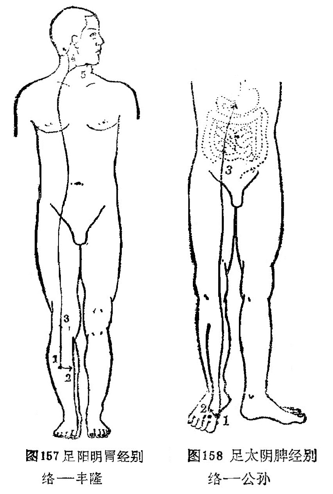

### 十、足太阴脾经别络——公孙

〔原文〕《灵枢·经脉》：“足太阴之别名曰公孙(1)。去本节(2)之后一寸，别走阳明，其别者，入络肠胃，厥气上逆则霍乱(3)，实则肠(4)中切痛；虚则鼓胀。取之所别也”（图158）。

〔注解〕(1)公孙：脾经之络穴，位于第一跖骨基底部前缘赤白肉际处。

(2)本节：指第一趾跖关节。

(3)霍乱：病名。发作时上吐下泻挥霍撩乱，故称霍撩乱。

〔语译〕足太阴经别行络脉，穴名公孙，在足大趾本节后一寸，别行于足阳明经。它的别行分支，入腹络于肠胃。其气上逆则为霍乱，实证为肠中剧痛，虚证为臌胀之疾，可取此穴治疗。

