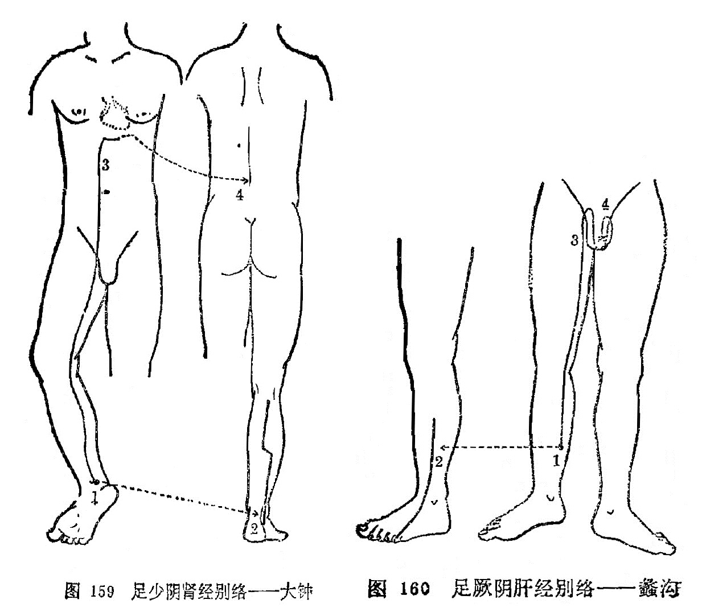

### 十二、足厥阴肝经别络——蠡沟

〔原文〕《灵枢·经脉》：“足厥阴之别，名曰蠡沟(1)。去内踝五寸，别走少阳，其别者，经胫上睾，结于茎。其病气逆则睾肿卒疝。实则挺长(2)，虚则暴痒。取之所别也”(图160)。

〔注解〕(1)蠡沟：肝经之络穴，位于内踝上5寸，胫骨内侧面的中央处。

(2)挺长：是指阴茎勃起。

〔语译〕足厥阴经的别行络脉，穴名蠡沟，距内踝五寸，别行于足少阳经。它的别出分支，经过胫部上至睾丸，终结于阴茎。它的病变，气上逆则睾丸肿大，突患疝气。实证为阴茎挺长，虚证为阴部暴痒，可取此穴治疗（图160）。

