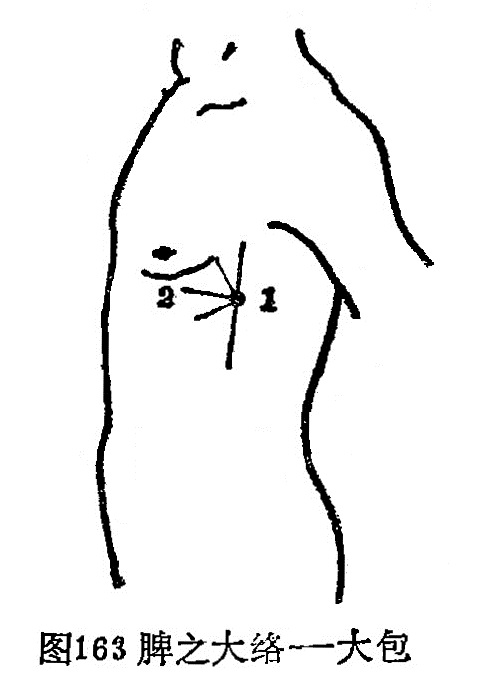

### 十五、脾之大络——大包

〔原文〕《灵枢·经脉》：“脾之大络，名曰大包(1)。出渊液下三寸，布胸胁。实则身尽痛，虚则百节尽皆纵。此脉若罗络之血者，皆取之脾之大络脉也”（图l63）。

〔注解〕(1)大包：脾经穴位，位于腋中线平第六肋间隙中。

〔语译〕脾的大络，穴名大包，在渊液穴下三寸，散布于胸胁部。它的病变，实证为全身皆痛，虚证为周身骨节都松弛无力。此一络脉象网络样绕络全身，如见血瘀，可取此穴治疗。



〔临床应用〕

十五络脉是经脉中分出的大的络脉，它对周身络脉起统属作用，其它络脉和孙络，都是十五络脉的支蔓。络脉分布躯体，主要在体表。《灵枢·经脉》指出：“经脉十二者，伏行于分肉之间，深而不见，……诸经之浮而常见者，皆络脉也。”又如“经脉为里，支而横者为络，络之别者为孙络”。由此可见，络脉分布人体的体表，属经脉在体表的联属部分；每条络脉均从本经络穴分出，通向与其表里的经脉，阴经别络于阳经，阳经别络于阴经。任脉别络散布于胸腹，以沟通腹部的经气；督脉别络散布于头，别走足太阳膀胱经，以沟通背部的经气；脾之大络散布于胸胁。通过十五络脉把经脉和全身络脉联系在一起，是达到濡润筋骨，疏利关节，调和阴阳作用的重要组织。与此同时，它发挥了天然屏障的作用，是承担抗御病邪，传递病变的通路。因此，当络脉有病时，均可取有关的络穴进行治疗。是指导临床治疗的重要内容。

复习思考题

1．何谓络脉？络脉有哪几种？

2．试述十五别络的名称、循行分右、别走经脉、病候。

3．络脉有哪些生理功能？

```
录入、校对、排版：朱明轩
```