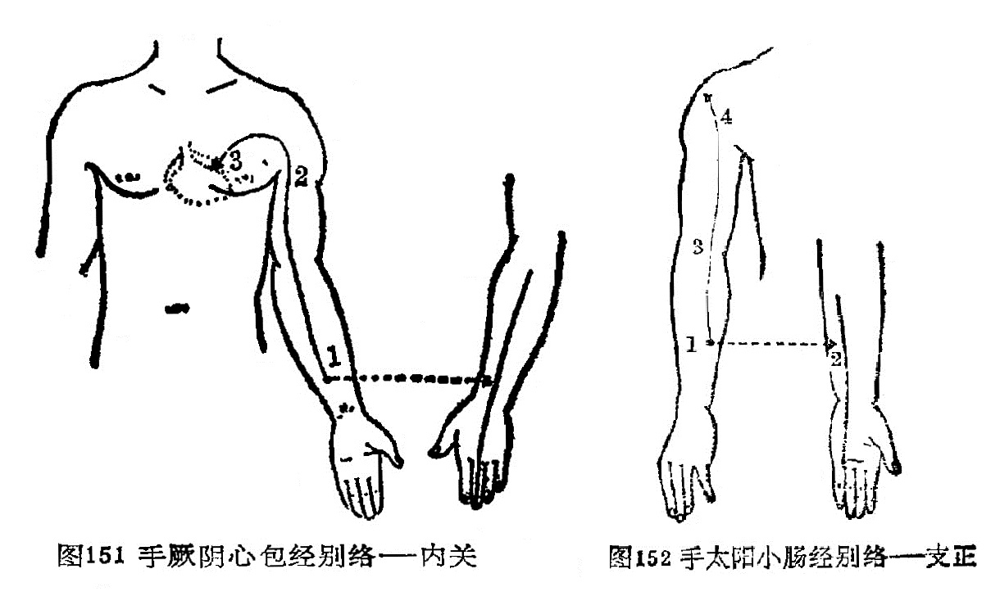

### 三、手厥阴心包经别络——内关

〔原文〕《灵枢·经脉》：“手心主之别，名曰[内关](https://www.gmzyjc.com/read/zjs/zjs3.1.9-12-0.0.1.3.6.md)(1)。去腕二寸，出于两筋之间，循经以上，系于心包络。心系实则心痛，虚则为头强(2)。取之两筋间也”（图151）。

〔注解〕(1)[内关](https://www.gmzyjc.com/read/zjs/zjs3.1.9-12-0.0.1.3.6.md)：心包经穴位，腕后2寸，两筋间。

(2)头强：《甲乙经》作“心烦”。

〔语译〕手厥阴经的别行络脉，穴名[内关](https://www.gmzyjc.com/read/zjs/zjs3.1.9-12-0.0.1.3.6.md)，在距腕二寸的两筋间，别行手少阳经。它沿着手厥阴本经上系于心包，联络于心系。它的病变，实证为心痛，虚证为心烦，可取此穴治疗。

