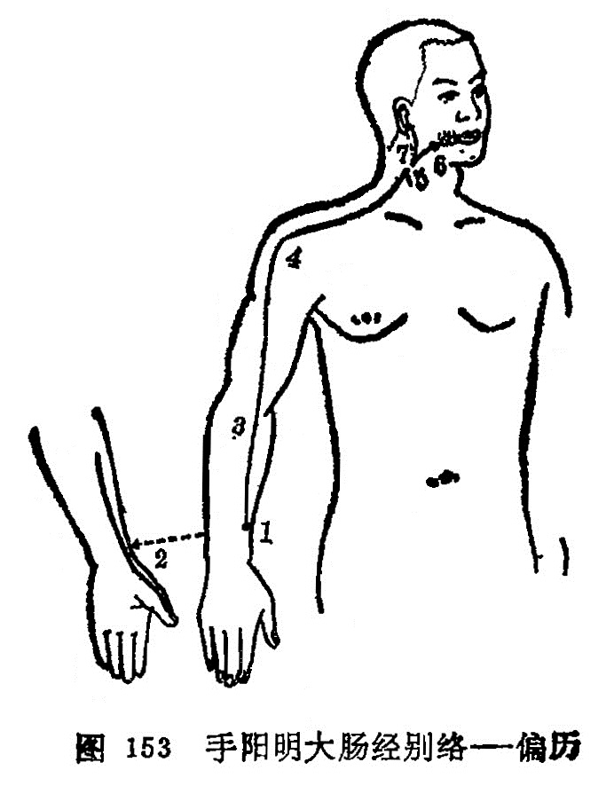

### 五、手阳明大肠经别络——偏历

〔原文〕《灵枢·经脉》：“手阳明之别，名曰偏历(1)。去腕三寸，别入太阴，其别者，上循臂，乘肩髃，上曲颊(2)偏齿(3)；其别者，入耳，合于宗脉(4)。实则龋聋(5)；虚则齿寒痹隔(6)。取之所别也。”（图153）。

〔注解〕(1)偏历：大肠经络穴，在阳溪穴与曲池穴连线上，阳溪穴上3寸处。

(2)曲颊：当下颌角处，曲如环形故名。

(3)偏齿：偏络于牙齿。

(4)宗脉：就是主脉、大脉。

(5)龋：龋齿，即蛀牙。

(6)痹隔：痹是闭塞不通，痹隔是形容膈间闭塞不畅的症状。

〔语译〕手阳明经的别行络脉，穴名偏历，距腕三寸，别行于手太阴经。它的别出分支，向上沿臂部，经肩髃穴上行至下颌角处，遍布于齿中，再别出分支，上行入耳中，合于该部所聚的主脉。它的病变，实证为龋齿、耳聋；虚证为牙齿寒冷酸楚，内闭阻隔，可取此穴治疗。

