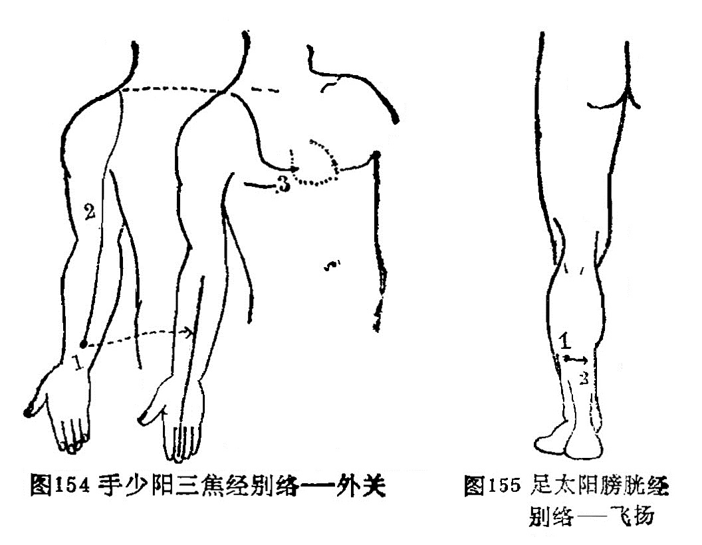

### 六、手少阳三焦经别络——外关

〔原文〕《灵柩·经脉》：“手少阳之别，名曰[外关](https://www.gmzyjc.com/read/zjs/zjs3.1.9-12-0.0.2.3.5.md)(1)。去腕二寸，外绕臂，注胸中，合心主(2)。病实则肘挛(3)；虚则不收。取之所别也”（图154）。

〔注解〕(1)[外关](https://www.gmzyjc.com/read/zjs/zjs3.1.9-12-0.0.2.3.5.md)：手少阳三焦经络穴，位于腕背横纹上2寸，尺桡骨之间。

(2)合心主：此脉与心包经相汇合。

(3)肘挛：肘部引掣拘挛。

〔语译〕手少阳经的别行络脉，穴名[外关](https://www.gmzyjc.com/read/zjs/zjs3.1.9-12-0.0.2.3.5.md)，距腕二寸，向外绕行臂部，上行注于胸中，别行合于手厥阴经。它的病变，实证为肘部拘挛，虚证为肘部弛缓不收，可取此穴治疗。

