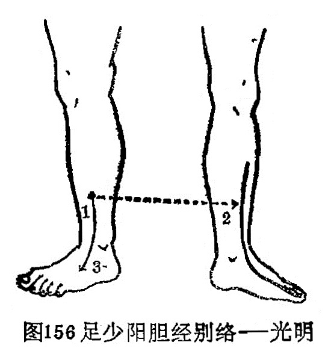

### 八、足少阳胆经别络——光明

〔原文〕《灵枢·经脉》：“足少阳之别，名曰光明(1)，去踝五寸，别走厥阴，下络足跗。实则厥，虚刚痿躄(2)，坐不能起。取之所别也”（图156）。

〔注解〕(1)光明：胆经之络穴，位于外踝上5寸，腓骨前缘。

(2)痿躄：痿，是痿软无力，躄，是足不能动。痿躄，就是下肢痿软无力，足不能行走。

〔语译〕足少阳胆经的别行络脉，穴名光明，距外踝五寸，别行于足厥阴经，向下络于足背。它的病变，实证为足胫厥冷，虚证为足软无力不能行走，坐而不能起立，可取此穴治疗。

