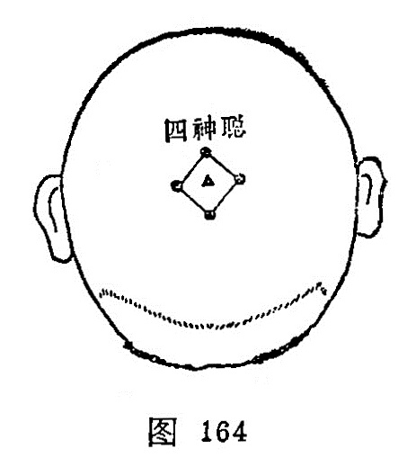

#### 四神聪

〔定位〕在[百会](https://www.gmzyjc.com/read/zjs/zjs3.2.2-0.0.1.3.20.md)穴前后左右各1寸处（图164）。

〔解剖〕在帽状腱膜中，有枕动、静脉，颞浅动、静脉顶支和眶上动、静脉的吻合网；布有枕大神经，耳颞神经及眶上神经分支。

〔功能〕安神，聪脑。

〔主治〕头痛，眩晕，失眠，健忘，癫痫，大脑发育不全。

〔刺灸〕向前或向后平刺0.5～0.8寸，可灸。

〔讲述〕见于《圣惠方》。别称神聪。前后左右为四方，因穴在头顶[百会](https://www.gmzyjc.com/read/zjs/zjs3.2.2-0.0.1.3.20.md)四周，脑为元神之府，因名。《圣惠方》用治头风目眩，狂乱风痫。《银海精微》：治眼疾，偏正头痛。《资生》配[涌泉](https://www.gmzyjc.com/read/zjs/zjs3.1.7-8-0.0.2.3.1.md)、[强间](https://www.gmzyjc.com/read/zjs/zjs3.2.2-0.0.1.3.18.md)治风痫。临床配[百会](https://www.gmzyjc.com/read/zjs/zjs3.2.2-0.0.1.3.20.md)、[哑门](https://www.gmzyjc.com/read/zjs/zjs3.2.2-0.0.1.3.15.md)治大脑发育不全；配[神门](https://www.gmzyjc.com/read/zjs/zjs3.1.4-6-0.0.2.3.7.md)治失眠，癫痫。
