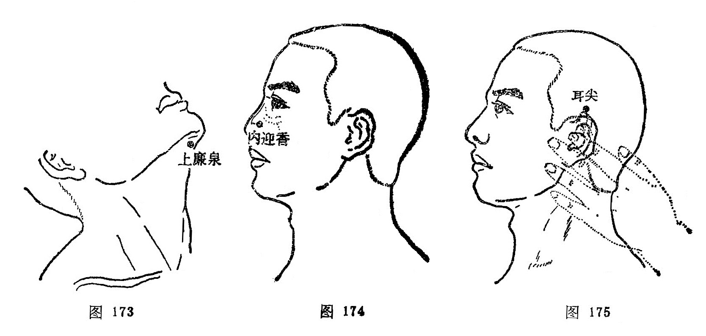

#### 上廉泉

〔定位〕廉泉穴与下颏之间取穴（图173）。

〔解剖〕在下颌舌骨肌，颏舌骨肌，舌肌中，有舌动、静脉；布有颈皮神经，面神经颈支和舌下神经。

〔功能〕利舌本，开窍闭。

〔主治〕舌疾。

〔刺灸〕向舌根部斜刺0.8～1.2寸，不灸。

〔讲述〕新订穴。与廉泉作用同而位置偏上，因名。主要用治舌疾。起哑门治舌强不语，配内关、合谷治舌肌麻痹、姜缩；配少商治咽喉疼痛；配天突、内关治吞咽困难。

