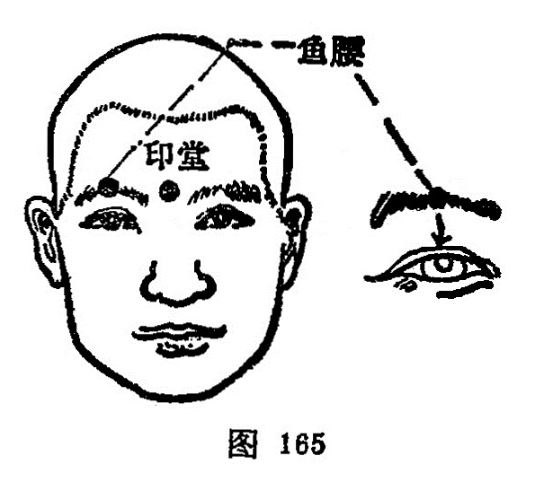

#### 印堂

〔定位〕在两眉头连线的中点（图165）。

〔解剖〕在掣眉间肌中，两侧有额内动、静脉分支；布有来自三叉神经的滑车上神经。

〔功能〕清热散风，镇静安神。

〔主治〕头痛头重，鼻衄鼻渊，小儿惊风，产后血晕，失眠，三叉神经痛。

〔刺灸〕向下平刺0.3～0.5寸，或用三棱针点刺出血，可灸。

〔讲述〕出《素问·刺疟论》。别称曲眉。定名见于《玉龙歌》：“头风呕吐眼昏花，穴取神庭治不差，孩子惊风皆可治，印堂刺入艾还加”。印指印染，居处为堂，古人常于两眉点染红点，以示貌美，穴当其处，因名。刺本穴，须提捏局部皮肤刺之。配迎香治鼻病；配内关治呕吐；配人中治惊风。

