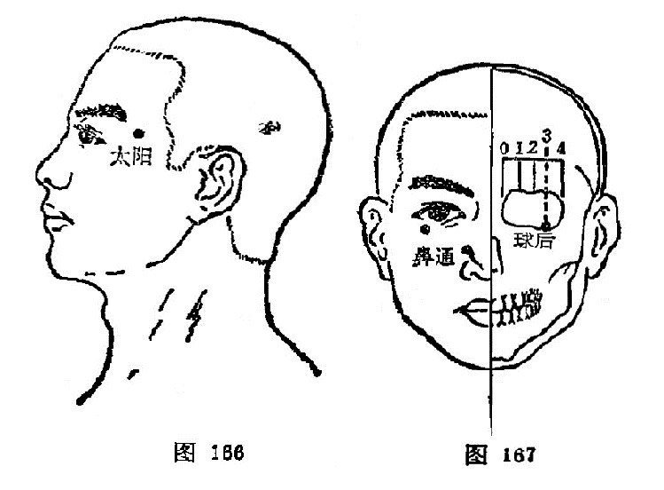

#### 球后

〔定位〕眶下缘外1/4与内3/4交界处（图167）。

〔解剖〕在眼轮匝肌中，深部为眼肌，浅层有面动、静脉；布有面神经颧支和眶下神经，结状神经结和视神经，深层有眼神经。

〔功能〕活血，明目。

〔主治〕目疾。

〔刺灸〕轻压眼球向上，针沿眼眶下缘缓慢直刺0.5～0.8寸，不提插捻转，禁灸。

〔讲述〕新订穴，见《眼科针灸疗法》。多用治视神经炎，视神经萎缩，青光眼，早期白内障，近视等，配光明、风池、肝俞效果尤佳。

