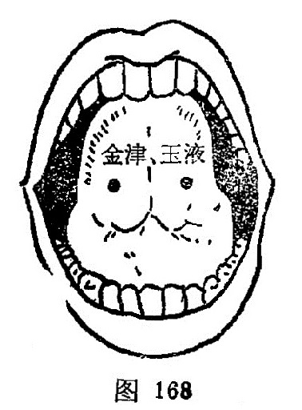

#### 金津、玉液

〔定位〕舌系带两侧静脉上，左称金津，右称玉液（图168）。

〔解剖〕有舌下静脉；布有舌下神经，舌神经。

〔功能〕清热开窍，止渴止呕。

〔主治〕口疮，舌强，舌肿，消渴，呕吐。

〔刺灸〕点刺出血，禁灸。

〔讲述〕见于《千金》。《大成》定名。主治重舌，舌炎之疾，还可用治呕吐，消渴。《千金》：治舌卒肿，刺舌下两边大脉出血。取刺本穴宜张口卷舌向上，舌系带两旁静脉上，左称金津，右称玉液，一般宜点刺出血。素有出血病者禁用。
