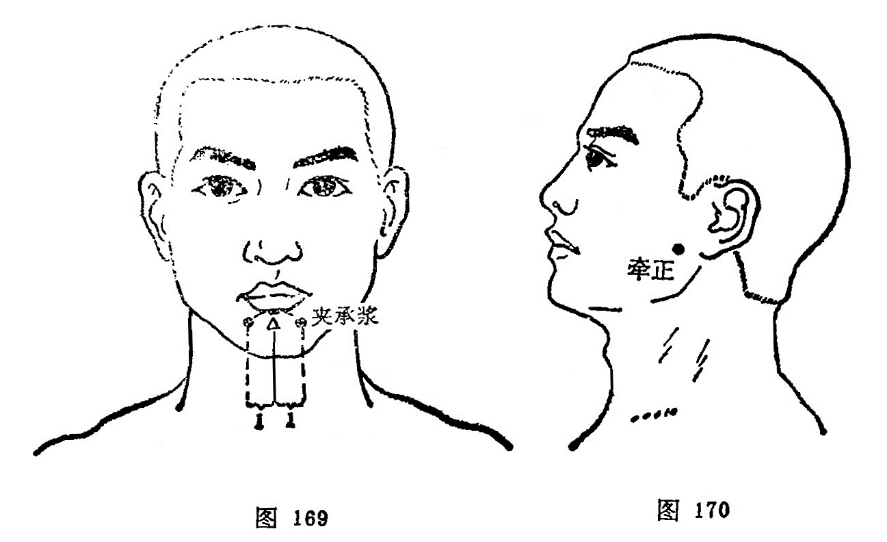

#### 夹承浆

〔定位〕承浆穴旁开1寸处，左右共二穴（图169）。

〔解剖〕在口轮匝肌中，有面动脉分支；布有三叉神经第三分支（颏神经）。

〔功能〕祛风通络。

〔主治〕面部疾病。

〔刺灸〕斜刺或平刺0.5～1寸，不灸。

〔讲述〕见于《千金》。夹有旁边的含意，是穴在承浆两边旁开1寸处，因名。主治马黄急疫。近用治面疾，如面瘫，面肌痉挛，三叉神经庸，以及齿龈溃烂等，常配合谷、内庭取效。

