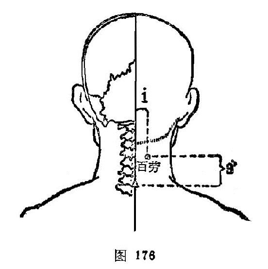

#### 百劳

〔定位〕[大椎](https://www.gmzyjc.com/read/zjs/zjs3.2.2-0.0.1.3.14.md)穴上2寸，旁开1寸（图176）。

〔解剖〕在斜方肌，头夹肌中，有枕动、静脉和椎动、静脉；布有枕大神经，枕小神经分支。

〔功能〕理虚损，补肺气。

〔主治〕虚劳之疾。

〔刺灸〕直刺0.5～0.8寸，可灸。

〔讲述〕见于《资生》。百有多的含意，劳同痨，言其治疗多种痨症，因名。它的定位，《集成》：[大椎](https://www.gmzyjc.com/read/zjs/zjs3.2.2-0.0.1.3.14.md)向发际二寸点记，将其二寸中摺，墨记，横布于先点上，左右两端尽处是。本穴主要用治虚劳之疾，特别对肺痨，有理虚损，补肺虚之效。
