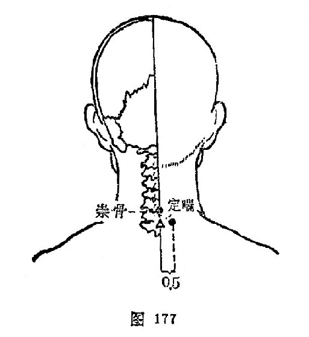

#### 定喘

〔定位〕[大椎](https://www.gmzyjc.com/read/zjs/zjs3.2.2-0.0.1.3.14.md)穴旁开0.5寸（图177）。

〔解剖〕在斜方肌，菱形肌，头夹肌，最长肌中，有颈横动脉和颈深动脉分支；布有第7、8颈神经后支。

〔功能〕宣肺[定喘](https://www.gmzyjc.com/read/zjs/zjs3.4-0.1.2.2.0.md)。

〔主治〕咳嗽，哮喘，落枕，荨麻疹。

〔刺灸〕直刺0.5～0.8寸，可灸。

〔讲述〕新订穴，见《中国针灸学》。定有平息之意，喘指喘息，针本穴能宣肺平喘，因名。临床配[丰隆](https://www.gmzyjc.com/read/zjs/zjs3.1.1-3-0.1.3.3.40.md)、[天突](https://www.gmzyjc.com/read/zjs/zjs3.2.1-0.1.1.3.20.1.md)平喘取效；配[血海](https://www.gmzyjc.com/read/zjs/zjs3.1.4-6-0.0.1.3.10.md)、[曲池](https://www.gmzyjc.com/read/zjs/zjs3.1.1-3-0.1.2.3.11.md)治荨麻疹。

