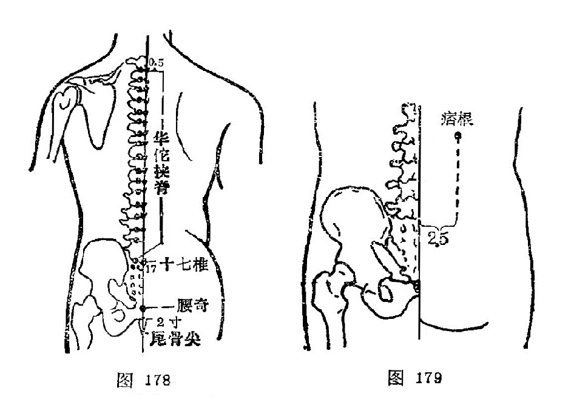

#### 夹脊

〔定位〕第1胸椎至第5腰椎，各椎棘突下旁开0.5寸，每侧十七穴，左右共三十四穴（图178）。

〔解剖〕在横突间的韧带和肌肉中。因穴位置不同，涉及的肌肉也不同。一般分三层；浅层为斜方肌，背阔肌和菱形肌，中层有上、下锯肌，深层有骶棘肌和横突棘突间的短肌。每穴都有相应椎骨下方发出的脊神经后支及其伴行的动脉和静脉丛分布。

〔功能〕调理脏腑，通利关节。

〔主治〕脊柱疾患及相应脏腑诸疾。

〔刺灸〕直刺0.5～1寸，或用梅花针叩剌，可灸。

〔讲述〕见于《肘后》。又称华佗夹脊。《后汉书·华佗传》：有人病脚躄不能行，佗切脉，便使解衣，点背数十处，相去一寸或五分，从邪不相当。言灸此各七壮，灸创愈即行也。后灸愈，灸处夹脊一寸上下，行端直均匀如引绳。《肘后》定位去脊各1寸。今时于脊柱棘突间两侧，背正中线外侧0.5寸为准。中、上胸部的夹脊穴适用于心肺及上肢病症；下胸部夹脊穴治疗胃肠疾患；腰部夹脊穴治疗腰、腹及下肢病症。

