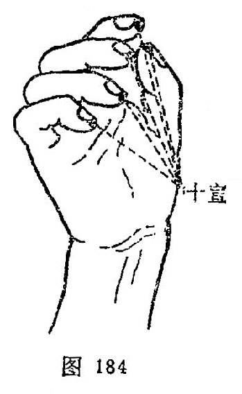

#### 十宣

〔定位〕在手十指尖端，距指甲0.1寸，左右共十穴（图184）。

〔解剖〕有指掌侧固有动、静脉形成的动，静脉网；布有指掌侧固有神经和丰富的痛觉感受器。

〔功能〕泄热醒神。

〔主治〕高热，昏迷，惊痫，癫痫，癔病。

〔刺灸〕浅刺0.1～0.2寸，或点刺出血。

〔讲述〕见于《千金》，《奇效良方》始定名。别称鬼城。十，指手十指端；宣，指宣散。以能宣散风热之邪，因名。临床宜点刺出血。
