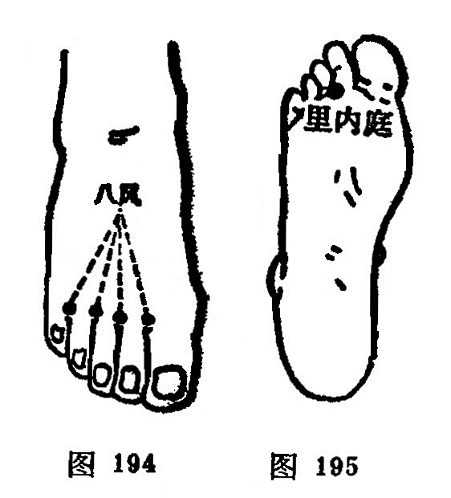

#### 八风

〔定位〕足背，五趾的各趾缝赤白肉际处，左右共八穴（图194）。

〔解剖〕在趾骨小头间前跖骨间肌中，有趾背动、静脉；布有腓浅、深神经。

〔功能〕清热，解毒，止痛。

〔主治〕脚气，趾痛，牙痛，头痛，毒蛇咬伤。

〔刺灸〕斜刺0.5～0.8寸，或点刺出血。

〔讲述〕出《素问·刺疟论》。《千金》称八冲，《集成》称阴独八穴。穴在双足五趾缝间，风指病邪，因名。主治脚气，趾痛。根据病上取下之理，还可用治牙痛，头痛。

