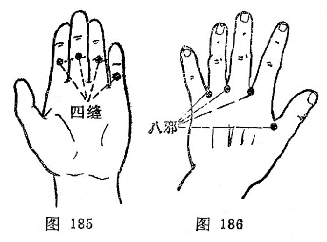

#### 四缝

〔定位〕第2、3、4、5指掌面，近端指骨关节横纹中点，左右共八穴（图185）。

〔解剖〕入皮后有指纤维鞘，指滑液鞘，屈指伸肌腱，深部为指关节腔，有指掌侧固有动、静脉的分支，布有指掌侧固有神经。

〔功能〕消积，驱蛔。

〔主治〕疳积，消化不良，百日咳。

〔刺灸〕点刺挤出少许黄白色液体。

〔讲述〕见于《奇效良方》。穴当掌面食、中、环、小四指第1、2指关节横纹缝隙中点，因名。《奇效良方》：治小儿猢狲劳症。主要用治小儿消化不良引起的消瘦、纳呆、腹泻、腹胀之疳积，虫痛，刺之挤出黄色液体，有消积驱蛔之力。

