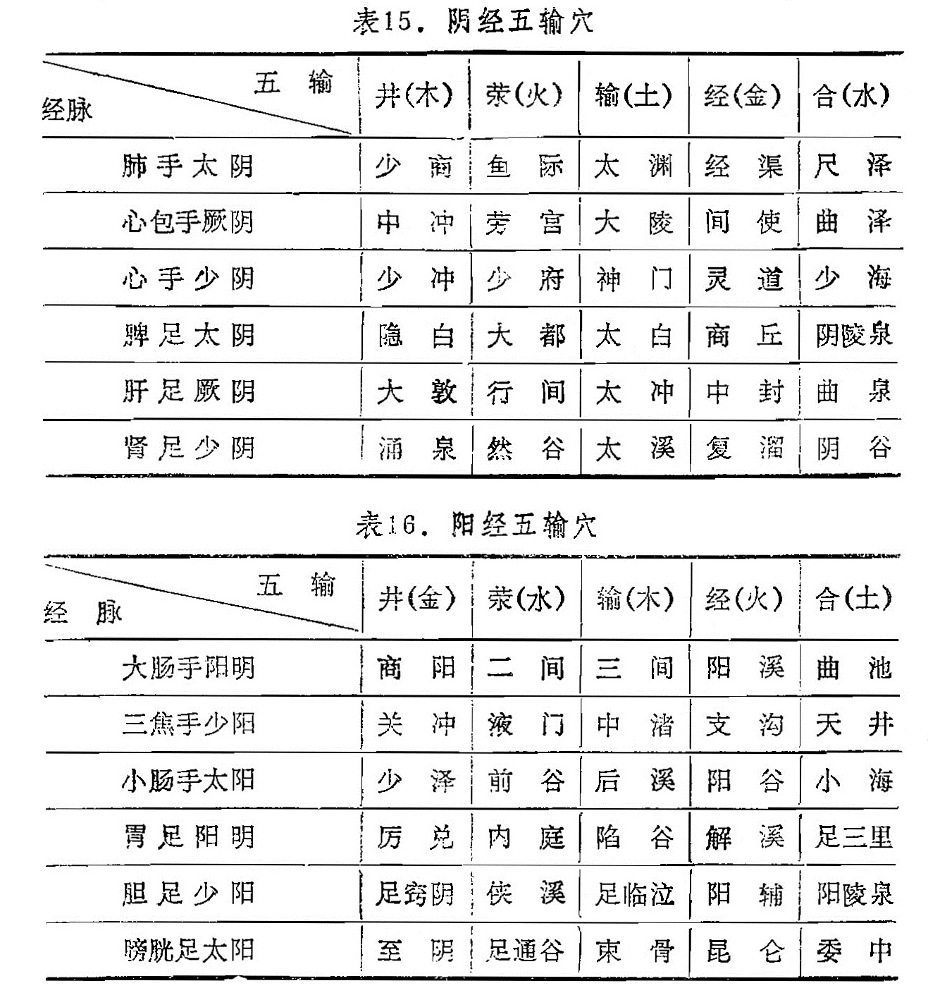
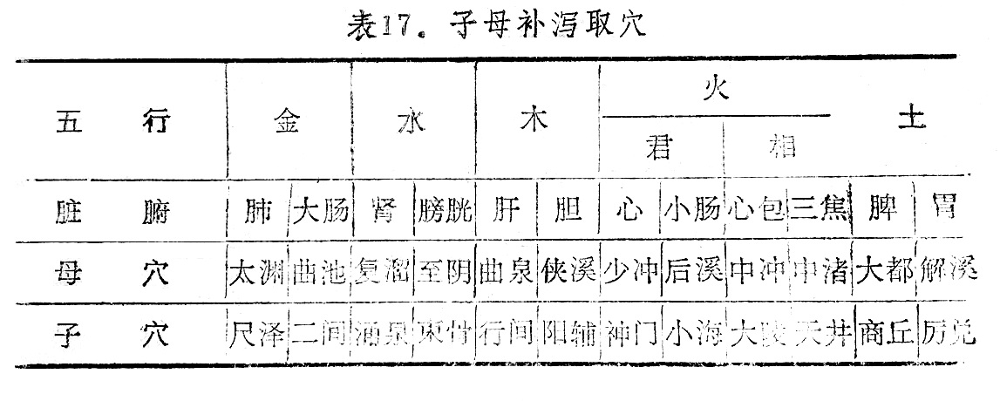

### 一、五输穴的应用

五输穴即井、荥、输、经、合等穴，是十二经脉分布于肘膝以下五个特定穴，简称五输穴。这类腧穴，每经5穴，十二经共有60个穴。这是古人将经脉之气流注运行的情况用自然界水流的动向作比喻，说明经气由小到大，由浅入深。经气在运行过程中所经过部位的深浅不同，其作用也有区别。《灵枢·九针十二原》说：“所出为井，所溜为荥，所注为俞，所行为经，所入为合”。十二经脉所属五输、五行见表15、16。

五输穴是十二经脉气出入之所，因此具有主治五脏六腑经脉病变的作用。《灵枢·顺气一日分四时》说：“病在脏者，取之井；病变于色者，取之荥；病时间时甚者，取之输；病变于音者，取之经；经满而血者，病生胃及以饮食不节得病者，取之于合”。这是对五输穴运用的一种方法，指出疾病发生在五脏时，可取井穴；疾病变化显现于面色时，可取荥穴；病情时轻时重时，可取输穴；疾病影响音声发生变化时，可取经穴；若经脉满盛，病在胃腑及饮食所伤而得的，可取合穴。《难经·六十八难》说：“井主心下满，荥主身热，输主体重节痛，经主喘咳寒热，合主逆气而泄”。这是五输穴在临床上运用的又一方法。

由于春夏阳气在上，人体之气行于浅表，刺宜较浅；秋冬阳气在下，人体之气潜伏于里，刺宜较深。而五输穴的分布，是井、荥所在部位的肌肉较浅薄，经合所在部位的肌肉较深厚，故亦可春夏取井、荥，秋冬取经、合等穴。

五输穴是人体十二经脉、十五络脉之气上下出入之所，因此，各脏腑经络有病，都可用五输穴。也可按五脏、五输与五行的关系来应用，提出了“虚者补其母，实者泻其子”的运用方法。如肝在五行属木，肝经的实证，可取肝经五输穴中属火的荥穴[行间](https://www.gmzyjc.com/read/zjs/zjs3.1.9-12-0.0.4.3.2.md)，因为木生火，火为木之子，取[行间](https://www.gmzyjc.com/read/zjs/zjs3.1.9-12-0.0.4.3.2.md)即所谓“实则泻其子”；若肝经虚证，可取肝经五输穴中属水的合穴[曲泉](https://www.gmzyjc.com/read/zjs/zjs3.1.9-12-0.0.4.3.8.md)，因水生木，水为木之母，取[曲泉](https://www.gmzyjc.com/read/zjs/zjs3.1.9-12-0.0.4.3.8.md)即所谓“虚者补其母”。各五输穴在临床应用时，以此类推，详见表17。

