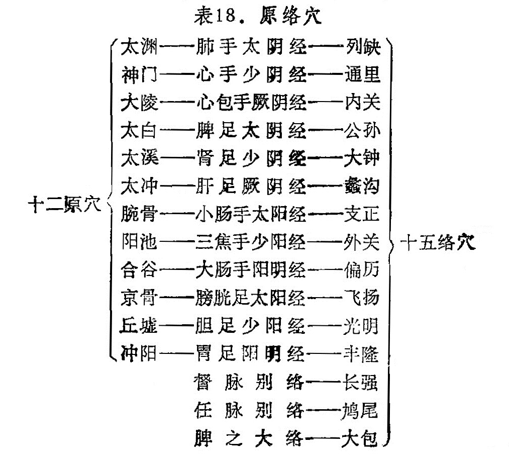

### 二、原穴、络穴的应用

原穴：原穴在六阳经中，排列在五输穴的“输穴”之后，而六阴经则以“输穴”为原穴。原穴是脏腑的原气输注经过留止的部位，原穴与三焦有密切关系，三焦是原气的别使，它导源于脐下肾间动气，而输布全身，和调内外，宣上导下，关系着整个人体的气化功能，特别是对促进五脏六腑的生理话动有一定的意义。针刺原穴能通达三焦原气，调整内脏功能，所以《灵枢》对原穴的主治作用指出：“ **凡此十二原者，主治五脏六腑之有疾者也** ”，这充分说明原穴对治疗内脏病有重要作用。十二经各有一原穴，均分布在四肢腕踝关节附近。

络穴：络穴是络脉由经脉别出部位的腧穴，也是表里两经联络之处。除在十二经中各有一个络穴外，还有任、督二脉的络穴和脾之大络。合计为十五络穴。络穴和络脉有密切关系，络脉在表里经之间有相互联络的作用，因此，络穴的主治特点，在于治疗表里两经的有关病证。如足太阴经络穴公孙，不仅主治脾病，也能治疗胃病。至于长强、鸠尾、大包则治疗患部及内脏病为主。

原穴、络穴可以单独应用，亦可配合应用，如配合应用、称为原络配穴法，又称主客配穴法。它是根据脏腑经络先病、后病为依据。运用时一般是先病脏腑为主，取其经的原穴，后病脏腑为客，取其经的络穴。如肺经（里）先病，大肠经（表）后病，则取手太阴原穴太渊为主，手阳明络穴偏历为客；反之，大肠经先病，肺经后病，则取手阳明原穴合谷为主，手太阴络穴列缺为客。本法属表里配穴法的一种。现将原穴、络穴见表18。

