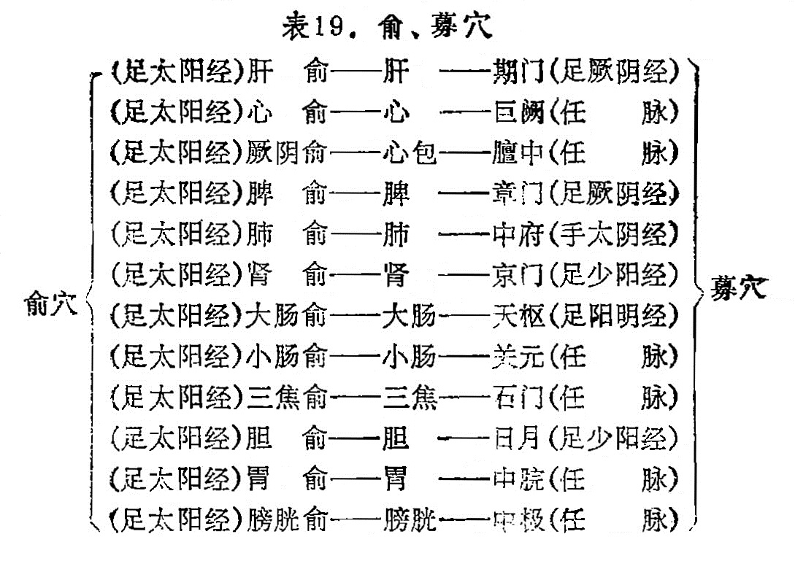

### 三、俞、募穴的应用

俞穴是脏腑之气输注于背部的腧穴。募穴是五脏六腑之气汇集在胸腹部的腧穴。俞为阳，均分布在背部的膀胱经内，为阴经行于阳的重要位置。募为阴，均分布在胸腹部，是阳病行阴的处所，每一脏腑均有各自所属的俞穴和募穴（见表19）。俞、募穴与脏腑有密切关系，脏腑发生病变时，每在所属的俞、募穴上出现反应，表现压痛或敏感等。因此，某一脏腑有病，可以用其所属之俞穴和募穴治疗。如《素问·奇病论》说：“口苦者，……此人者，数谋虑不决，故胆虚，气上溢，而口为之苦。治之以胆募、俞。”即对俞、募穴的具体应用。再如胃病取[胃俞](https://www.gmzyjc.com/read/zjs/zjs3.1.7-8-0.0.1.3.21.md)和[中脘](https://www.gmzyjc.com/read/zjs/zjs3.2.1-0.1.1.3.11.md)，膀胱病取[膀胱俞](https://www.gmzyjc.com/read/zjs/zjs3.1.7-8-0.0.1.3.28.md)和[中极](https://www.gmzyjc.com/read/zjs/zjs3.2.1-0.1.1.3.3.md)等。俞、募穴也可单独使用，五脏有病，多取背部的俞穴，六腑有病，多取胸腹部的募穴，这就是《难经》所说：“阴病引阳，阳病引阴”的涵义。如肺经病变，出现咳嗽，多痰，胸闷等证状，可针刺背部的[肺俞](https://www.gmzyjc.com/read/zjs/zjs3.1.7-8-0.0.1.3.13.md)；如胃病疼痛，呕吐，可针刺胃的募穴[中脘](https://www.gmzyjc.com/read/zjs/zjs3.2.1-0.1.1.3.11.md)。

另外，背部的五脏俞穴，还可以治疗与五脏有关器官的病证，如肝开窍于目，刺[肝俞](https://www.gmzyjc.com/read/zjs/zjs3.1.7-8-0.0.1.3.18.md)可治疗目疾；肾开窍于耳，刺[肾俞](https://www.gmzyjc.com/read/zjs/zjs3.1.7-8-0.0.1.3.23.md)可以治疗耳聋、耳鸣等。