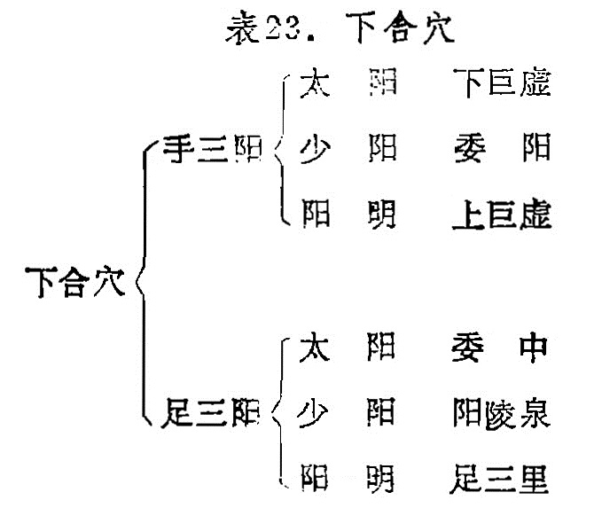

### 七、下合穴的应用

下合穴是指六腑经脉下合于足三阳经的腧穴。它是根据《灵枢·邪气脏腑病形》：“合治内府”的理论提出来的。即指“胃合入于[足三里](https://www.gmzyjc.com/read/zjs/zjs3.1.1-3-0.1.3.3.36.md)，大肠合入于巨虚[上廉](https://www.gmzyjc.com/read/zjs/zjs3.1.1-3-0.1.2.3.9.md)，小肠合入于巨虚[下廉](https://www.gmzyjc.com/read/zjs/zjs3.1.1-3-0.1.2.3.8.md)，三焦合入于[委阳](https://www.gmzyjc.com/read/zjs/zjs3.1.7-8-0.0.1.3.39.md)，膀胱合入于[委中](https://www.gmzyjc.com/read/zjs/zjs3.1.7-8-0.0.1.3.40.md)央，胆合入于[阳陵泉](https://www.gmzyjc.com/read/zjs/zjs3.1.9-12-0.0.3.3.34.md)”，见表23。

手三阳经的大肠、小肠、三焦在上肢的五输穴中皆有其合穴，而以上六穴皆在下肢，为了区别，故以下合穴命名。其理论根据在《灵枢·本输》：“六腑皆出足之三阳，上合于手者也”。因“大肠、小肠皆属于胃”，所以，大肠、小肠的下合穴在胃经上；《甲乙经》指出：“[委阳](https://www.gmzyjc.com/read/zjs/zjs3.1.7-8-0.0.1.3.39.md)，三焦下辅俞也，……此足[太阳](https://www.gmzyjc.com/read/zjs/zjs3.4-0.1.1.4.0.md)之别络也”。膀胱主藏津液，三焦主水液代谢，故三焦与膀胱关系密切，因此，三焦的下合穴在膀胱经上；胃、胆、膀胱三经的合穴，本在下肢，因此，以上六穴称为六腑下合穴。

下合穴是治疗六腑病候的主要穴位，所以《灵枢·邪气脏腑病形》有“合治府病”，《素问·咳论》有“治府者治其合”之说。例如[足三里](https://www.gmzyjc.com/read/zjs/zjs3.1.1-3-0.1.3.3.36.md)治疗胃脘痛；[下巨虚](https://www.gmzyjc.com/read/zjs/zjs3.1.1-3-0.1.3.3.39.md)治疗泄泻：[上巨虚](https://www.gmzyjc.com/read/zjs/zjs3.1.1-3-0.1.3.3.37.md)治疗肠痈、痢疾；[阳陵泉](https://www.gmzyjc.com/read/zjs/zjs3.1.9-12-0.0.3.3.34.md)治疗蛔厥；[委中](https://www.gmzyjc.com/read/zjs/zjs3.1.7-8-0.0.1.3.40.md)、[委阳](https://www.gmzyjc.com/read/zjs/zjs3.1.7-8-0.0.1.3.39.md)治疗三焦气化失常而引起的癃闭，遗尿等，都为临床所习用的穴位。
