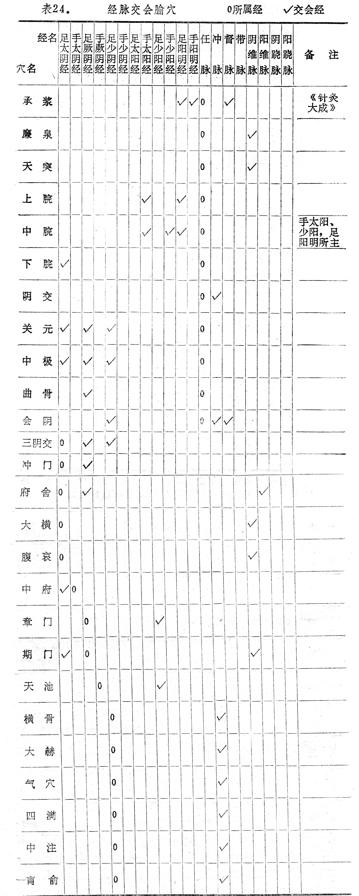
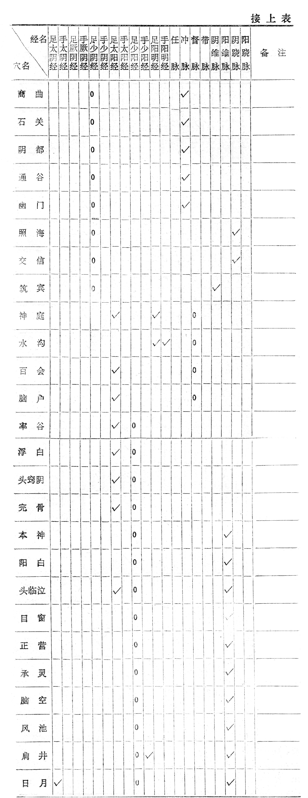
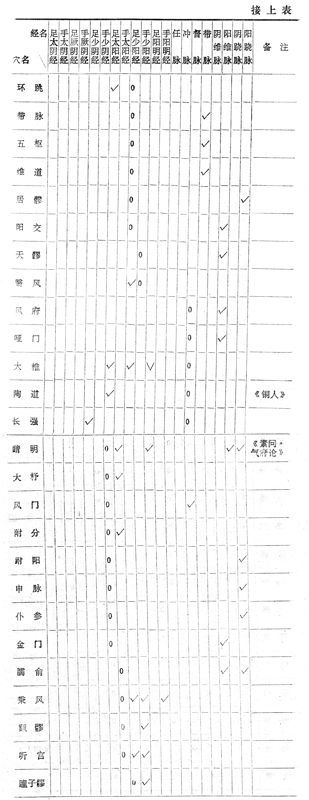
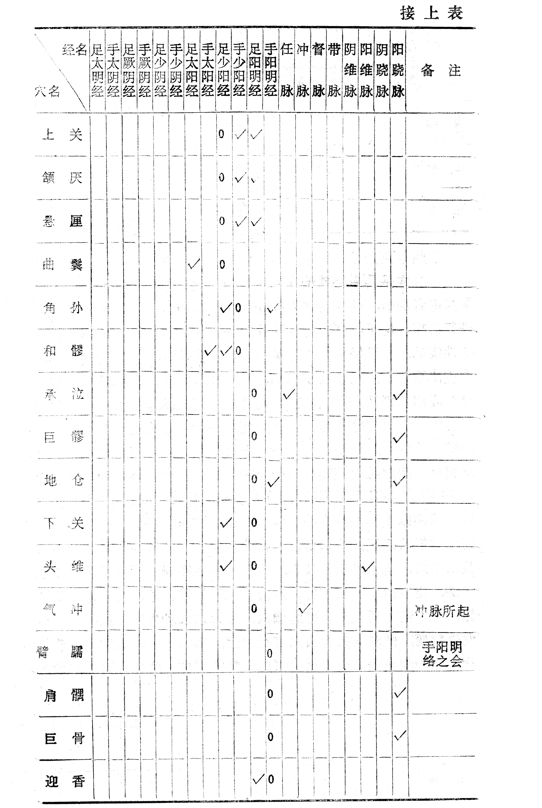

### 八、交会穴的应用

交会穴是指两经或两经以上经脉交叉、会合部位的腧穴。其中主要的一经，即腧穴所归属的一经称为本经，相交会的经称为他经。交会穴不但能治本经的疾病，还能兼治所交会经脉的疾病。如关元、中极是任脉的经穴，又与足三阴经相交会，既可治任脉的疾病又可治足三阴经的疾病；大椎是督脉的经穴，又与手足三阳经相交会，它既可治疗督脉的疾病，又可治疗诸阳经的全身性疾病；三阴交是足太阴经的穴位，又与足少阴肾经和足厥阴肝经的经脉相交会，不仅可以治疗脾经的病症，也可治疗足厥阴肝经、足少阴肾经的病症。今据《甲乙经》所载会穴，列表24如下。

