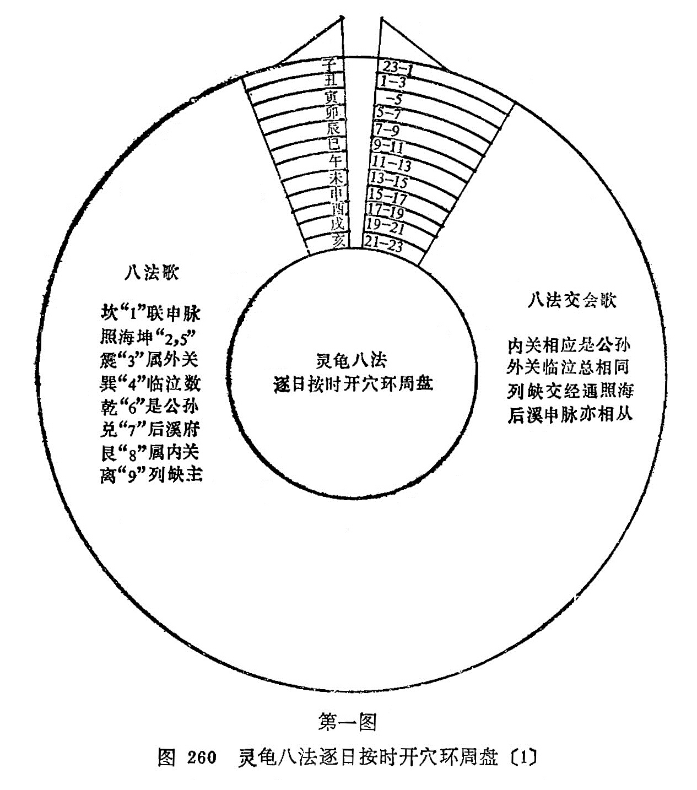

## 灵龟八法

灵龟八法又称奇经纳甲法。它是运用古代哲学的八卦九宫学说，结合人体奇经八脉气血的会合，取其与奇经八脉相通的八个经穴，按照日时干支的推演数字变化，采用相加、相除的方法，作出按时取穴的一种针刺法。此法包含着天人相应之说，阴阳消长之理，五行生克之变，气血流注之机，这种方法是在金·窦汉卿《针经指南》中所运用的八脉八穴基础上发展起来的。到宋、元干支盛行时，才配以八卦九宫；明·徐风《针灸大全》才提出灵龟八法这一名词。后来明·杨继洲《针灸大成》中指出：“ **八法神针妙，飞腾法最奇，砭针行内外，水火就中推，上下交经走，疾如应手驱，往来依进退，补泻逐迎随。用似船推舵，应如弩发机，气聚逢时散，身疼指下移，这般玄妙诀，料得少人知。** ”这种方法和子午流注针法相辅相成、并用不悖。兹将灵龟八法的八脉、八穴和八卦干支等，分述如下。

### 灵龟八法的组成

#### 1.九宫八卦：

八卦是古人取阴阳之象，结合自然界的天、地、火、水、风、雷、山、泽作成的。即：乾为天作☰形，坤为地作☷形，坎为水作☵形，离为火作☲形，巽为风作☴形，震为雷作☳形，艮为山作☶形，兑为泽作☱形。把八卦的名称和图象结合四方，即成九宫。由于八卦各有方位，配合九宫，根据戴九履一、左三右七、二四为肩、八六为足、五十居中的九宫数字。（见《窦文真公八法流注》）每宫再配上一条奇经及其配属的穴位，就成为：坎一联申脉。照海坤二五，震三属外关，巽四临泣数，乾六是公孙，兑七后溪府，艮八系内关，离九列缺主（见《窦文真公八法流注》）此八穴的代表数字，在灵龟八法的推算中占有极为重要的地位。

#### 2.八脉交会：

八脉指任、督、冲、带、阴维、阳维、阴跷、阳跷；交指交通；会指会合。它具有统帅和调整十二经脉气血的作用，而十二经脉本身又有上下循行，交错相会的特性，所以在四肢部位的十二经上有八个经穴相通为八脉。即：小肠经后溪通于督脉，肺经列缺通于任脉，脾经公孙通于冲脉，胆经临泣通于带脉，肾经照海通于阴跷，膀胱经申脉通于阳跷，心包经内关通于阴维，三焦经外关通于阳维。另外这八个经穴彼此之间又有着密切的联系和沟通。如公孙与内关相通，合于心、胃、胸：后溪与申脉相通合于目内眦、颈项、耳、肩膊、小肠、膀胱；临泣与外关相通合于目锐眦、耳后、颈项、肩；列缺与照海相通合于肺系、咽喉、胸膈等。这样就使八脉八穴分为四组，相互结合，有着一致的主治范围，如内关配公孙治胸、心、胃部之疾……，并将其相互结合称之为“父母”、“夫妻”、“男女”、“主客”。为便于参考，列表47,附歌如下：

表47八穴八脉交会表

| 八穴名称       | 相互关系   | 交通八脉       | 会合部位                           |
| -------------- | ---------- | -------------- | ---------------------------------- |
| 公孙 内关 | 父 母 | 冲脉 阴维 | 心、胸、胃                         |
| 后溪 申脉 | 夫 妻 | 督脉 阳跷 | 目内眦、颈项、耳、肩膊、小肠、膀胱 |
| 临泣 外关 | 男 女 | 带脉 阳维 | 目锐眦、耳后、颊、颈肩             |
| 列缺 照海 | 主 客 | 任脉 阴跷 | 肺系、咽喉、胸膈                   |

八脉交会歌诀

公孙冲脉胃心胸，内关阴维下总同；

临泣胆经连带脉，阳维目锐外关逢；

后溪督脉内眦颈，申脉阳跷络亦通；

列缺任脉行肺系，阴跷照海膈喉咙。

#### 3.八法逐日干支代数：

灵龟八法的组成除八脉、八穴、八卦外，尚有日时的干支数字作为八法取穴的依据。干文代数字的由来，是根据五行生成数和干支顺序的阴阳定出的，它是演算灵龟八法穴位的基本数字。宜牢记下记歌诀，并附表解如表48。

| 代数 | 10             | 9          | 8          | 7              |
| ---- | -------------- | ---------- | ---------- | -------------- |
| 天干 | 甲 巳     | 乙 庚 | 丁 壬 | 戊丙 癸辛 |
| 地支 | 辰戌 丑未 | 申 酉 | 寅 卯 | 巳亥 午子 |
| 五行 | 土             | 金         | 木         | 火             |

甲巳辰戌丑未十，乙庚申酉九为期，

丁壬寅卯八成数，戊癸巳午七相宜，

丙辛亥子亦七数，逐日干支即得知。

#### 4.八法临时干支代数：

每日时辰的干支，亦各有一个代数，这个代数与逐日干支的代数有着同样的意义，是推演八法须掌握的内容。宜牢记下记歌诀，列表49，以利推算。

表49八法临时干支代数表

| 代数           | 9              | 8              | 7              | 6              | 5              | 4    |
| -------------- | -------------- | -------------- | -------------- | -------------- | -------------- | ---- |
| 天干 地支 | 甲己 子午 | 乙庚 丑未 | 丙辛 寅申 | 丁壬 卯酉 | 戊癸 辰戍 | 巳亥 |

甲己子午九宜用，乙庚丑未八无疑，

丙辛寅申七作数，丁壬卯酉六须知，

戊癸辰戍各有五，巳亥单加四共齐，

阳日除九阴除六，不及另余穴下推。

### 灵龟八法的运用：

#### 1.开穴法：

运用灵龟八法，是将日、时的干支数字，共同加起来，得出四个数字的和数，然后按照阳日用九除，阴日用六除的公式，去除干支的和数，再将它的余数，求得八卦所分配的某穴的数字，就是当时应开的腧穴。它的公式是：（日干+日支+时干+时支）+6（阴）或9（阳）=商（余数)。

如欲求甲子日的子、丑等时所开穴位，首先要从甲日子时上起出时干；甲日子时按五虎建元（日上起时干）推算，则仍起于“甲子”，再按六十花甲子的排列，第二个时辰就是“乙丑”。

八法逐日干支代数，甲为十，子为七；八法临时干支代数，甲为九，子亦为九。四数相加的总和为三十五，由于天干的甲属阳，故用九除，所剩的余数是八，八为内关穴所应，所以我们知道甲子日的甲子时内关穴当开。

即日乙丑时的代数是十六，加上逐日甲子的代数十七，合为三十三数，由于天干的甲属阳，故仍用九除，所剩的余数是六，六为公孙穴的代数，所以甲子日乙丑时公孙穴当开。

如欲求乙丑日子、丑时应开之穴，乙日的子时是超于“丙子”。日干乙的代数为九，日支丑的代数为十，时干丙的代数为七，时支子的代数为九，四数相加的合数为三十五。由干乙日属阴，所以要被六除，结果余五，五属照海，则知乙丑日丙子时照海穴应开。而乙丑日丁丑时是，日干乙代数是九，日支丑是十，时干丁的代数是六，时支丑是八，四数相加的合数为三十三，由于乙日属阴，所以要被六除，结果余三，三属外关，则知乙丑日丁丑时外关穴应开。另外，凡除尽不余，遇到这种情况，阳日作九计箅，应开的是列缺；阴日则作六计算，应开的穴是公孙。

以上仅是根据公式计算按时所开的经穴方法，临床运用时还有父母、夫妻、男女、主客等的配用关系，就是公孙配内关，临泣配外关，后溪配申脉，列缺配照海，这样共同应用，即可提高疗效。

为便于掌握和运用灵龟八法开穴，兹绘龟灵八法逐日按时开穴环周盘，以便临床应用。（图260、图261）

（1）第一图中数字是代表八穴的穴名，即：1、申脉，2、照海，3、外关，4、临泣，5、照海，6、公孙，7、后溪，8、内关，9、列缺。

（2）第二图是八穴与八卦、九宫的关系，每穴各有代表性的数字，上边是十二时辰配合二十四小时。

（3）在制做时，第一图应较第二图小一圈。将图一斜线处剪掉，使成空缺，复于第二图上，露出第一图的干支名称，如须查对开穴时间，将第二图的当天干支名称对准第一图的空缺。

#### 2.定时取穴、配合治疗：

就是根据病情选取与病情适应的八法开穴的穴位，再配以适当的经穴进行治疗。例如：头面之疾可选后溪、列缺、临泣、照海适应证的开穴时间；胃心胸诸疾可选公孙、内关适应证的开穴时间进行治疗。本法适用于慢性疾病，故称定时取穴，配穴治疗。

#### 3.按时取穴，配合病穴：

就是根据患者来诊时间所开的八法穴，再配合与疾病相适应的穴位进行治疗，即先开内关，以扶正驱邪，消除病痛，例如厥心痛，适逢丙申日己丑时，即先开公孙、内关，再取厥阴俞、巨厥。再如蛔厥，时逢壬午时，即先开内关、公孙，再配中脘、肝俞、胆俞。

#### 4.流注、八法联合应用：

子午流注法，灵龟八法，二者皆以“时穴“为主，所以二者都是建立在人与自然按着气血流注盛衰的规律进行选穴的。同时二者所用的经穴为人体重要腧穴，正如明·李梴所说：“ **周身三百六十穴，统于手足六十六穴，六十六穴又统于八穴** ”，说明五输八法穴的重要意义。这二者联合应用，可先开八法穴，再配纳干按时取穴；先开八法穴，再配纳支取穴：先根据病情，预定八法开穴时间再配纳干定时取穴。由此可见，运用时穴法，必须审慎辨证，根据病情适当配穴，才能更好地发挥时穴的疗效。

## 附：飞腾八法

飞腾八法也是以八脉八穴为基础，按时开穴的一种方法。它的运用和灵龟八法略有不同。本法不论日干支和时干支，均以天干为主，不用零余方法。其运用方法·应牢记飞腾八法歌，并列表50说明。

表50八穴八卦天干配合表

飞腾八法歌

壬甲公孙即是乾，丙居艮上内关然，

戊为临泣生坎水，庚属外关震相连，

辛上后溪装巽卦，乙癸申脉到坤传，

己土列缺南离上，丁居照海兑金全。

例如：本日天干是甲或是己，按“五虎建元“法推算，即是“甲己之日起丙寅”。丙寅应取内关穴，因丙配艮卦内关（其它如丙申、丙戊、丙辰、丙午皆同）。他如戊辰时取临泣，己巳时取列等，均同此例。

> 电子版附：
>
> 1、在“灵龟八法的组成”中“3八法逐日干支代数”部分，原文字样“甲**乙**辰戌丑未十”应为“甲**巳**辰戌丑未十”。电子版已改。
