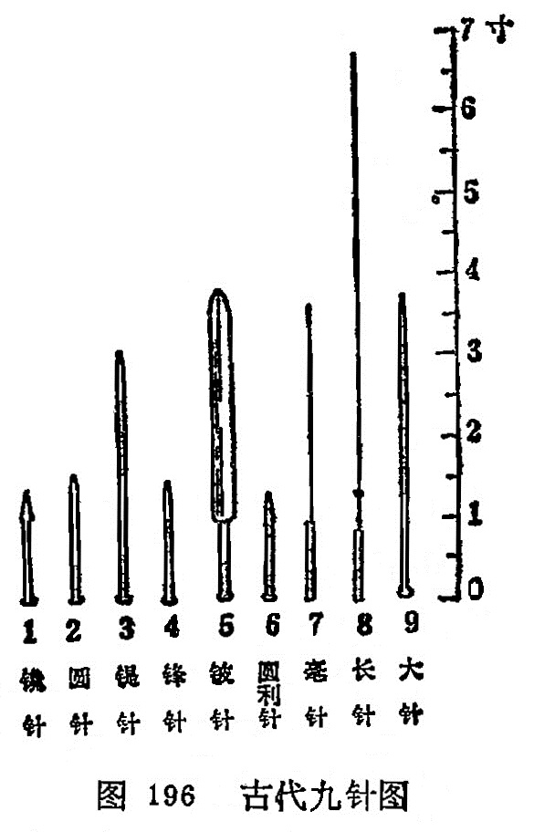
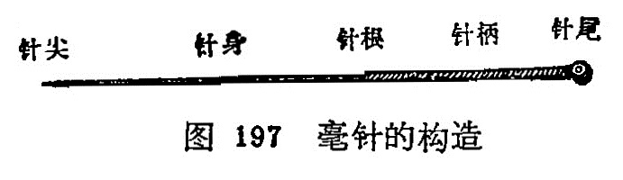

## 第一节毫针的基本知识

近代的毫针，是从古代的九针基础上发展而来。不仅制针的质料有金、银、不锈钢等不同，而且制针的工艺和形状亦有很大 改进。现将九针及近代毫针分述如下：

### 一、九针

从砭石发展到九针，这时才有正式的针法，在《灵枢•官针》篇中说："九针之宜，各有所为，长短大小，各有所施。”说明九种不同形状的针具各有不同的用途，在针灸医学发展上起了很大作用（图196)。

**（1）镵针**

形状：长一寸六分，形似箭头，头大末锐，当末端一分处收小，形成尖端，后人有称为"箭头针”。近人在此基础上发展为皮肤针。

用途：浅刺皮肤而不能深入，用于浅刺皮肤泻血，治头身热症等。

**（2）圆针**

形状：长一寸六分，针身圆柱形，针头卵圆，后人有称为“圆头针”。

用途：揩摩体表，治分肉间气滞，不伤肌肉。为按摩用具。

**（3）鍉针**

形状：长三寸半，针头如黍粟形，圆而微尖，近人有称为 "推针”。

用途：按压经脉，不能深入（按脉勿陷）为按压穴位的用具。

**（4）锋针**
形状：长一寸六分，针身圆柱形，针尖锋利，呈三棱锥形，后人称为三棱针。

用途：用于泻血，治疗痈肿、热病。

**（5）铍针**

形状：长四寸，宽二分半。形如剑，后人有称为剑头针。

用途：痈肿外症割治用。

**（6）圆利针**

形状：长一寸六分，末端尖锐，中部略膨大，针身反细小圆而且利。

用途：痈肿、痹证的深刺。

**（7）毫针**

形状：长一寸六分或三寸六分，针身细如毫（豪）毛。

用途：通调经络，治寒热、痛痹等。

**（8）长针**

形状：长七寸，针身细长而尖部锋利。后人称为环跳针，近人又称为芒针。

用途：深刺，治“深邪远痹”。

**（9）大针**

形状：长四寸，针身粗圆。

用途：泻水，“取大气之不能过于关节者”，治关节积液，后人有作火针用，治瘰疬、乳痈等症。

### 二、毫针的构造、规格和保藏

(一)毫针的构造和规格

1.毫针的构造：毫针是针刺治病的主要针具，临床上应用最广。制针的原料以不锈钢为主，但也有金、银或合金制成的。

毫针的构造可分为五个部分（图197)。

图197毫针的构造

（1）针尖：针的尖端锋锐部分称针尖，亦名针芒。其状似松针，是接触腧穴刺入机体的前锋。

（2）针身：针尖与针根之间称为针身。针身宜光滑挺直，富有弹性。

（3）针根：针身与针柄连接处称为针根。

（4）针柄：手持处称针柄。是以铜丝或铝丝将针的一端呈螺旋形的紧密缠绕而成，是持针着力部分。

（5）针尾：针柄的末端称针尾。一般是用铜丝或铝丝横行缠绕呈圆筒状，是温针装置艾绒的部分。

2.毫针的规格：主要是指针身的粗细和长短。目前所用毫针的长短、粗细规格分别如表9、10。

表9、毫针的长短规格

| **寸** | 0.5  | 1    | 1.5  | 2    | 2.5  | 3    | 3.5  | 4    | 4.5  | 5    |
| ------ | ---- | ---- | ---- | ---- | ---- | ---- | ---- | ---- | ---- | ---- |
| 毫米   | 15   | 25   | 40   | 50   | 65   | 75   | 90   | 100  | 115  | 125  |

表10、毫针的粗细规格

| 号数         | 26   | 27   | 28   | 29   | 30   | 31   | 32   | 33   | 34   | 35   |
| ------------ | ---- | ---- | ---- | ---- | ---- | ---- | ---- | ---- | ---- | ---- |
| 直径（毫米） | 0.45 | 0.42 | 0.38 | 0.34 | 0.32 | 0.30 | 0.28 | 0.26 | 0.23 | 0.22 |

临床上以28〜30号粗细和1〜3寸长者最为常用。短针多用于耳穴及体穴浅刺，长针多用于肌肉丰厚部位腧穴的深刺。

3.毫针的修藏：毫针的修藏是指对针具的维修和保藏。保藏针具，是为防止针尖受损、针身弯曲或生锈、污染等。藏针的器具有针盒、针管和藏针夹等。使用针盒藏针时，在盒内多垫几层消毒纱布，将消毒后的针具，根据毫针的长短分别置于盒内， 再用消毒纱布敷盖，以免污染，然后将针盒盖好备用。使用藏针夹藏针时，针夹两侧要放有硬纸板（防止针身弯曲），夹内放多层消毒纱布，放入消毒后的针具，然后合上针夹备用。使用针管藏针时，针管的一端放入干棉球（以防针尖损坏钩曲），然后将针置入，盖好备用。

针是治病的工具，在使用过程中，应随时注意针尖是否有钩曲或过钝，针身是否有弯曲等。若针身弯曲，针尖过钝或有钩曲，不仅直接影响进针，而且使病人感到刺痛，影响治疗效果。
因此对针具应随时检查，经常维修，现将针具的检修方法介绍如下：

（1）针身的检修：检修时应注意针身有无锈蚀，急弯或一般弯曲。若一般弯曲可用手指或竹板夹住针身，将针身捋直。若属急弯，针身有锈蚀，一般剔之不用，以免折针。同时也应检查针 柄与针身是否衔接牢固，形成一体，如针身与针柄接触不牢，则不宜应用。

（2）针尖检修：检修时应注意针尖有无钩曲，针尖钝和针尖偏斜。若针尖不正、有钩、过钝时，可用细砂纸或细磨石磨好， 使针尖正直光滑，圆而不钝，利而不锐，过锐则易弯成钩，过钝则易痛，应磨成如松针形为宜。

### 〔临床应用〕

近代的毫针就是在九针的基础上发展起来的，不论是从结构上，规格上渐趋精巧，便于临床应用。了解毫针的结构和规格之后，一方面便于毫针的检查，另一方面便于临床选用不同规格的 毫针，选针适当，便于不同穴位的针刺，才能提高疗效，防止意外事故的发生。毫针的修藏，主要是延长针具的使用寿命和防止针刺的疼痛以及意外事故的发生有一定作用。

复习思考题

1.九针的名称和用途是什么？

2.毫针的构造、规格是什么？哪些规格的针临床治疗时最常用？

3.毫针如何维修和保藏？
