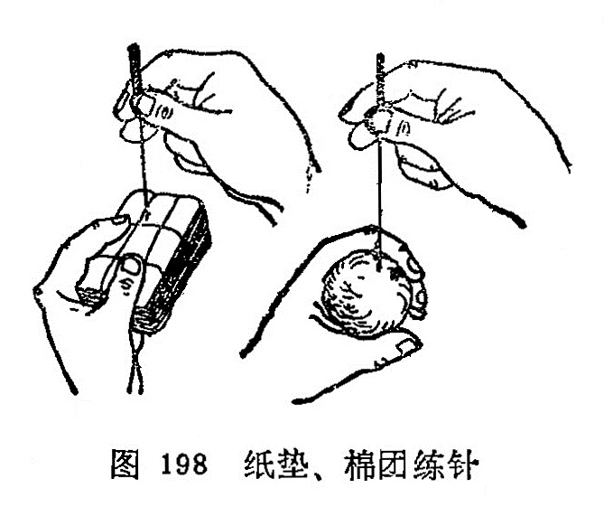

## 第二节针刺练习&

针刺练习，主要是对指力和手法的锻炼。为了达到针刺的治疗目的，不使病人增加痛苦，就要熟练掌握进针和进行各种手法的操作。由于毫针针身细软，要把毫针刺入肌肤内，没有一定的指力是不行的。指力只有通过练习才能掌握，所以练习指力是初学针刺者的重要基本技能训练。指力是进针顺利，减轻疼痛，提高疗效的基本保证。对初学者在临床操作之前，首先要有练习指方的过程。

### 1.纸垫练针法：

用松软的纸张，折迭成长约8厘米，宽约5厘米，厚约2〜3厘米的纸块，用线如“井”字形扎紧，做成纸垫，练针时左手执纸垫，右手拇、食、中三指持针柄，如持笔状 地持1. 0〜1. 5寸毫针，使针尖垂直地抵在纸块上，然后右手拇指 与食中指前后交替地捻动针柄，并逐渐加一定的压力，待针穿透银垫后另换一处，反复练习。纸垫练习主要是锻炼指力和捻转的 基本手法（图198)。

### 2.棉团练针法：

用布将棉花包裹，用线封口扎紧，做成直径 约6〜7厘米的棉团，练针方法同纸垫练针法，所不同的是棉团松 软，可以做提插、捻转等多种基本手法的练习（图198)。

在进行练针时，要做到捻转的角度大小，捻转的速度，可以随意掌握，来去的角度力求一致，快慢均匀。在
这一过程中也可配合上下提插的练习，一般总的要求景提插幅度，上下一致，捻转角度来去一致，频率的快慢
—致，达到得心应手，运用自如。但纸垫或棉花团与人体有一定的差异，为了体验不同的针刺手法所产生的不同作用，最好在自己身上进行练针，以便临床针刺施术时，心中有数，提 高针刺手法水平。

### 〔临床应用〕

针刺练习是掌握针刺技术的基本功之一。练针就是练习指 力，所谓指力包括手指的力量和手腕力量的两个方面，握针靠手 指的力量，进针靠手腕的力量，手指和手腕这两个力量要配合好，才能把又细又软的毫针刺人穴位内，进针即颃利又能减少疼痛， 操作灵活自如。所以初学者在针刺之前，必须加强指力的锻炼，刻苦练习指力，才有针刺的基本功。练针除了练指力外，还要练 习进针的角度和深度，才能掌握针刺治疗时的要求，既能提高治疗效果，又能防止意外事故的发生，所以练针是初学者不可缺少 的基本功。

复习思考题

1.练针的意义及目的何在？

2.怎样进行针剌练习？
