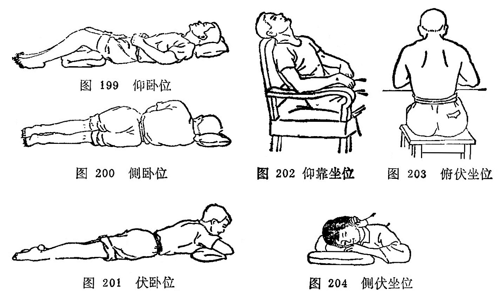

## 第三节针刺前的准备

### 一、选择针具

对针具的选择，现在多选用不锈钢所制针具，因不锈钢不仅能防腐蚀、能耐热，而且具有一定的硬度、弹性和韧性。金质和银质的针，弹性较差，价格昂贵，故临床较少应用。从质优的毫 针中应选择针柄无松动，针身挺直光滑，坚韧而富有弹性，针尖圆而不钝，利而不锐，呈松针形者为好。如针身有缺损和伤痕者，应剔出不用，以免在针刺施术过程中，给病人造成不必要的 痛苦。

在选择针具时，除应注意上述事项外，在临床上还应根据病人的性别、年龄的长幼、形体的胖瘦、体质的强弱、病情的虚实、病变部的表里深浅和所取穴位的具体部位，选择长短、粗细适宜的针具。《灵枢•官针》说：“九针之宜，各有所为，长短大小，各有所施也”。如男性，体壮、形肥、病变部位较深者，可选稍粗、稍长的毫针。反之若女性、体弱、形瘦，而病变部位较浅者，就应选用较短、较细的毫针。至于根据腧穴所在具体部位迸行选针时，一般是皮薄肉少之处和针刺较浅的腧穴，选择针具宜短而针身宜细；皮肤厚肌肉多而针刺宜深的腧穴，宜选用针身稍长和稍粗的毫针。在临床选针的长短时，除刺入的深度外，针身还应露出皮肤表面3〜5分为宜。

### 二、解释工作

在临床上医生给初诊病人针刺时，应耐心的向病人解释针刺的一般常识，减少病人对针刺的恐惧心里，从而取得病人的积极配合，以便更好的发挥针刺的治疗作用，并可避免针刺异常情况 的发生。

### 三、选择体位

为了使病人适应针灸施术，针刺前应根据所选的腧穴，指导病人选择适当的体位。病人体位选择是否得当，对腧穴的正确定位，针刺的施术操作，持久的留针，以及防止晕针、滞针、弯针， 折针等；都有很大影响，如病重体弱或精神紧张的病人，采用坐位，易使病人产生疲劳，往往易发生晕针。又如体位选择不当，在针刺施术时或在留针过程中，病人常因移动体位而造成弯针、滞针甚至发生折针事故。因此说选择体位具有重要意义。

（一）选择体位的一般原则
1.选择体位应该是以医生能正确取穴，操作方便，患者体位舒适，并能持久为原则。

2.在可能条件下，一种体位能暴露出针灸处方所列的腧穴。

3.一般可采取卧位，尤其是精神不好，或精神过度紧张，体质虚弱的患者最好采取卧位，防止晕针或其他事故。

4.在比较冷的条件下，应采取少暴露皮肤面上的穴位，以防受凉或感冒。

（二）临床常用体位
临床常用体位一般以卧位和有倚靠的坐位为主，分述如下：

1.仰卧位：适用于取头、面、胸、腹部腧穴，和上、下肢的部分腧穴（图199)。

2.侧卧位：适用于取身体侧面少阳经腧穴和上、下肢的部分腧穴（图200)。

3.伏卧位：适用于取头、项、脊背、腰尻部腧穴和下肢后面的腧穴(图201）。

4.仰靠坐位：适用于取前头、颜面和颈前等部位的腧穴(图 202)。

5.俯伏坐位：适用于取后头和项、背部腧穴（图203)。

6.侧伏坐位：适用于取头部一侧、面颊及耳前后部位的腧穴（图204)。

总之，患者的体位一定要舒适，取穴准确，医生针灸操作方便可即。

### 四、消毒

针刺前的消毒工作，包括针具消毒，医者手指消毒，腧穴部位消毒。消毒的方法，可根据具体条件选用以下方法。

（一）针具消毒     可根据具体条件选用下列消毒方法：

1.高压消毒法：将针具修好后，用纱布包好，放在针盒内，置于高压消毒锅内，一般需要在15磅气压，温度应达120℃，消毒时间应为15分钟以上，即达到消毒的目的。

2.煮沸消毒法：将针具修检好后用纱布包好，放置在清水锅内，待水沸腾后，再煮15分钟即可。为了提高沸点，应在水中加入重碳酸钠，使之成为2%的溶液，可以提高水的沸点达120℃， 并且有减低沸水对针具的腐蚀作用。

3.药物消毒：将修好的针具置于75%酒精溶液内，浸泡30分钟即可达到消毒要求。亦可用0.1%的新洁尔灭浸泡并加防腐剂 0.5%浓度的亚硝酸钠，浸泡30分钟即可达到消毒作用。取出后用消毒纱布擦干，放在消毒的针盒内备用。还可用2%来苏溶液或1:1000的升汞溶液浸泡1〜2小时后应用。对某些传染性疾患者，应做到一针一穴，一次性使用。

总之，不管哪种消毒方法，只要达到消毒要求即可。

（二）医者手指消毒   在施术前，医者先用肥皂水将手洗刷干净，待干后再用75%酒精棉球擦拭即可。施术时医者应尽量避免手指直接接触针体，如必须接触针体时，可用消毒干棉球作间隔物，以保持针身无菌，以免感染。

（三）施术部位消毒   在患者需要针刺的腧穴部位消毒时， 可用75%酒精棉球拭擦即可。在拭擦时应由腧穴部位的中心向四周绕圈拭擦。或先用2%碘酒棉球拭擦，然后再用75%酒精棉球涂擦脱碘消毒，当穴位消毒后，切忌接触污物，以免重新污染。

### 五医者的态度

医者的态度是整个治疗工作中的关键问题，首先要有急病人之所急，痛病人之所痛这种感情，全心全意为患者服务，只有医生关心病人，病人才能相信医生，这种医患合作，有利于病人战 胜疾病的信心。这就要求医生要有严肃的态度，精神要集中，专心一意的为患者治疗，尽到医生的职责。《灵枢•九针十二原》： "祖守形，上守神”。在患者方面也必须树立针灸治疗的信心，对疾病要有战胜的决心，这要医生帮助树立。只有调动医生、患者两个方面的积极性，才能收到满意的治疗效果。

### 〔临床应用〕

临床上应用的针具，都应选择优质的针，而劣质的针具应剔除不用。在选择毫针的粗细、长短时，要根据患者的性别、年龄、形体、体质、虚实、表里来进行选择。凡是体质壮实，肌肉丰满，实热证选择粗针长针；凡体质虚弱，肌肉瘠薄，虚寒证选择细针短针。否则就会影响针灸的治疗效果。消毒也是针刺治疗中很重要的环节，针具和腧穴部位消毒要彻底就会防止感染，有 利于患者身体健康。体位的选择要根据疾病的诊断、处方中的腧穴来选择，选择的体位应该是以医者能正确取穴，操作方便；患者又感到舒适持久为原则，以免引起疼痛或弯针、断针等异常情况的出现。

复习思考题

1.针刺前要做哪些准备工作？

2.用高压气锅消毒针具需要多大压力？多高温度？多长时间？

3.煮沸消毒针具，应煮沸多长时间？为了提高沸点，应采取什么措施？

4.针刺消毒包括哪些方面？常用的消毒方法是什么？

5.常用的针灸体位有几种？各适用于针灸哪些穴位？
