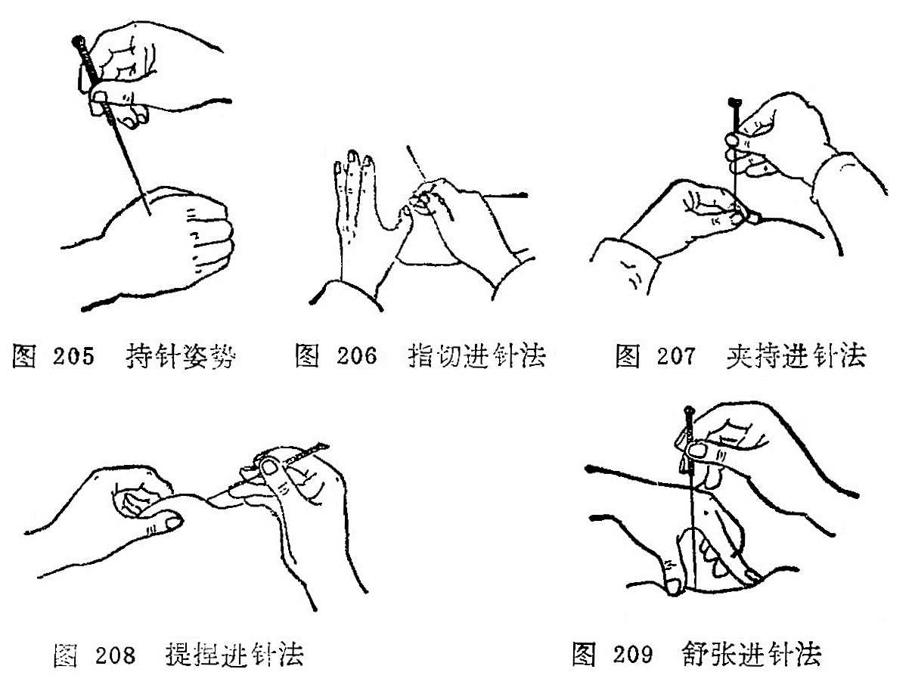

### 一、进针

把针刺入皮肤内就是进针。进针是针刺操作的基本手法。在进行针刺操作时，一般均须双手协作，互相配合，才能把针迅速刺入皮肤。正如《流注指微论》中指出:“针入贵速，即入徐进"。持针施术的手称"刺手”；按压穴位局部，帮助施术的手称为“押手”。《针经指南•标幽赋》指出：“左手重而多按，欲令气散；右手轻而徐入，不痛之因”。刺手就是拿针的手，一般习惯都称右手为刺手（图205)。持针的方法是根据治疗的需要来决定的，常用持针方法有以下四种：

1.执笔式持针法：一般用右手拇食指挟持针柄，中指抵住针身，进针时帮助着力，防止针身弯曲，使着力点集中到针尖上进行针刺。

2.拇食指持针法：右手拇食二指持住针柄，进行针刺。

3.拇中指持针法：右手拇中二指持住针柄，进行针刺。

4.拇食，中指持针法：右手拇中二指持住针柄，食指放在针尾上，稍再力下压，帮助进行针刺。

剌手的作用：是掌握针具，进针时运用指力，使针尖迅速刺透皮肤，掌握进针的角度、方向、深度、刺激的强度，便于对身体不同部位腧穴的针刺，行针时进行适当的捻转、提插等手法进行施术。

押手就是辅助施术的手，一般习惯都称左手为押手，是根据腧穴的位置和用针的长短而定。临床常用的进针方法有以下四种：

1.指切进针法：又称爪切进针法，用左手拇指或食指端切按在腧穴位置的旁边，右手持针，紧靠左手指甲面将针刺入腧穴。此法多用于短针的进针。如针刺睛明、球后、内关、足三里等腧穴（图206）。

2.夹持进针法：或称骈指进针法，即用左手拇食二指持捏消毒干棉球，夹住针体下端，将针尖固定在所刺腧穴的皮肤表面位置，右手捻动针柄，将针刺入腧穴。此法是双手配合，适用于长针的进针。如针刺环跳、秩边、殷门等腧穴（图207)。

临床上也有采用插刺进针的，即单用右手拇、食二指夹持消毒干棉球，夹住针身下端，使针尖露出2〜3分，对准腧穴位置，将针迅速刺入腧穴，然后将针捻转刺入一定深度，并根据需要选  用适当押手配合行针。

3.提捏进针法：用左手拇、食二指将针刺腧穴部位的皮肤捏起，右手持针，从捏起的上端将针刺入。此法主要用于皮肉浅薄部位的腧穴进针，如印堂、阳白、水沟、地仓等腧穴（图208)。

4.舒张进针法：用左手拇、食二指将针刺腧穴部位的皮肤向两侧撑开，使皮肤绷紧，右手持针，使针从左手拇、食二指的中间刺入。此法主要用于皮肤松弛部位的腧穴，如中脘、关元、 归来、四满等腧穴(图209)。

押手的作用：正如《难经•七十六难》指出：“知为针者信其左，不知为针者信其右”。这说明在针刺时不能单靠右手，左手帮助进针时起着很重要作用。其作用一般可分为以下四种：

1.可以固定穴位，使进针时不移动位置，准确刺入腧穴， 避开脏器器官和血管。

2.可以帮助进针时的指力，使针不致于弯曲。

3.可以减少进针时的疼痛，压则气散，不伤营卫，缓解肌肉紧张。正如《标幽赋》中记载：“左手重而多按，欲令气散；右手轻而徐入，不痛之因”。这是窦汉卿总结前人的经验，直到今天，仍为针灸临床广泛采用。

4.可以加强针刺的作用，提高治疗效果。即“欲气上行，按之在后，欲气下行，按之在前”，可使针感按临床治疗的要求去传导，趋向病所。

除上述的进针方法外，还有采用针管进针的，即备好玻璃或专属制成的针管，针管长度要比毫针短2—3分，以便露出针柄，针管的直径以能顺利通过针尾为宜，进针时左手持针管，将针裝入管内，针尖与针管下端平齐，置于应刺的腧穴上，针管上端露出针柄2〜3分，用右手食指叩打针尾或用中指弹击针尾，即可使针刺入，然后退出针管，再运用行针手法进行操作。
