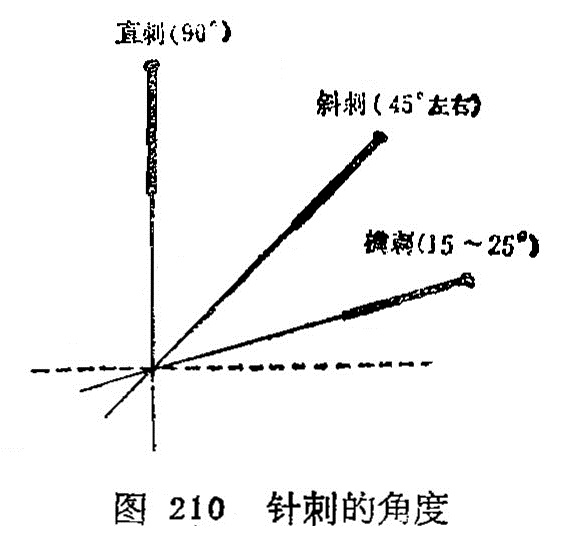

### 二、针刺的角度和深度

在针刺操作过程中，掌握正确的针刺角度、方向和深度，是增强针感，提高疗效，防止意外事故发生的重要环节，腧穴定位的正确，不应仅限于体表的位置，还必须与正确的进针角度、方 向、深度等有机的结合起来，才能充分发挥其应有效应。临床上同一腧穴，由于针刺的角度、方向、深度不同，所产生针感的强弱、感传的方向和治疗效果常有明显的差异。正确掌握针刺角度、方向和深度，要根据施术腧穴所在的具体位置，病人体质，病情需要和针刺手法等实际情况，灵活掌握，现分述如下：

（一）针刺角度   针刺的角度是指进针时针身与皮肤表面所构成的夹角。它是根据腧穴所在的位置和医者针刺时所要达到的目的结合而定。一般分为直刺、斜刺、平刺三种(图210）。

1.直刺：即针身与皮肤表面呈90°角垂直刺入。此法适用于肌肉丰厚处的腧穴或腹部的腧穴，如臀部、腹部及四肢等部位的腧穴。

2.斜刺：即针身与皮肤表面呈45°角倾斜刺入。此法适用于肌肉较薄处或内有重要脏器的部位，如胸、背、骨间隙等部位的腧穴。

3.平刺：又称“横刺、沿皮刺"即针身与皮肤表面呈15°角沿皮刺入。此法适用于肌肉特别浅薄处，如头、胸部位的腧穴，有时在透穴刺法时也用这类针刺角度。

（二）针刺深度   针刺深度是指针身刺入皮肉内的深度而言。 一般以既有针感又不伤及重要脏器为原则。《素问•刺要论》指出： “病有沉浮，刺有深浅，各至其理，无过其道”。每个腧穴的针刺深度，在腧穴各论中已有详述，在此仅根据下列情况，作原则的介绍。

1.年龄：年老体弱及小儿娇嫩之体，宜浅刺；中青年身体强壮，气血旺盛者，宜深刺。如《灵枢•逆顺肥瘦》：“婴儿，瘦人，浅而疾之，壮士肥人，深而留之”。

2.体形： 体壮的胖人，肌肉丰盛者，针刺应深些；体形瘦小，肌肉不那么丰满者，针刺应浅些。如《素问•三部九候论》 说：“必先度其形之肥瘦，以调其气之虚实”。

3.部位：头面及胸背部和皮薄肉少处的腧穴，宜浅刺；四肢及臀、腹部和肌肉丰满处的腧穴，宜深刺，《针灸聚英•附辨》: “若肌肉厚实处则可深，浅层则宜浅”。

4.病情：病在表、阳证、新病者针刺应浅些；病在里、阴证、久病者针刺应深些。如《素问•刺要论》说：“病有沉浮，刺有浅深”。

综上所述，针刺的角度和深度之间，有着相辅相成的密切关系，一般来讲，深刺多用直刺，浅刺多用斜刺或平刺。尤其对天突、哑门、风府、风池以及眼区、胸背部腧穴和重要脏器如心、肝、肺等部位的腧穴，要掌握好针刺的角度和深度。至于不同季节、对针刺深浅也有影响，也应予以重视。