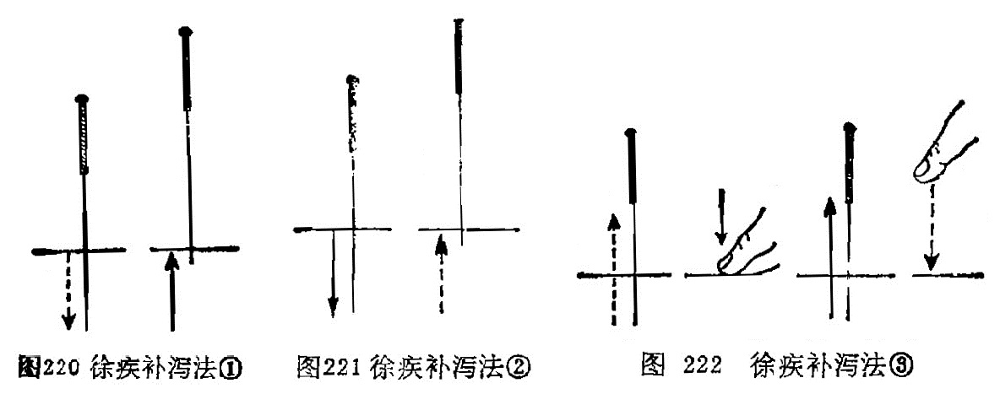
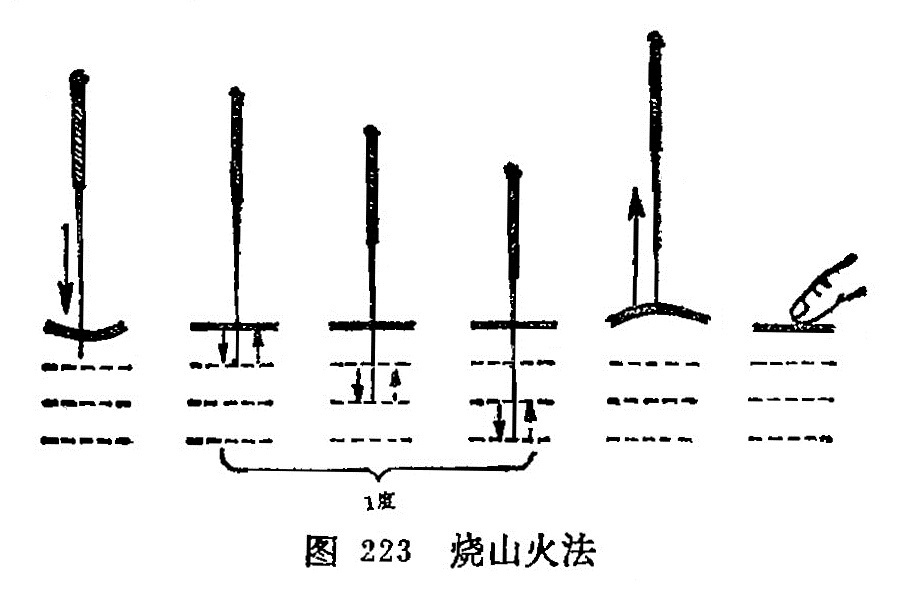
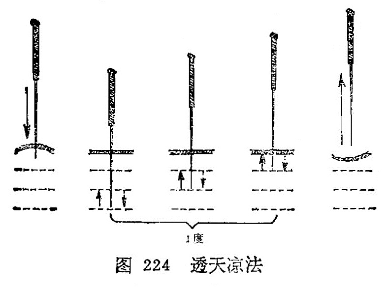

### 四、针刺补泻

针刺补泻，是根据《灵枢•经脉》：“盛则泻之，虚则补之， 寒则留之，陷下则灸之”的理论确定的两种不同的治疗原则和方法，是针刺治疗当中很重要的一个环节，针刺的补泻就是通过补泻手法来实现的。《千金方》说：“凡用针之法，以补泻为先”。《灵枢•九针十二原》说“虚实之要，九针最妙，补泻之时，以针为之。”补泻是毫针刺法的核心内容。

补法：凡是能鼓舞人体正气，使低下的功能恢复旺盛的方法。泻法：凡是能疏泄病邪，使亢进的机能恢复正常的方法。针刺补泻都是通过针刺腧穴，激发经气来调节脏腑功能，促进阴阳平衡而恢复健康。

所谓经气，即经络之气。《灵枢•终始》说："凡刺之道，气调而止。”可见针刺治病，关键在于调气。

大量临床实践和科学实验证明，针刺补泻效果的产生，主要取决于以下三个方面的因素：

(一)机体状态  人体在不同的病理状态下，针刺可产生不同的调节作用，即补泻效果。如当机体处于虚脱状态时，针刺可起到回阳固脱的作用；当机体处于实、热、闭证的情况下，针刺又可以起到泄热启闭的作用。如胃肠痉挛疼痛时，针刺可起到止痉而使疼痛缓解；胃肠蠕动缓慢而呈弛缓时，针刺可以增强胃肠蠕动而使其功能恢复正常。内因是事物发展变化的根据，针刺时 机体的状态是产生针刺补泻效应的主要因素。当然，针刺对机体的这种调节作用，又和机体正气的盛衰有着密切的关系。如机体正气旺盛，经气易于激发，针刺调节作用就显著；如果机体正气不足，经气不易激发，则针刺调节作用就较差。所以《灵枢•终始》说：“谷气至者，已补而实，已泻而虚。”

（二）腧穴特性  腧穴的功能不仅具有它的普遍性，而且有些腧穴具有相对的特异性。有些腧穴适宜于补虚，如足三里、关元等具有强壮作用，多用于补虚；而有些腧穴适宜于泻实，如少 商、十宣等，具有泻邪作用，多用于泻实。

（三）针刺手法  针刺手法是促进人体内在因素转化的条件 是实现补虚泻实的重要环节。为了达到补泻的目的，进针以后， 往往需要配合运用一定的手法。古代医家在长期的医疗实践中， 创造和总结了很多针刺补泻手法。现将临床主要的几种针刺补泻手法介绍如下：

#### 1.提插补泻：

将针刺入穴位得气后，以提插时，针尖上下用力轻重和快慢，时间长短来进行补泻的一种方法。

补法：针刺得气后，先浅后深，重插轻提，提插的幅度小， 频率慢，操作时间短者。

泻法：针刺得气后，先深后浅，轻插重提，提插的幅度大， 频率快，操作时间长者。

#### 2.捻转补泻：

将针刺入穴位得气后，以针身左右旋转进行补泻的一种方法。

补法：针下得气后，捻转角度小，用力轻，频率慢，操作时间短者。

泻法:针下得气后，捻转角度大，用力重，频率快，操作时间长者。

此外，也有以左转时角度大，用力重者为补；右转时角度大，用力重者为泻。

#### 3.疾徐补泻：

将针刺人穴位得气后，以进出针的快慢（疾徐）为基础的一种补泻方法。

补法：进针时徐徐刺入，少捻转，疾速出针者。

泻法：进针时疾速刺入，多捻转，徐徐出针者（图220、221 , 222）。

#### 4.开阖补泻：

是根据出针后，揉按针孔与否，依针孔的开闭为补泻的方法。

补法：出针后迅速揉按针孔。

泻法：出针时摇大针孔而不立即揉按。

#### 5.迎随补泻：

必须分辨经脉循行的顺逆与针刺的进针方向进行补泻的一种方法。

补法：进针时针尖随着经脉循行方向，顺经而刺。

泻法:进针时针尖逆着经脉循行方向，逆经而刺。

#### 6.呼吸补泻：

以进针、出针的时间，结合病人的呼吸分补泻的一种方法。

补法：当患者在呼气时将针刺入，吸气时出针。

泻法：当患者在吸气时将针刺入，呼气时出针。

#### 7.平补平泻：

进针得气后均匀地提插、捻转后即可出针。

以上各种手法，临床上可以相互配合使用。此外还有如下的复式手法：

#### 1.烧山火：

有补的作用，用于治疗寒证、虚钲、阴证。《针灸大成》：“烧山火能除寒，三进一退热涌涌，鼻吸气一口呵五口。"又说：“烧山之火能除寒，一退三飞病自安，始是五分终一寸，三番出入慢提看。”

操作：将针刺入应刺深度的上1/3 (天部)，得气后行捻转补法，再将针刺入腧穴中1/3 (人部），得气后行捻转补法，然后将针刺入腧穴下1/3 (地部），得气后行捻转补法，即慢慢地将针提到上1/3，如此反复操作3次，即将针紧按至地部留针。在操作过程中，或配合呼吸补泻法中的补法，即为烧山火法（图223）。

#### 2.透天凉：

有泻的作用，用于治疗热证、实证、阳证。《针灸大成》：“透天凉能除热，三退一进冷冰冰，口吸气一口，鼻出五口”。

操作：将针刺入腧穴应刺深度的下1/3 (地部)，得气后行转泻法，再将针紧提至中1/3 (人部），得气后行捻转泻法，然后将针提至上1/3 (天部），得气后行捻转泻法，将针缓慢地按至下1/3，如此反复操作3次，将针紧提至上1/3即可留针。在操作过程中，或配合呼吸补泻法中的泻法，即为透天凉法（图 224)。

#### 3.阳中隐阴：

有先补后泻作用，用于治疗先寒后热，虚中夹实。《针灸大成》：“阳中隐阴，能治先寒后热，浅而深”。"阳中有个阴，先寒后热人，五分阳九数，一寸六阴行。”

操作：将针进入天部浅层，向左捻转九次，然后插入地部深层，向右捻针六次，提回天部浅层，以便重复操作如前。

#### 4.阴中隐阳：

有先泻后补作用，用于治疗先热后寒，实中夹虚。《针灸大成》：“阴中隐阳，能治先热后寒，深而浅。”

操作：将针进入地部深层，将针向右捻针六次，然后将针提至天部浅层，又向左捻九次，亦将针插入地部，以便重复操作。
