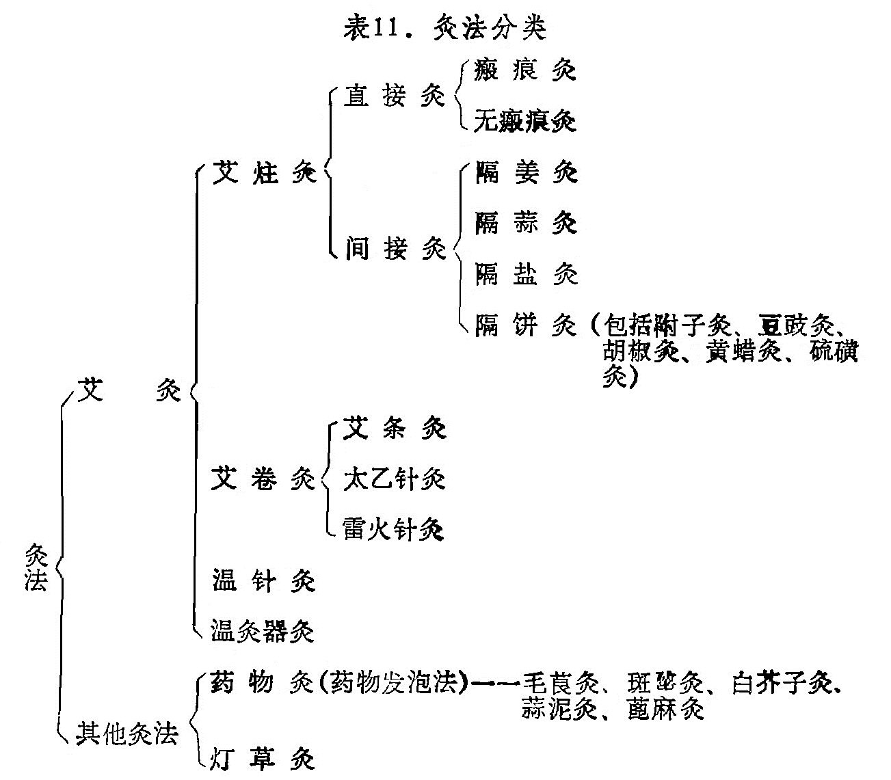
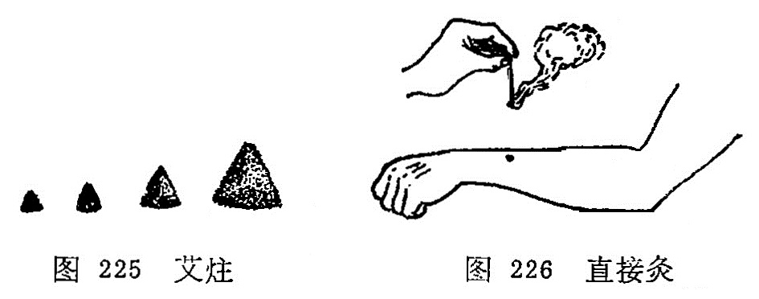
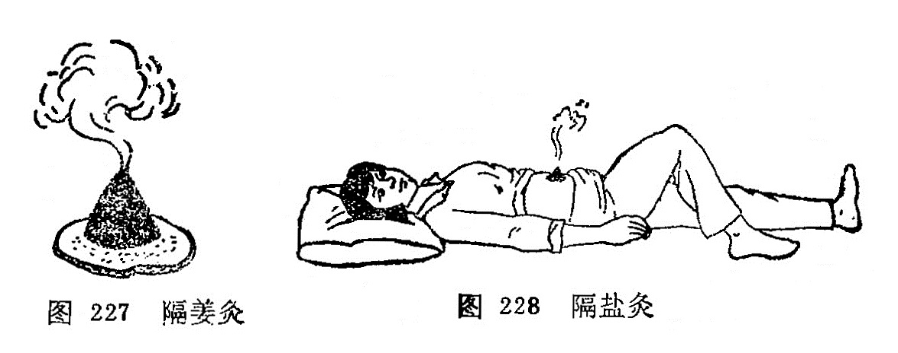
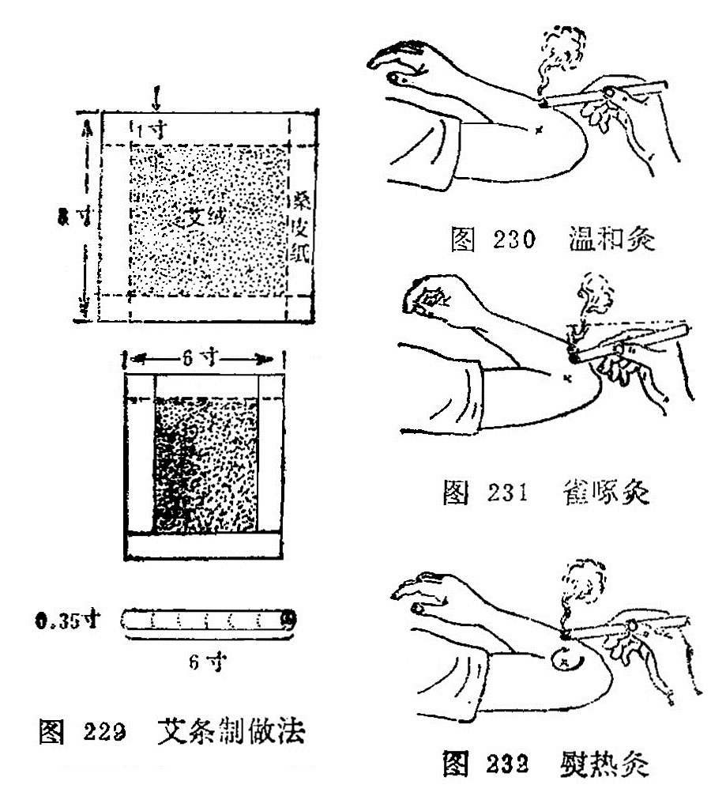
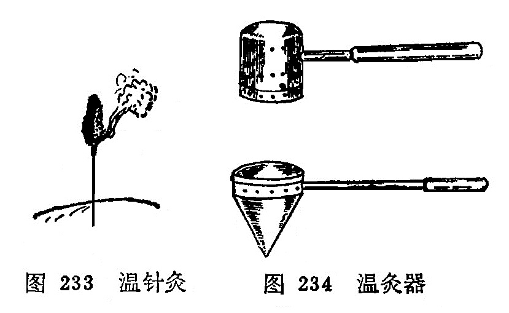

## 第二节　灸法的分类及其操作

        灸法治疗疾病，已有悠久的历史。先是单纯的艾灸，后来衍化为多种灸法。大体上可分为艾炷灸、艾条灸、温针灸、温灸器灸和药物灸（药物发泡法）等几类。各类灸法如表11。

### 一、艾炷灸

        艾炷灸包括直接灸和间接灸，是灸法的主体。古代的灸法多指直接灸，间接灸是后来发展起来的一种疗法。

        艾炷是将纯艾绒用手指搓捏成圆锥体。又称艾团、艾丸、艾圆等。艾炷分为大、中、小三种类型。小艾炷是把艾绒搓紧，捻成麦粒状或上尖下大的圆锥体；中艾炷是搓成象半个黄豆粒或半个杏核大的上尖下大的锥体；大艾炷是搓成蚕豆大者的上尖下大的圆锥体（图225）。

        一般规定炷底直径为0. 8厘米，高1厘米，重量为0.1克， 燃烧时间为3〜5分钟。这是为了科学研究和临床准确而设的。施灸多少？以“壮”计数，壮，是以青壮年为标准的意思。燃烧一枚艾炷即为一壮。施灸的壮数是因人、因病、因穴而异，少则一壮，多则数百壮，一般灸3〜7壮即可。

        (一)直接灸        是将艾炷直接放在皮肤上施灸（图226）。可分为瘢痕灸和无瘢痕灸。

        1.瘢痕灸：又称化脓灸、着肤灸、打脓灸。施灸前用大蒜捣汁，涂敷施灸部位以增加粘附和刺激作用，然后放置中艾炷施灸、 每壮艾炷必须燃尽，除去灰烬后，方可继续加炷施灸，一般施灸5〜10壮。因施灸时艾火烧灼皮肤疼痛较剧，可用手在施灸部位周围轻轻拍打，借以缓解疼痛。在正常情况下，灸后一周左右施灸部位化脓形成灸疮，5〜6周左右灸疮自行痊愈，结痂脱落，留下瘢痕。临床上用于慢性、顽固性病症。如哮喘、肺痨、瘰疬、慢性胃肠病等证。

        2.无瘢痕灸：又称非化脓灸。将施灸部位涂敷凡士林油，以增加粘附作用，再放上艾炷点燃，当艾炷燃剩2/5左右，患者感到烫时即用镊子将艾炷夹去，更换艾炷再灸，连续灸3〜7壮。以局部皮肤充血、红晕为度。因灸后不化脓，也不留有瘢痕，易为患者所接受。本法适用于虚寒性疾病，小儿各种虚弱病证。如腹痛、 腹泻、胃脘痛、腰痛、阳萎、痛经等症。

        （二）间接灸    又称隔物灸、间隔灸。在施灸时于皮肤和艾炷之间垫上不同的药物，称为间接灸。由于间隔的药物不同，可分为隔姜灸、隔蒜灸、隔盐灸、隔饼灸等。

         1.隔姜灸：皮肤和艾炷之间隔上姜片，即为隔姜灸。

        用鲜姜切成直径大约2—3厘米，厚约0. 2〜0. 3厘米的薄片，片上用针刺数孔，置于施术部位或腧穴上，再将大艾炷放在姜片上点燃施灸（图227），当艾炷燃尽，再移炷施灸，灸3〜7壮，以局部皮肤红润不起泡、患者有舒适感为度。适用于虚寒证。呕吐、腹痛、腹泻、遗精、风寒痹痛如等。

        2.隔蒜灸：皮肤和艾炷之间隔上蒜片，即为隔蒜灸。

        用独头大蒜切成约0.2〜0.3厘米厚的薄片，片上用针刺数孔，施灸法同隔姜灸。适用于外科痈疽疮毒，肺痨、瘰疬、腹中积块等。

        3.隔盐灸：皮肤和艾炷之间隔上细盐即为隔盐灸。

        用于脐窝部施灸。将纯净细盐填敷于脐孔，将脐孔填平，或于盐上再置一薄片姜，上置大艾炷施灸（图228）。待患者感到灼痛时则换艾炷再灸，连续施灸，至证候改善为止。适用于中风脱证, 急性腹痛，吐泻，痢疾，四肢厥冷等证。

        4.隔饼灸: 皮肤和艾炷之间隔上药饼，即为隔饼灸。根据病情需要，所选用的药饼不同，有不同的名称。

    （1）附子饼灸：皮肤和艾炷之间隔上附子饼，即为附子饼灸。

        将附子压成粉末，以黄酒调和做成直径约3厘米、厚约0.2~0.3厘米的附子饼，饼上以针刺数孔，放置施术部位或腧穴上，上置大艾炷施灸，灸数壮，以患者有温热舒适感为度。适用于各种阳虚证。如外科中的疮毒窦道盲管，久不收口，或既不消散又不化脓的阴性虚性外证等，有祛腐生肌作用；还可用于命门火衰而致的阳萎、早泄，有温肾壮阳作用。

    （2）豆豉饼灸：皮肤和艾炷之间隔上豆豉饼，即为豆豉饼灸。

      将豆豉压成粉末，用黄酒调和，制成疮口大的饼，厚约0.2~0.3厘米，饼上用针刺数孔，置于疮面上，上置大艾炷施灸，以患者感到温热舒适为度。适用于外科的痈疽发背，溃后久不收口，疮色黑暗者，每日灸1次，直到疮口愈合为止，有散泄毒邪的作用。

   （3）胡椒饼灸：皮肤和艾炷之间隔上胡椒饼，即为胡椒饼灸。

    将白胡椒压成粉末，用水调面粉作饼，厚约0.2厘米，中央按成凹陷，内置入丁香散（丁香、肉桂、麝香)上置大艾炷灸之，使患者感到温热为宜。适用于风湿痹痛及局部麻木不仁等病。有温经散寒，通经止痛作用。

   （4）黄蜡灸：据《医宗金鉴》记载: "黄蜡灸法，可治痈疽发背，恶疮顽疮。先以湿面随肿根作圈，高寸余，实贴皮上，如井口形，圈内铺蜡屑三、四分厚，次以铜漏杓盛桑木炭火，悬蜡上烘之，令蜡溶化至沸，再添蜡屑，随溶随添，以井满为度。皮不痛者毒浅，灸至觉痛为度；皮痛者毒深，灸至不痛为度。然后去火杓，即喷冷水少许于蜡上，俟冷起蜡，蜡底之色青黑，此毒出之征也。如慢肿无头者，以湿纸试之，于先干处灸之，初起者一、二次即消，已成者二、三次即溃。疮久溃不敛，四围顽硬者，即于疮口上灸之，蜡从口入，愈深愈妙，其顽腐瘀脓尽化，收敛甚速。”

   （5）硫磺灸：据《东医宝鉴》记载，此法可治诸疮久不瘥，变成瘘管者。方法是：取硫磺一块，如疮口大小，安置疮上，另取少许硫磺，于火上烧之，用叉尖挑起，点硫磺令著，如此三、五遍，以脓水干瘥为度。因硫磺性温有毒，有温阳杀虫之效，所以用之灸治瘘管，可收良效。

### 二、艾卷灸

        包括艾条灸、太乙针灸和雷火针灸。

        (一)艾条灸       是取纯艾绒24克，平铺在26厘米长，20厘米宽、质地柔软疏松而又坚韧的桑皮纸上，将其卷成直径约1. 5厘米的圆柱形，越紧越好，用胶水或浆糊封口而成(图229)。也有在每条艾绒中掺入肉桂、干姜、丁香、独活、细辛、白芷、雄黄、 苍术、没药、乳香、川椒各等分的细末6克，则成为药条。施灸的方法分温和灸、雀啄灸、熨热灸三种方法。

        1.温和灸：将艾条的一端点燃，对准施灸部位，约距2〜3厘米左右进行熏烤（图230）,使患者局部有温热感而无灼痛，一般每处灸3〜5分钟，至皮肤稍起红晕为度。对于昏厥、局部知觉减退的患者和小儿，医者可将食、中二指，置于施灸部位两侧， 这样可以通过医者手指的感觉来测知患者局部受热程度，以便随时调节施灸距离，掌握施灸时间，防止烫伤。适用于风寒湿痹等证。

        2.雀啄灸：将艾条的一端燃着，与施灸部位的皮肤并不固定在一定距离，而是象雀啄食一样，一上一下活动施灸（图231)。 适用于小儿疾病、胎位不正、无乳等证。

        3.熨热灸：将艾条燃着的一端，与施灸部位的皮肤约距离3厘米左右，如熨衣服一样，来回旋转移动进行施灸（图232)。适用于面积较大的风湿痛、软组织损伤等。

     （二）太乙针灸   是以纯艾绒和太乙针灸处方中的药物制成。

        制针法：人参125克、穿山甲250克、山羊血90克、千年健500克、钻地风300克、肉桂500克、小茴香500克、苍术500克、甘草1000克、防风2000克、麝香少许，共为细末，取药末24克掺入艾绒内，平铺在40厘米见方的桑皮纸上，紧卷成爆竹状，外用鸡蛋清封固，阴干后备用。

        用法：施灸时，将太乙针的一端烧着，用布七层包裹其烧着的一端，立即紧按于应灸的腧穴或患处，进行灸熨，针冷再燃再灸熨，如此反复灸熨7〜10次为度。适用于风寒湿痹，顽麻、痿弱无力、半身不遂等以及腹痛，泻泄。

      （三）雷火针灸  其制作方法与太乙针基本相同，惟药物处方有异。

        制针法：用纯净的艾绒150克；沉香、木香、乳香、茵陈、羌活、干姜、穿山甲各9克，共为细末，麝香少许。取棉皮纸二方，一方平置桌上，一方双折重复于上，然后将药料与艾绒和匀，铺于纸上，卷成爆竹状，外涂鸡蛋清，以桑皮纸厚糊六、七层，阴干勿令泄气。

        用法：取两支，先燃一支，将烧红的一端紧裹于数层布中，按于应灸的部位或穴上，如雀啄样随按随提。待针热消失后，即另换一支，反复施灸，使热感及药气透入组织，直至灸处红润为止。适用于筋骨疼痛，经络不通，沉寒积冷等证。

### 三、温针灸

        温针灸又称针上加灸、传热灸、烧针尾。是针刺与艾灸结合使用的一种方法。适用于既需留针， 又需施灸的疾病。操作方法是，针刺得气后，并给予适当补泻手法而留针时，将纯净艾绒捏裹在针柄上，或用艾条一段长约2厘米左右，插在针柄上，点燃施灸（图233）。待艾绒或艾条烧完后除去灰烬，将针取出。本法适应证比较广，如虚寒性病症，腰脊、关节、肢体冷痛，胃腹冷痛，经闭，痛经等。

### 四、温灸器灸

        温灸器灸，又称灸疗器灸、温筒灸。是一种用特制的金属温灸器而施灸的方法。

        器具：温灸器的样式有多种，一般是用金属片特制成的，分内外两层，都有数十小孔，内层装艾绒，外层是保护层。市场有出售。(图234）

        操作方法：使用温灸器时，先将艾草或加参药末放入小筒内燃着后，将温灸器扣盖好，然后在拟灸的腧穴部位上来回熨烫，使局部发红为度。有调和气血、温中散寒的作用。适用于妇人小儿及惧怕灸者，可用于治疗寒性腰痛、腹痛、关节痛等。

### 五、药物灸

        药物灸，又称天灸、自灸。近代又称为发泡疗法。是用对皮肤有刺激性药物敷贴于穴位或患部，使局部充血、起泡有如灸疮，故称药物灸。如毛莨灸、斑蝥灸、白芥子灸、蒜泥灸、蓖麻子灸等，介绍如下：

        （一）毛莨灸   毛茛灸是将草乌头的嫩苗，采取其叶子揉烂，敷贴于皮肤。初感局部热辣、充血，轻时即发生水泡。一般3〜4 天后自行愈合。愈合后局部呈现色素沉着，逐渐消退。敷贴在内关、大椎穴时，可治疗疟疾，寒痹可贴于局部。

        （二）斑蝥灸   斑蝥是一种甲虫，含斑蝥素，对皮肤有较强的刺激作用。用时研成末，用甘油调和敷贴于皮肤，发泡作用很强， 用于治疗面瘫、癣等。

        （三）白芥子灸   白芥子含挥发油，对皮肤有刺激作用。用时研末水调，发泡效果显著，用于治疗关节疼痛等。或调和其它药物，如白芥子50克，延胡索50克，细辛、甘遂各25克，共为细末，加麝香少许，调匀，调敷肺俞、膏肓、百劳等穴治疗哮喘。

        （四）蒜泥灸   大蒜含精油，对皮肤有刺激作用。用时把大蒜捣成泥，敷贴皮肤能起泡。如贴鱼际穴处，使之发泡，可治疗喉痹；贴合谷穴处发泡，可治疗扁桃腺炎等。

        （五）蓖麻子灸   把篦麻子去外壳，捣烂如泥备用。敷贴于百会穴治疗子宫脱垂、脱肛，敷贴于涌泉穴处治疗滞产等。

### 六灯草灸

        灯草灸又称灯火灸。用灯心草一根，以麻油浸之，燃着后，于应灸的腧穴上爆之。功能疏风解表，行气化痰，清神止搐。多用于治疗小儿脐风，痄腮和胃痛，腹痛，痧胀等症。

### 〔临床应用〕

        应用灸法治疗疾病，必须掌握各类灸法的操作及运用。如瘢痕灸，在操作时为什么要用蒜汁贴艾炷？主要原因是大蒜内含精油，对皮肤有刺激作用，有发泡和消毒作用，减少感染机会。瘢痕灸已达到三度烧伤，灸后要保护局部清洁，以防感染，灸后要贴上淡水膏（樟丹50克，麻油300克熬膏备用），再用消毒敷料保护。化脓期每天要多换几次淡水膏，防止脓汁排泄不畅。由于本法灸后成三度烧伤，患者极为痛苦，要用此法治疗时，必须征得患者的同意，否则中途不合作，造成失败。瘢痕灸虽然疼痛，却属于良性刺激，能改善体质，增强抗病能力，从而达到防病治病的目的。

        非瘢痕灸在操作时为什么要用凡士林油贴艾炷？这是因为非瘢痕灸不须烧伤，只要达到皮肤红润为度，凡士林油没有发泡作用，故用之。在操作时一定不要烧伤皮肤，特别是面部，否则影响美观。

        间接灸，必须根据不同的病证选择不同的隔物，在操作中，只更换艾炷不更换隔物，将预定施灸的壮数灸完为止。

        温针灸，在操作时一定要把艾炷或艾条的一段在针柄固定牢，并嘱病人不要变动体位，防止燃着的艾炷或艾段脱落，烧伤皮肤或衣物。为了防止烧伤，也可用5厘米的正方形的硬纸片，纸片中间扎一孔套在针体上，覆盖在穴位的皮肤上，起到保护作用。

        药物灸，一定要掌握药物的剂量，用量过大后引起中毒，或者给患者造成不应有的痛苦。

                 **复习思考题**

        1.何谓艾灸疗法？主要分哪些类别？

        2.概述艾炷灸、艾卷灸的操作方法及其适应证。

        3.何谓温针疗法？其操作方法怎样？

        4.常用的间接灸法有哪些？

        5.常用的药物灸法有哪些？

        6.艾炷分几种？标准艾炷是指什么说的？
