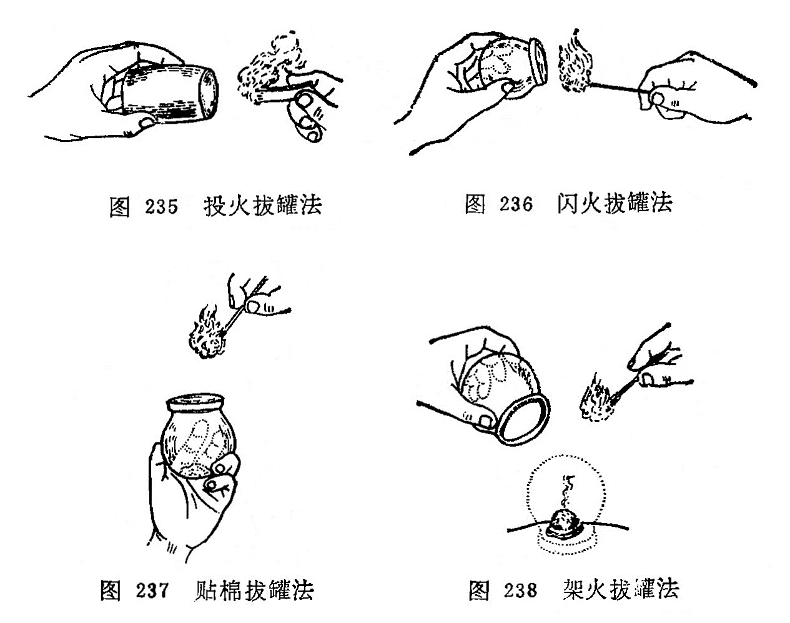
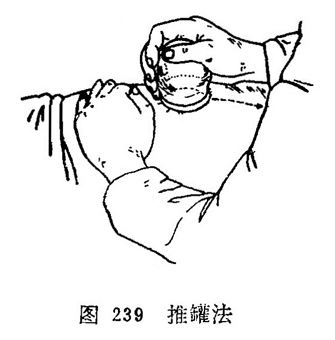

## 〔附〕拔罐法

拔罐法是以罐为工具，利用燃烧热力排除罐内空气，造成负压，使罐吸附于腧穴或应施术的部位，产生温热刺激并造成皮肤充血、瘀血现象的一种疗法。最早见于《肘后方》，以牛角制罐， 作外科吸脓血之用，故又称角法和吸筒法。随着医疗实践的不断发展，罐的质料大为改进，使用方法有所发展，治疗范围有所扩大，不仅用于外科，也用于内科的一部分病证。拔罐法常和针灸疗法配合使用，其作用与灸法有相似之处。

### 1.罐的种类：

罐的种类很多，临床常用的有以下几种：

(1)竹罐：用直径3〜5厘米坚固无损的竹子，制成6〜10厘米长的腰鼓形的圆筒，一端留节做底，另一端做罐口，打磨光滑平正。它的优点是取材容易，经济易制，轻巧，不易摔碎。缺点容易燥裂、漏气、吸附力不大。

（2）陶罐：是由陶土烧制而成，有大有小，罐口平正光滑，肚大而圆，口、底较小，其状如腰鼓。它的优点是吸着力大，缺点是质量易摔碎、损坏。

（3）玻璃罐：形如球状，罐口平滑而宽，有大、中、小三种 不同型号。它的优点是质地透明，使用时可以窥测罐内皮肤的充血、瘀血程度，便于随时掌握情况，缺点是容易摔碎、损坏。

（4）抽气罐：用青、链霉素药瓶，将瓶底切去磨平，切口须光洁，瓶口的橡皮塞须保留完整，便于拔气时用。近年已发展成电动抽气吸罐。

### 2.操作方法：

拔罐的操作方法分以下几种：

（1）火罐的操作法：用燃烧时火焰的热力排除罐内空气，使罐内呈负压，将罐吸着在皮肤上。有以下几种方法：

投火法：将小纸条点燃后、投入罐内，然后速将罐罩在施术部位（图235)。此法适用于侧面横拔，否则，会因燃烧物落下而烧伤皮肤。

闪火法：用镊子或止血钳子挟住酒精棉球，点燃后在火罐内壁中段绕1〜3圈后，迅速退出，然后将罐罩在施术部位（图236)。此法比较安全，不受体位限制，是较常用的拔罐方法。

贴棉法：用一平方厘米的棉花片，不要太厚，略浸95%酒精，贴在罐内壁的上、中段，以火柴点燃，罩在施术部位上(图237)。此法多用横位拔罐。

架火法：用2〜3平方厘米不易燃烧的块状物作支架，上置95%的酒锖棉球，点燃后把罐罩上。此法去罩罐要准确，不要碰掉燃烧的棉球，以防烧伤皮肤，适用用于平卧位（图238)。

（2）水罐操作方法：一般用于竹罐。先将竹罐放在锅内加水煮沸，用镊子倒挟竹罐的底端，甩去罐内的沸水，并用折迭的冷毛巾紧扪罐口。乘热按在施术部位，即能吸住。适用任何部位的拔罐。

### 3.各种拔罐法的运用：

（1）单罐：用于较小范围病变或压痛点。可按病变的或压痛的范围大小，选用适当口径的火罐。如胃病可在中院穴拔罐，岗上肌肌腱炎在肩髃穴处拔罐等。

（2）多罐：用于病变范围比较广泛的疾病。可按病变部位的解剖形态等情况，酌量吸拔数个乃至十数个。如某一肌束劳损时可按肌束的位置成行排列吸拔多个罐，称为排罐法。治疗某些内脏或器官的瘀血时，可按脏器的解剖部位的范围在相应的体表部位纵横并列吸拔几个罐子。

（3）闪罐：罐子拔上后，立即起下，如此反复多次地拔住起下，起下拔住，至皮肤潮红为止，多用于局部皮肤麻木、疼痛或功能减退等疾患，如面瘫等。

（4）留罐：拔罐后，留置一定的时间，一般留置5〜15分钟。罐大吸着力强的应当减少留罐时间，肌肤薄处留罐时间不宜过长，以免损伤皮肤。

（5）推罐：又称走罐、飞罐。一般用于面积较大、肌肉丰厚的部位，如腰背、大腿等。选用口径较大的罐子，罐口要求平滑，最好用玻璃罐，先在罐口涂一些滑润油脂将罐子吸上后，以双手握住罐底，即后边着力，前边略起来,慢慢向前推动，这样在皮肤表面上下或左右来回推拉移动数次，至皮肤潮红为度 （图239）。

（6）药罐：常用的药罐有两种：煮药罐：将配制成的药物装入布袋内，扎紧袋口，放入清水煮沸至适当浓度，再把竹罐投入药液内煮15分钟。使用时，按水罐法吸拔在应拔的部位上，多用于风湿痛等病。

常用药物处方：麻黄、蕲艾、羌活、活独、防风、秦艽、木瓜、川椒、生乌头、蔓陀罗花、刘寄奴、乳香、没药各6克。

贮药罐：在抽气罐内事先盛贮药液（约为罐子的2/3~1/2)。常用的药液为辣椒水、两面针酊、生姜汁、风湿酒等。然后按抽气 罐操作法，抽去空气，使罐吸在皮肤上。也有在玻璃罐内盛贮 1/3〜1/4的药液，然后用火罐法吸拔在皮肤上。常用于风湿痛，哮喘，咳嗽，感冒，溃疡病，慢性胃炎，消化不良，牛皮癣等。

（7）针罐：先在一定部位施行针刺，待达到一定的刺激量后，将针留在原处，并以针刺处为中心，拔上火罐。如果与药罐结合，称为针药罐，多用于风湿病。

（8）剌血（刺络）拔罐：用三棱针、粗毫针、皮肤针等，先按病变部位的大小和出血要求，按刺血法刺破出血，然后拔上火罐，可以加强刺血法的效果。适用各种急性、慢性软组织损伤， 神经性皮炎，皮肤瘙痒，丹毒，神经衰弱， 胃肠神经官能症等。

### 4.适应范围：

拔罐法有温经通络、祛湿逐寒、行气活血、消肿止痛的作用。临床多用于以下几个方面：

风湿痹痛：如肩痛、背痛、腰腿痛、落枕等。均可在痛处拔 罐。

胃肠疾病：胃痛，腹痛，呕吐，腹泻等。可在腹部及背部拔罐。

肺部疾病：如哮喘，咳嗽等。可在背部拔罐。

刺络拔罐：适用于急性扭伤有瘀血者，疮疡和部分皮肤病，如丹毒，神经性皮炎等。可在患处拔罐。

### 5.注意事项

（1）患者要取舒适体位，应根据不同部位，选择不同口径的火罐，注意选择肌肉丰满，富有弹性，没有毛发和骨骼凸凹的部位，防止罐脱落。

（2）皮肤有溃疡、过敏、水肿及大血管部位，不宜拔罐；孕妇的腹部和腰骶部，也不宜拔罐。

（3）有自发性出血和损伤后出血不止的患者，不宜使用拔罐法。

（4）起罐时手法要轻巧而缓慢，以一手抵住罐边皮肤，按压—下，使气漏入，罐子即能脱下，不可硬拉或旋动。

（5）拔火罐时应注意勿灼伤或烫伤皮肤。如出现烫伤、水泡，小的可不必处理，任其自然吸收；如水泡较大或皮肤有破损， 先用消毒针具刺破水泡，或用注射器抽出水液，然后涂龙胆紫 并以纱布包數，防止感染。

### 〔临床应用〕

拔罐法是一种物理疗法，是使罐内空气因热而膨胀逸出，当罐口紧贴皮肤时，罐内温度下降，空气稀薄而产生负压，吸力增强，皮肤因被吸吮而高起，毛细血管扩张，局部充血，通过机体 的调整功能。以疏通气血，宣泄风寒湿邪，从而直接改善局部状态，而达到治病目的。

拔罐应根据不同部位，选用大小合适的罐。应用投火法拔罐时，火焰须旺，动作要快，使罐口向上倾斜，避免火原落下烫伤皮肤。应用闪火法时，棉花棒蘸95%酒精不要过多，以防酒精滴 下烧伤皮肤。用贴棉法时，须防止燃着棉花脱下。用架火法时， 扣罩要准确，不要把燃着火架撞翻。用煮水罐时，应甩去罐中的沸水、以免烫伤病人的皮肤。

拔罐时，体位不要变动，防止罐脱落；经拔罐后，局部有瘀血未消退时，不要在原处拔罐。

复习思考題

1.什么叫拔罐疗法？常用的火罐有哪几种？

2.闪火法、投火法拔罐如何操作？

3.拔罐法的适应范围是什么？

4.试述拔罐法的注意事项。

5.拔罐疗法为什么能治病？
