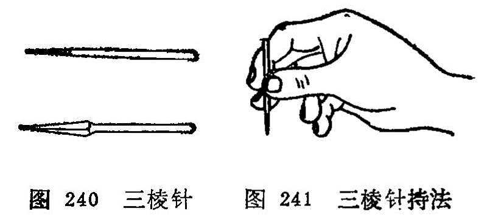

## 第一节三棱针

〔自学时数〕1学时

〔目的要求〕

掌握三棱针的操作方法，适应范围和注意事项。

三棱针是由古代九针中的锋针发展而来的，古称锋针。针长约2寸，是一种针柄粗而圆、针身呈三棱形、针尖锋利的针具 (图240)。一般应用于刺络放血。《素问•针解》说:“菀陈则除之者，出恶血也。”《灵枢•官针》也说：“络刺者，刺小络之血脉也。”络脉壅滞、血瘀不通的疾病，在人体特定部位的浅表血管， 放出少量血液，达到治疗目的。

### 一、操作方法

右手拇、食两指持住针柄，中指扶住针尖部，露出针尖1〜2分许，以控制针刺深浅度，针刺时左手捏住指（趾）部，或夹持、舒张皮肤，右手持三棱针针刺（图241)。常用的刺法有下列几种：

1.缓刺：适用于肘窝、胭窝浅静脉放血。如曲泽、委中等穴，先用橡皮带在应刺穴位上端束扎，医者用右手持三棱针对准穴位或静脉胬起处，刺入1〜2分，然后将针退出，待黑色血出尽变为红赤色，可将橡皮带解开，用消毒棉球揉按针孔。

2.点刺：又称速刺。适用于四肢末梢穴位或表浅静脉浅刺放血。用左手拇指、食指和中指捏紧应刺的部位或腧穴、右手持三棱针迅速刺入1〜2分，立即退针，然后用手挤压局部，使之出血。

3.挑刺：又称挑针疗法。适用于腧穴或反应点的挑刺。是以左手按压施术部位的两侧，使皮肤固定，右手持针，将腧穴或反应点的表皮挑破，深入皮内，将针身倾斜并轻轻地提起，挑断部分纤维组织，然后局部消毒，覆盖敷料。

4.散刺：又称围刺。适用于病灶周围，如癣、丹毒等。在病灶周围用三棱针由外向内点刺数针，然后用两手轻轻挤压或者用火罐吸拔，使恶血出尽，以消肿痛（图242)。

### 二、适用范围

三棱针是在放血泻络时使用，故有活血消肿，开窍泄热，通经活络的作用，适用实证和热证。现就临床常见病症及其放血部位介绍如表12。

表12.    常见病症放血部位表

| 病症     | 放血部位                    | 刺法       | 备注            |
| -------- | --------------------------- | ---------- | --------------- |
| 发热     | 大椎、十宣、委中、 曲泽     | 点刺       |                 |
| 中暑     | 水沟、十宣、委中            | 点刺       |                 |
| 吐泻     | 十二井、曲泽、委中          | 点刺       |                 |
| 中风闭症 | 十二井、水沟                | 点刺       |                 |
| 头痛     | 太阳、印堂                  | 点刺       |                 |
| 疟疾     | 大椎、陶道、后溪            | 点刺       |                 |
| 腰痛     | 委中                        | 缓刺       |                 |
| 热痹     | 委中、曲泽                  | 缓刺       |                 |
| 肢端麻木 | 十宣                        | 点刺       |                 |
| 丹毒     | 局部及周围、尺泽、 委中     | 散剌、缓刺 | 尺泽、 委中缓刺 |
| 风癣     | 耳后静脉、局部              | 点刺、散剌 | 局部散刺        |
| 酒皶鼻   | 素髎及两侧变赤处、尺泽      | 散剌、缓刺 | 尺泽缓刺        |
| 湿疹     | 委中                        | 缓刺       |                 |
| 痔疮     | 上唇内侧、及与上齿龈交界处  | 挑刺       | 挑粟粒样小疙瘩  |
| 急惊风   | 攒竹、水沟、十宣、 督脉沿线 | 点刺       |                 |
| 疳积     | 四缝                        | 点刺       |                 |
| 暴发火眼 | 耳尖                        | 点刺       |                 |
| 喉痹     | 少商、商阳                  | 点刺       |                 |
| 口疮     | 患处周围                    | 散剌       |                 |
| 发际疮   | 背部小红疙瘩、委中          | 点刺、缓刺 | 委中缓刺        |

### 三、注意事项

1.注意无菌操作，以防感染。

2.点刺放血时，宜轻、宣浅、宜快，出血不宜过多。勿刺伤深部动静脉。

3.气血两亏的虚证及常有自发性出血或损伤后出血不止的患者，不宜使用。

### 〔临床应用〕

使用三棱针进行治疗时，首先要对针刺部位进行严密消毒， 并要检查针具是否锋利，刺入1〜2分深，以出血为度。出血时不要按其针孔，任其血流，最初是紫色，待变鲜红色为度，一般不要超过10毫升。最后用干棉球揉按擦净针孔即可。根据不同病症可采用缓刺、点刺、挑刺、散刺等方法进行放血。

复习思考题

1.三棱针有几种操作方法？如何进行操作？

2.三棱针的适应范围是什么？

3.应用三棱针时应注意什么？ 
