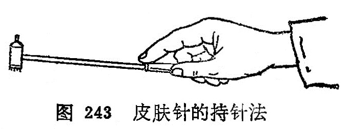

## 第二节皮肤针

〔自学时数〕1学时

〔目的要求〕

掌握皮肤针的操作方法，适应范围和注意事项

皮肤针又名梅花针、七星针、是用5或7枚不锈钢针，集束固定在针柄的一端而成，用它在一定部位皮肤上进行叩打，以疏通经络，调节脏腑之气，而治疗疾病。《灵枢•官针》：“半刺者， 浅内而疾发针，无针伤肉，如拔毛状。”“扬刺者，正内一，傍内四而浮之，以治寒气之博大者也。” “毛刺者，剌浮痹皮肤也。”皮肤针是半剌、扬刺、毛刺等针法的发展。

### 一、操作方法

针具和施术部位常规消毒，针具可在75%酒精中浸泡30分钟。用右手握针柄，以无名指、小指将针柄末端固定于小鱼际处，一般针柄末端露出手掌后2～3厘米，以拇、中二指夹持针 柄，食指置于针柄中段上面（图243)。用腕力进行弹刺，使针尖 垂直叩打在皮肤上，并立即弹起，反复进行。

叩刺分轻刺、重刺和中等刺激法三种：

轻刺激：叩刺时用力小，针尖接触皮肤时间越短越好，使局部皮肤潮红、充血即可。

重刺激：叩刺时用力稍大，针尖接触皮肤时间稍长，使叩刺的部位皮肤微出血为度。

中等刺激：叩刺时用力介于轻刺激，重刺激之间，使叩剌部位皮肤呈潮红，有丘疹，但不出血为度。

### 二、刺激部位

皮肤针的刺激部位比较广泛，大体可分为三类：

1.常规刺激部位：一般均以背部脊柱侧为主，并按不同疾病配用其他相应部位。

2.局部刺激部位：在病区及四周有关炎位进行叩刺，或环形叩刺。

3.重点刺激部位：在脊柱两侧异常反应点（敏感点、条索状物、结节等）进行反复重点叩刺。

### 三、适应范围

一般疾病均可应用。在临床多用于不寐，头痛，胸胁痛，班秃，高血压，神经性皮炎，近视，口眼㖞斜等。

1.不寐：重点叩刺脊柱两侧，心俞、肝俞及手少阴心经、手厥阴心包经。失眠，多梦，心悸加风池、三阴交穴或其附近的 敏感部位。

2.头痛、偏头痛：重点叩刺后项部、头部。头痛可取后头、 项部以及疼痛部位和远端有关经脉循行线上的敏感部位；偏头痛可取后项部，痛侧头部和有关经脉循行的敏感部位。

3 .胸痛、胁痛：重点叩刺第1～12胸椎两侧，特别是膈俞、 肝俞处。胸痛可按疼痛部位及其上下沿肋骨走行叩刺；胁痛除上述重点部位外，可配合支沟、太冲穴。

4.斑秃：重点叩刺后项、脱发区、腰、骶部、太渊、内关， 阳性物处。兼头痛、口干，心烦加刺胸椎8〜10两侧及风池。心悸多梦，失眠加刺胸椎5〜7两侧及神门、大椎。

5.高血压：重点叩刺后项部、腰骶部，以及阳性物处、风池、曲池、足三里。

6.神经性皮炎：重点叩刺后项部，骶部和患部、阳性物处。

7.近视：重点叩刺后项部、眼区、颞部。在叩打时可在太阳、攒竹、四白、风池多叩刺几针。

8.口眼㖞斜：重点叩刺颜面局部，以攒竹、瞳子髎  、地仓、颊车部为主，并配合合谷或敏感点。

9.痛经：重点叩刺腰骶两侧和任脉、肾经循行位。重点叩刺气海、关元，配合用肝俞、三阴交。

10.瘰疬：重点叩刺部位为第5〜10胸椎两侧，并配合在瘰疬周围重刺。

### 四、注意事项

1.针尖要平齐、无钩，叩刺时针尖必须垂直而下、以减少疼痛。针柄与针头联结处必须牢固，以防叩刺时滑动。

2.针具及叩刺部位的皮肤应消毒，叩刺后的局部皮肤，如有出血者，应进行清洁及消毒，以防感染。

3.局部皮肤有外伤及溃疡者，不宜使用皮肤针叩刺。

4.应用皮肤针治疗时，出现晕针现象，处理同体针。

### 〔临床应用〕

皮肤针治疗疾病，虽然不限于腧穴，也不是单纯“以痛为腧”。 而是祖国医学整体观作为理论依据的。《素问•皮部论》指出：“凡十二经络脉者，皮之部也。是故百病之始生也，必先于皮毛。”说明十二皮部同十二经脉、十二脏腑有密切关系。应用皮肤针叩击皮部，可疏通经络脏腑之气，从而起到调整机体的作用。

皮肤针在操作时，持针不要过紧或过松，如果握针太紧会使腕关节肌肉紧张，影响操作；如果握针太松，会使针身左右摆动， 造成疼痛或出血。叩打皮肤针时速度要均匀，防止快慢不一，用力不匀地乱刺。针尖起落要垂真，即将针垂直刺下，垂直提起，如此反复操作。针刺部位要准确，按预定应刺部位下针，针与针之间的距离要相等，一般针距在1～1.5厘米左右。

叩刺的部位：脊柱两侧，由上而下，左右各打三行，椎体叩剌棘突间；头部呈网状叩刺；胸部沿肋缘叩刺；腹部按“井”字叩刺；四肢按三阴三阳经脉进行叩刺；各关节、口、眼、耳按耳环形叩刺。

叩刺的强度，要根据患者体质、年龄、病情以及叩击部位的不同，而分为轻刺激、中刺激、重刺激三种强度，临床时选择应用。

复匀思考题

1.皮肤针如何操作？能治疗哪些疾病？

2.使用皮肤针治病时应注意什么？

3.皮肤针为什么能治病？

4.皮肤针的刺激部位大体可分几类？
