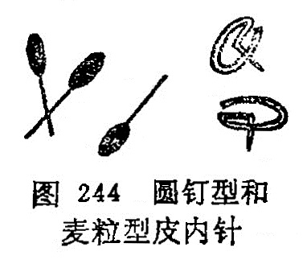

## 第三节皮内针

〔自学时数〕1学时

〔目的要求〕

掌握皮内针的操作方法，适应范围和注意事项。

皮内针是以特制的小型针具固定腧穴的皮下或皮内，进行时间较长埋藏，达到防治疾病一种方法。

### 一、皮内针具

皮内针是用30～32号不锈钢丝制成图钉型和麦粒型两种不同形状的针具(图224)。由于较长时间留针，所以又称埋针。

1.图钉型皮内针：又称掀针型皮内针。针身长约0.2〜0.3厘米，针柄呈环形，针身与针柄呈垂直状。

2.麦粒型皮内针：又称颗粒型皮内针。一般针身长约1〜1.5厘米，针柄形似麦粒，针身与针柄呈一直线。

### 二、操作方法

1.图钉型皮内针：多用于面部和耳部腧穴埋针。局部常规消毒后，用小镊子夹住针柄，针尖对准选定的腧穴，轻轻垂直刺入，使环状的针柄平整的留在皮肤上，然后以小方形胶布贴敷固定。

2.麦粒型皮内针：可用于人体大部分腧穴。用左手拇、食二指按压腧穴的上下皮肤，固定穴位，右手用小镊子夹住针柄， 对准穴位沿皮刺入0.5〜1.0厘米左右，针柄留于皮肤外，用胶布将留于皮肤外的针身和针柄固定，再用较大的方形胶布把埋入皮肤内的针身和皮肤外部分覆盖上，以防止针具因活动而退出和汗水浸入针孔，发生感染。

埋针时间的长短，要根据病情而定。一般以2〜3天为宜，秋冬季节可埋6〜7天，暑热天埋针不宜超过2天，以防止感染。埋针期间，每隔4小时左右，用手按压埋针处1〜2分钟，以加强剌激，增强疗效。

### 三、适应范围

埋针多用于顽固性疼痛疾病，久治不愈的慢性病症。如头痛胃脘痛，胆结石，胆绞痛，哮喘，不寐，高血压，面肌痉挛，遗尿，月经不调，痛经，痹症等。

### 四、注意事项

1.不要在关节处埋针，以免活动时产生疼痛或折针。

2.皮肤有化脓性炎症或破溃处，不宜埋针。

3.埋针期间，注意清洁，避免针孔处着水。暑热天出汗较多，埋针时间不宜过长，以防感染。

4.埋针后，患者感觉疼痛，或防碍肢体活动时，应将针取，重新埋置。

### 〔临床应用〕

皮内针是从九针中的毫针演变而成，本于《素问•离合真邪论》：“静以久留”的刺法。选穴时，一定要选择易固定而又不妨碍肢体活动的部位，更不应该在关节部位埋针。用胶布固定时，一定要用小块胶布固定针柄，再用适当的大块胶布固定埋针部位，以防针具因活动而退出。若进针时，皮下出血，该处就不宜留针，防止因针继续刺激该处，造成出血不止或血肿。埋针时或埋针后患者出现疼痛，或防碍肢体活动时，应将针改变针刺方向重埋或另选其它腧穴再埋。

复习思考题

1.皮内针有几种？如何操作？

2.皮内针的适应范围是什么？

3.应用皮内针时应注意什么？
