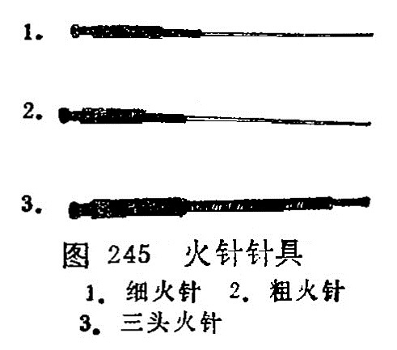

## 第四节　火针

〔自学时数〕1学时

〔目的要求〕

掌握火针的操作方法，适应范围和注意事项。

火针是用特制的粗针，烧红后刺入一定部位或腧穴以治疗疾病的一种方法。《灵枢•官针》说：“焠刺者，刺燔针取痹也。”明•吴鹤皋说：“焠针者，用火先赤其针而后刺，此治寒痹之在骨也”。《千金方》说：“外疖痈疽，针惟令极熟。”火针不但能治疗痹证及疮疖，痈疽，也可治疗各科中的一些病症。

### 一、针具

火针的针体较粗，多用不锈钢制成。针柄多用竹或骨质包裹，以避免烫手。也有应用特制的针具，如弹簧式火针、三头火针以及用钨合金所制的火针等。弹簧式火针进针迅速并易于掌握针刺深度，三头火针常用于对体表痣、疣的治疗（图245）。钨合金制成的火针，在炽热时弹性好，便于临床应用。

### 二、操作方法

1.选穴与消毒：火针选穴与毫针选穴的基本规律相同，根据病症不同而辨证取穴。先用碘酒消毒局部，后用酒精棉球脱碘。

2.烧针方法：《针灸大成•火针》说：“灯上烧，令通红，用方有功。若不红，不能去病，反损于人。”目前临床多用酒精灯烧针、必须把针烧红，才能使用。近年电火针也有应用。

3.针刺与深度：针刺时，用烧红的针具，迅速刺入选定穴位内，即迅速拔出。关于针刺的深度要根据病情、体质、年龄和针刺部位而定。四肢、腰腹针刺稍深，可刺2〜5分；胸背部穴位针刺宜浅，可刺1〜2分。外科疾患如痈疽、瘰疬、血丝虫病象皮腿等可深刺些，风湿痛、顽癣、肌肤冷麻等可浅刺些，顽癣亦可用三头火针浅刺。

### 三、适应范围

火针具有温经通络，祛风散寒，化腐软坚的作用。主要用痹证，胃下垂，胃脘痛，泄泻 ，阳萎，瘰疬，风疹，月经不调，痛经，小儿疳积，顽癣，肌鞘囊肿， 血丝虫病象皮腿，痈疽，扁平疣，痣等。

### 四、注意事项

1.使用火针时，必须细心慎重，动作敏捷、准确。

2.使用火针时要避开血管、肌腱、神经干及内脏器官。面部除治疣和痣外，不用火针。

3.火针刺激强烈，体质虚弱者及孕妇慎用或不用。

4.发热的病症，不宜用火针治疗。

5.施行火针后，要保护针孔，不能搔抓和洗浴，以防感染。深刺后，要用消毒纱布敷贴，用胶布固定1〜2天，以保护针孔， 防止感染。

〔临床应用〕

应用火针治疗疾病时，手法一定要熟练，动作要敏捷，准确掌握进针的深度、角度、方向，才能达到应刺的深度和部位。一般针具的针身长3〜4寸，也有1〜1.5寸的，直径为0.5〜1毫米，针柄一般用竹子或骨质制成，可免烫手。治疗顽癣时，可用三头火针，针刺要浅，针距要均匀而疏松，可免发生刺脱皮肤等。

复习思考题

1.火针操作有几种方法？如何应用？

2.火针的适应范围是什么？

3.应用火针治疗时应注意什么？
