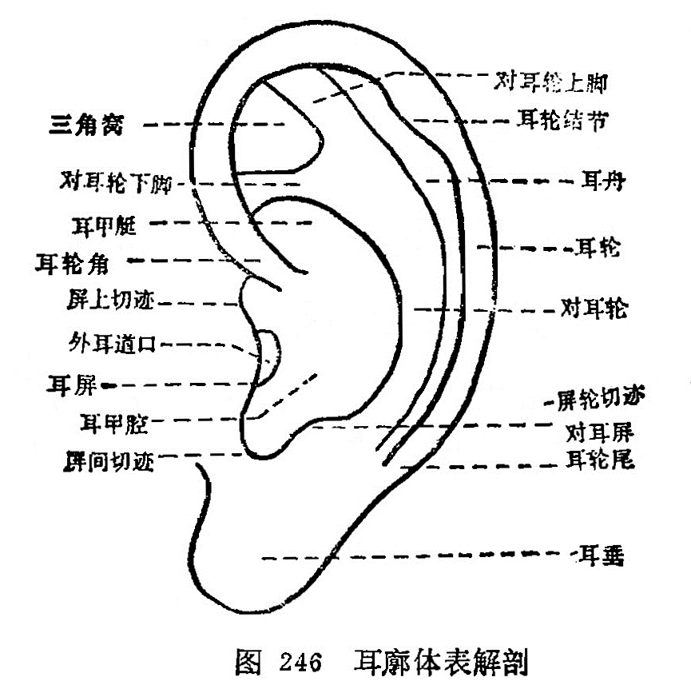

### 一、耳廓表面解剖

耳廓主要是由弹性纤维软骨、软骨膜、韧带及覃盖在最外层 的皮下组织和皮肤所构成。在皮下有丰富的神经、血管和淋巴分布。耳廓分前面和背后，耳廓前面为凹面，耳廓后面为凸面。其耳廓表面解剖如下:

1.耳轮：耳廓最外圈的卷曲部分。

2.耳轮脚：耳轮深入到耳腔内的横行突起部分。

3.耳轮结节：耳轮后上方稍突起处。

4.耳轮尾：耳轮末端与耳垂的交界处。

5.对耳轮：在耳轮的内侧，与耳轮相对的隆起部，其上方有两分叉，向上分叉的一支称对耳轮上脚，向下分叉的一支称对耳轮下脚。

6.三角窝：对耳轮上脚、下脚之间的三角形凹窝。

7.耳舟：耳轮与对耳轮之间的凹沟，又称舟状窝，

8.耳屏：耳廓前面的瓣状突起，又称为耳珠。

9.屏上切迹：耳屏上缘与耳轮脚之间的凹陷。

10.对耳屏：对耳轮下方与耳屏相对的隆起部。

11.屏间切迹：耳屏与对耳屏之间的凹陷。

12.屏轮切迹：对耳屏与对耳轮之间的稍凹陷处。

13.耳垂：耳廓下部无软骨之皮垂。

14.耳甲艇：耳轮脚以上的耳腔部分，又称耳甲窝。

15.耳甲腔：耳轮脚以下的耳腔部分。

16.外耳道开口：在耳甲腔内，为耳屏所遮盖着的孔窍（图246）。

