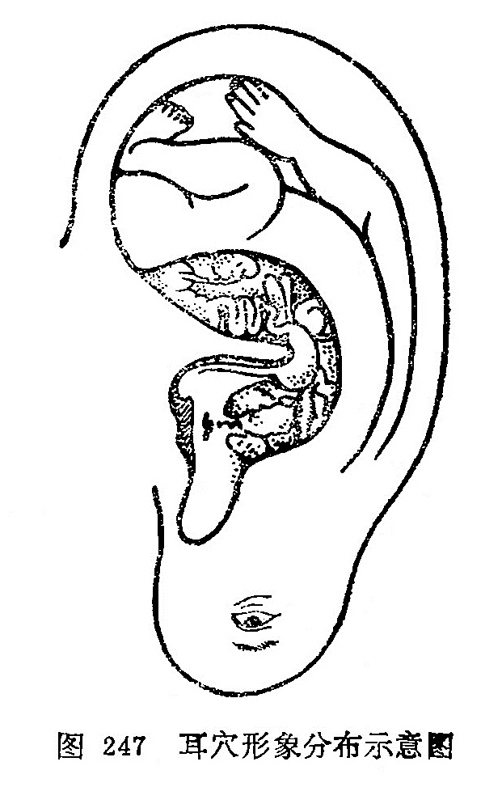

### 三、耳穴的分布

当人体的脏腑或躯体有病时，往往会在耳部的一定部位出现某些病理反应，如压痛、导电性能改变、变形、变色、结节、脱屑等。针刺这些部位时可以防治疾病，这些部位就是耳穴。

耳穴在耳廓的分布有一定的规律，与身体各部相应的穴位在耳廓的分布象一个倒置的胎儿。一般来说，与头面相应的穴位在耳垂；与上肢相应的穴位在耳舟；与躯干和下肢相应的穴位在对耳轮及对耳轮上、下脚；与内脏相应的穴位多集中在耳甲艇和耳甲腔，其分布如图247。

