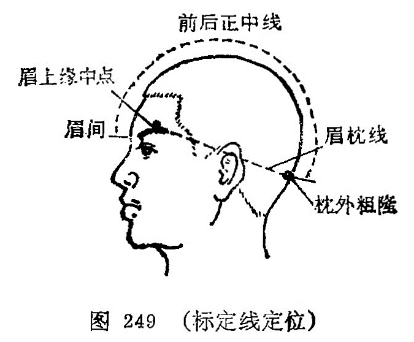
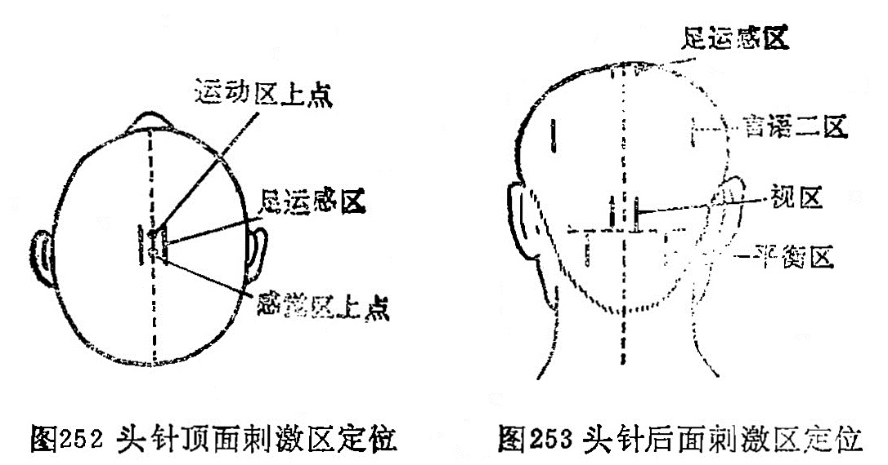
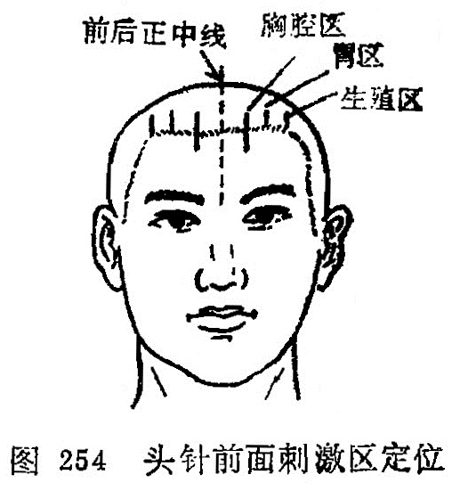
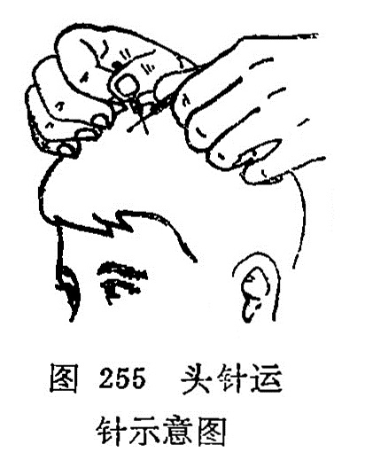

## 第八节头针

〔自学时数〕2学时

〔目的要求〕

掌握头针的操作方法及注意事项。

根据祖国医学“头为诸阳之会”， “诸经皆归于脑”，以及手、足三阳经都会于巅顶的理论，针刺头部腧穴可起通经活络、调节经气的作用。头针是针刺与现代医学大脑皮层的功能定位理论相结合的一种疗法。

### 一、刺激区的定位和主治作用

为了便于刺激区的定位，在头部设有两条标准定位线。

前后正中线：是从两眉间中点至枕外粗隆尖端下缘经过头顶正中的连线（图249）。

眉枕线：是从眉中点上缘和枕外粗隆尖端的头侧面连线（图249)。

（一）运动区（图250)

定位：上点在前后正中线中点往后0.5厘米处，下点在眉枕线和鬓角发际前缘相交处。如果鬓角不明显，可以从颧弓中点向上引垂直线，此线与眉枕线交叉处向前移0.5厘米为运动区下点。上下两点连线即为运动区。运动区又可分为上、中、下三部。

1.上部：是运动区的上1/5，为下肢、躯干运动区。

2.中部：是运动区的中2/5，为上肢运动区。

下部：是运动区的下2/5，为面运动区（语言一区）。

主治：

1.上部：对侧下肢、躯干部瘫痪。

2.中部：对侧上肢瘫痪。

3.下部：对侧中枢性面神经瘫痪，运动性失语（部分或完全丧失语言能力，但基本保持理解语言的能力），流涎，发音障碍。

（二）感觉区（图250）

定位：在运动区向后移1.5厘米的平行线，即是感觉区。感觉区可分为上、中、下三部。

1.上部：是感觉区的上1/5，为下肢、头、躯干感觉区。

2.中部：是感觉区的中2/5，为上肢感觉区。

3.下部：是感觉区的下2/5，为面部感觉区。

主治：

1.上部：对侧腰腿痛、麻木、感觉异常，后头、颈项部疼痛，头晕，耳鸣。

2.中部：对侧上肢疼痛、麻木、感觉异常等。

3.下部：对侧面部麻木、偏头痛、颞合关节炎等。

（三）舞蹈震颤控制区（图251）

定位：在运动区向前移，1.5厘米的平行线。

主治：舞蹈病，震颤麻痹，震颤麻痹综合征。

（四）晕听区（图251）

定位：从耳尖直上1. 5厘米处、向前及向后各引2厘米的水平线。

主治：眩晕，耳鸣，听力下降。

（五）言语二区（图251）

定位：从顶骨结节后下方2厘米处引一平行于前后正中线的直线，向下取3厘米长直线。

主治：命名性失语（又称健忘性失语，病人称呼“名称”能力障碍，如病人不会叫“椅”，只说是“坐的”；其他人叫椅时，他能听懂)。

（六）言语三区（图251）

定位：晕听区中点向后引4厘米长的水平线。

主治：磁觉性失语（病人理解言语能力障碍，常答非所问）。

（七）运用区（图251）

定位：从顶骨结节起分别引一垂线和与该线夹角为40度的前后两线，长度均为3厘米。

主治：失用症（又称运动不能症，患者肌力、肌张力及基本运动正常，但存在技巧能力障碍）。

（八）足运感区（图252）

定位：在前后正中线的中点旁开左右各1厘米，向后引3厘米长，平行于正中线。

主治：对侧下肢瘫痪、疼痛、麻木，急性腰扭伤，夜尿，皮层性多尿；子宫下垂等。

（九）视区（图253）

定位：在前后正中线的后点旁开1厘米处的枕外粗隆水平线上，向上引平行于前后正中线的4厘米长的直线。

主治：皮层性视力障碍。

（十）平衡区（图253)

定位：在前后正中线的后点旁开3.5厘米处的枕外粗隆水平线上，向下引平行于前后正中线的4厘米长直线。

主治：小脑疾病引起的共济失调，平衡障碍，头晕，脑干功能障碍引起的肢休麻木瘫痪等。

(十—)胃区（图254）

定位：从瞳孔直上发际处为起点，向上引平行于前后正中线2厘米长直线。

主治：胃炎、胃溃疡等引起的胃痛，上腹部不适等。

（十二）胸腔区（图254）
定位：在胃区与前后正中线之间，发际上下各引2厘米长直线。

主治：支气管哮喘，胸部不适，胸痛，胸闷，心悸，冠状动脉供血不足等。

（十三）生殖区（图254）

定位：从额角处向上引平行于前后正中线的2厘米长直线。

 主治：功能性子宫出血，盆腔炎，子宫脱垂，白带多等。

 选穴方法：单侧肢体疾病，选用对侧刺激区；两侧肢体疾病，选用双侧刺激区；内脏全身疾病或不易区别左右的疾病，可双侧取穴。一般根据疾病选用相应的刺激区，并可选用有关刺激区配合治疗。

### 二、操作方法

1.体位：明确诊断，选定刺激区让患者采取坐位或卧位，以医者操作方便，有利于捻针为准。分开头发，常规消毒。

2.针具：选择26〜28号、长1.5〜2. 5寸长的不锈钢毫针。

3.进针：针与头皮呈30度左右夹角，用夹持进针法将针刺 入帽状腱膜下，或者是刺入皮下或肌层，达到该区的长度，然后、运针。

4.运针：头针的运针只捻转不提插。医者肩、肘、瞬关节、 拇指固定，食指半屈曲状，用拇指第一节的掌侧面与食指第一节的桡侧面捏住针柄，然后以食指指掌关节不断曲伸，使针体回来快速旋转200次/分左右，每次左右旋转各两转左右。捻转持续约0.5〜1分钟，然后留针5〜10分钟，捻转两次，即可出针。捻转时或留针时，家属协助患者（或患者自己）活动肢体，加强患肢功能锻炼，有助于提高疗效。一般3〜5分钟刺激后，部分患者在病变部位（患肢或内脏，个别患者在健侧）会出现热、麻、胀、凉、抽动等感应，这样疗效较好。也可用电针代替手捻进行治疗（图255)。

5.出针：出针时要用消毒干棉球压迫针孔，以防出血。如有出血或皮下血肿，应轻度压迫按摩，血肿可自行吸收，无需特殊处理。

6.疗程：每日或隔日1次，一般10〜15次为一疗程。体息 5〜7天，再作下一疗程的治疗。

### 三、适应范围

头针主要适用于脑源性疾患，如瘫痪、麻木、失语、眩晕、 耳鸣、舞蹈病等。此外，也可治疗腰腿痛、夜尿、三叉神经痛， 肩周炎、各种神经痛等。头针在治疗的基础上又创造了头针麻醉。 已经应用于外科的多种手术。

### 四、注意事项

1.对脑溢血患者，要待病情及血压稳定方可进行头针治疗。

2.凡患者并发有高热、心力衰竭等，不宜立即采用头针治疗。

3.头部长有头发，因此必须做到严密消毒，以防感染。

4.由于头针刺激较强，刺激时间较长，医者要注意观察患者表情，以防晕针。

5.头皮血管丰富，容易出血，起针时要用消毒干棉球压迫针孔，以防出血。

### 〔临床应用〕

头针重点要掌握各刺激区的位置、主治和操作方法。采用头针治病时，在治疗前必须有明确的定位诊断，为选刺激区提供依据，否则就不能收到良好的效果。而刺激区要按规定的方法选取， 这就应注意前发际、鬓角是否清楚，如果有脱发，鬓角和前发际不清，取刺激区就有困难。如鬓角不清，运动区的下点就无法确定，这时就要找解剖标志，可从颧骨弓中点向上引垂线，此线与眉枕线的交叉点向前移0.5厘米处就是运动区的下点；如果前发际不清，取胸腔区、胃区、生殖区就有困难，所以前发际不清者就可以在两眉之间的中点向上量5厘米处为一点，引垂直前后正中线的一条直线，即为前发际。在刺激区的主治中提到的运动性失语，是指患者部分或完全丧失言语能力，但基本保留着理解言 语的能力；命名性失语是指病人称呼“名称”能力障碍，如病人不会叫“铅笔”，而只能说是“写字用的”，别人说铅笔时他也懂得；感觉性失语，是指患者理解语真能力障碍，往往答非所问。失用症又称“运用不能症”，患者肌力、肌张力及基本运动正常，但存在技巧能力障碍，如患者不能解扣、不能写字等。

头针操作，捻针是很重要的一环。在捻针时要求固定、快速， 持续捻转。

头针刺激这有的比较长，一根针很难贯通。可将刺激分成几份，每份针刺一针。如运动区就分成三份，运动区上1/5针刺一针 ，中2/5针剌一针，下2/5针刺一针。

复习思考题？

1.什么叫头针疗法？它的主要适应证是什么？

2.试述头针的操作方法。

3.运动区、感觉区、足运感区、平衡区、晕听区的定位和主治？
