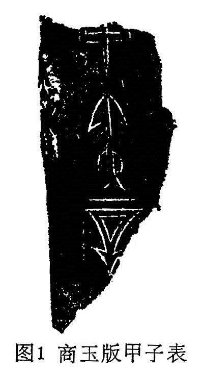

# 第一章　绪论

中医文献学，就是中医文献研究整理的方法学。先谈谈什么是文献？文献一词，随着时代的不同，它的涵义也有所变化。最初它包括文章、贤才。《论语·八佾》记载：“子曰：夏礼吾能言之，杞不足徵也；殷礼吾能言之，宋不足徵也；文献不足故也。”孔子所谓的“文献”涵义，据汉·郑玄注说，“文”指文章，“献”指贤才。

梁·刘勰《文心雕龙·情采》说：“圣贤书辞，总称文章”。清·王先谦《汉书·卜式传》补注引何焯说，“文章，谓文物典章，稽古以立文垂训者也。”据刘、何的说法，凡是前贤的文字纪录，如著作、图书亦即文字纪录的“载体”，即所谓“文物”都叫做文章。何焯对文章的定义，颇有科学性，1977年国际图联制定的《国际标准书目著录（总则）》对于“文献”（item）—词的定义，原则上也未越出何氏定义的藩篱。古人说“文以载道”，道即是知识、信息。故文献，古也称载籍。

“文”和“物”总是密切联系在一起的。在古代未发明造纸以前，文字的记录常常刻划或书写在甲、骨、金、玉、石、陶、竹、木、帛等载体上。比如刻在龟甲兽骨上的，就叫做甲骨文。刻或铸在金属器上的，叫做金文。刻在玉石上，叫做石文。写在竹片上，叫做竹简。写在木片上，叫做木牍。刻烧在陶器上，叫做陶文。写在缣帛上，叫做帛书。金文和石文，又合称金石文：竹简和木牍，亦合称简牍。在先秦，尤其是在商周时代，大量流行青铜器。这些青铜器包括生活饮食用具、装饰品以及祭祀、宴会、典礼时使用的“礼器”。因此，在钟鼎上的金文，也称钟鼎文；在礼器上的金文，也称吉金文。这些青铜器，不仅是考察历史文化、礼法制度的实物，也是获得文字资料的载体，如毛公鼎有四百九十二个字的铭文，这在商周时代已是洋洋大观的文章了。再如战国时代的“行气玉”，上面刻了四十五个字的《行气铭》，虽然文字简略，但是文简意赅、言近意远，基本上把行气，即现在所谓的气功要领都说了。如《素问》有“玉版论要篇”，並说“著之玉版，命曰《玉机》”，《玉机》就是指刻在玉版上的一篇石文著作。殷墟出土过玉版甲子表残版，仅庚寅辛二个半字，见图1（引自《文物》1978年第二期）。

在孔子时代“文献”的涵义还包括活资料即贤才。所谓贤才，就是有知识、有学问的学者。古代文字记录工具手段落后，故多事繁而文简。远古未发明文字，自然一些名物史事、知识传递，要靠口传面授，世代师承，相继不绝。时至商周，才有文字的记录，帝王还设有史官，汉·班固《汉书·艺文志》说：“古之王者，世有史官，左史记言，右史记事，事为《春秋》，言为《尚书》。”尽管如此，由于记录工具手段的落后，文化不能普及等种种原因，大大限制了文字资料的信息容量和知识传递的功能，一些当世学者的口传面授活资料，就成为对文字资料必不可少的补充。

在我国发明造纸和印刷术以后，大量流传的是以图书形式的著作与文件。先秦时期使用的一些文字载体，有的已经淘汰，如甲骨。有的如简牍，在东汉后期已渐绝迹。其他如金、石、陶等等还在使用，不过已经不是主流了，只有在特定的目的、场合才使用，如墓誌铭、碑文、工艺品等等。

元·马端临在《文献通考》序中说：“凡叙事，则本之《经》《史》，而参之以历代《会要》，以及百家传记之书，信而有证者从之，乖异传疑者不录，所谓文也；凡论事，则先取当时臣僚之奏疏，次及近代诸儒之评论，以至名流之燕谈，稗官之记录，凡一话一言，可以订典故之得失，证史传之是非者，则采而录之，所谓献也。”马氏对“文献”的定义冗杂而不全面，虽谈到“诸儒”、“名流”、“一话一言”等，实质上都是纸书上的文字记录资料，已经不是孔子所说的“文献”含义了。

现代科学发达，事物、知识与信息的储存、记录、传递，已不止是用纸作为载体，而且发展到摄影、录像、录音和电脑储存。因此，现代“文献”的涵义，已包括缩微胶卷、缩微平片、录音带、唱片、录像带、电影片、幻灯片、磁带软件等。《美国资讯科学协会杂志》将“文献”的涵义归结为“历史上所形成的、以各种方式记载的人类科学文化知识的各种物质载体”。1977年国际图联制定的《国际标准书目著录（总则）》对“文献”的定义明确“是指任何实体形式出现的文献”。我国近年颁布的国家标准《GB3792.1—83文献著录总则》，对“文献”的定义为：“记录有知识的一切载体。”这样，“文献”一词的涵义，就把古今各种形式的科学文化作品都包括进去了。

根据我国历史情况与中医文献的实际特点，我们可以把它划分为古代文献、近代文献、现代文献。古代文献又可分为三个阶段：

1.从上古至东汉：这一阶段的著作，文字复杂，内容深奥，语言简朴，距离我们现在的文字语言习惯很远。所用文字语言，不经专家释译。一般人很难读懂。从载体形式看，除后代传抄、刊印（绝大多数，文字已经楷化）外，还存在少部分保存下来的实物，如甲骨文、金文、简牍、帛书等，像长沙马王堆出土的医学竹简、帛书《五十二病方》、《阴阳十一脉灸经》，以及武威出土的《汉代医简》等，即属于此类。

2.从魏晋至隋唐：这一阶段的著作，文字已为通行的楷书，然尚保留若干古字。在内容上，虽然不像汉以前那样难懂，但仍是去古未远，言简意赅，并以文言文撰写。从载体形式看，这期间尚未发明刻版印刷（只有少量佛经、日历书），著作皆以纸卷书写传世，即所谓“卷子本”。现在尚保留下来许多卷子本实物，如敦煌石窟发现的《神农本草经集注》、《新修本草》、《五脏论》以及日本人的中医著作《医心方》等等，即属于此类。唐以后，即发明印刷术以后，也有大量手写的医籍传世，我们通常不把这些称作“卷子本”，而称作抄本、写本或稿本等。

3.从宋至清：这一阶段的著作，文字已非常接近现代，内容仍多以文言文书写，但已不如隋唐以前那样艰深难懂。尤其是清代，还出现了少量白话文的著作，如《蠢子医》、《医学白话》等。但毕竟以文言文居多，虽不太艰深难懂，终究与现代语言还有相当的距离。如果没有一定的古汉语基础，阅读起来还是困难很多的。从载体形式上看，这一阶段主要以刊刻印刷流传。以上这些，都和现代文献截然不同。

文献，为什么说还要研究、并且逐渐成为一门学科呢？

不言而喻，凡是要学习、研究某一门学问，总是要继承前人的经验、前人的成就。前人的经验、成就、知识，大量地是通过文献来进行信息传递的，因而总是要接触文献、要读书。譬如要学好中医、研究中医，不阅读相当的中医文献，不掌握丰富的中医知识，无疑是难以成为一名出色的中医学家，不能做出卓越的成就。宋·史崧《灵枢·序》说：“医者，在读医书耳。读而不能为医者有矣，未有不读而能为医者也。不读医书，又非世医，杀人尤毒于梃刃！”这话基本上是对的。试看历来一代名医，都是既有丰富的实践经验，又是博览群籍，具有扎实的、丰富的理论知识素养。

但是读书，尤其是会读书、善读书，读通、读懂、读精，谈何容易！且不说我国文史哲的图书浩如烟海，单就中医图书而言，也是汗牛充栋。现存的中医文献，粗略统计不下六、七千种。数以几万卷。如果不懂得文献知识、治学的门径、读书的方法，你简直不知从何入手、从何读起，徒然望洋兴叹，更不要说读通、读精。即或是勉强随便拿书就读，有可能是瞎读、乱读，产生弊病多端，甚至误入歧途。例如：

你不懂得目录学知识，你就不能分别部类、辨彰学术、考镜源流、晓其师承、究其得失，也难以借助指引，从而迅速检索到你所需要的文献资料。

不懂得版本学知识，就不知道选择善本。随便拿来一本坊刊俗刻去读，有可能书中脱衍错简，不一而足。因而以讹传讹，误己误人，欲获其益。反受其害。

不懂得校勘学的知识，则不知如何订夺衍、正讹误、决异同、存疑义，以及诸多的文献整理方法。

不懂得音韵训诂学的知识，则不能识字辨句，通理达义，或者误解误读，指桃为李。

以上只是举其大端，这些都是读好书的必备知识。当然，阅读现代的中医文献，並不一定需要上述所有的知识。可是，做为一名合格的中医，必读的中医原著，绝大多数恰恰都是古代文献。

按照以上所说的，所谓文献学，是否就等于目录学、版本学、校勘学、训诂学等等学科的综合呢？当然不是。文献学不可能统括这些学科、代替这些学科，它只是运用並不断吸收这些学科的新成果，用以指导读书和治学。

关于文献学的创始与发展历史，以及它的研究内容、领域，还有待深入地探讨。我认为中国文献学肇源已久，西汉·刘向、刘歆父子堪称文献学的奠基人。对于刘氏父子的学业，后世学者意见尚未完全一致。目录学家以为他是目录学的鼻祖；版本学家以为他开版本学之先河；校勘学家以为他是校勘学的圭臬；也有专家以为古代之校讐，兼赅目录、版本诸学。实则，文献之研究，法有程序，事有次第，目录版本、校勘训诂、辨伪辑佚、叙源析流，不同阶段，各有其用，时须交互考证，方能事半功倍而学有所成。后世学者，多难俱精，而刘氏父子则博大精深，目录版本、校勘训诂，俱称绝学。说他们是某一方面的专家，皆无可无不可。刘氏父子对于文献研究的各个方面，全都接触到了。清·孙德谦《刘向校讐学纂微》总结了刘氏父子之学，列举了二十三项内容：

“备众本，一也；订脱误，二也；删重复，三也；条篇目，四也；定书名，五也；谨编次，六也；析内外，七也；待刊改，八也；分部类，九也；辨异同，十也；通学术，十一也；叙源流，十二也；究得失，十三也；撮旨义，十四也；撰序录，十五也；述疑似，十六也；准经义，十七也；征史传，十八也；闢旧说，十九也；增佚文，二十也；考师承，二十一也；纪图卷，二十二也；存别义，二十三也。”我们把以上这些研究内容与领域，概括为文献学，最为得体。以上这些内容，后世研究愈精愈细，不断发展，有些已分化各为专门，渐成学科。这是历史发展的必然趋势，因为历史越久，文献的数量越多、载体的形式也日益复杂，所要研究的问题与内容，自然也就日益繁多。现在，欲以一人之力精通目录版本、校勘训诂等各个学科，自非易事，文献学也就应运而生。文献学与目录学、版本学、校勘学、训诂学、音韵学等等，既有不可分割的联系，又有区别。它不研究各有关学科的自身，而是综合各有关学科的成果，以达应用的目的。

中医文献学是一般文献学的一个分支，一般文献学的理论、方法和原则，基本上都适用于中医文献学。由于研究的层次与对象不同，中医文献学有它自己的规律和特色。

1.中医有数千年的历史，其文献之多，为其他古代自然科学之最。一般文献学，大都详于文史而略于艺术。至于医药方技，大者不过举其部类，细者不过列其纲目，不可能针对中医文献，事无巨细论述无遗。这样，一般文献学就不能适应中医药科技人员的实际的需要。

2.专业不同，文理自异。大量中医文献，非专门从事研究，难以恰到好处。医籍之中，不仅学理与文史不同，其中古字古义、故事名物，亦多与文史有异。因而，对于中医文献的问题，若要决疑义、别异同、辨章学术、考镜源流，非精于文而又深于医者莫能善其事。故古代校理医籍，多委以专业人才，如汉初命侍医李柱国校方技，宋代命名医孙用和之子孙兆、孙奇校正医书，明初令朱丹溪弟子赵道震，董事《永乐大典》运气书的编修等。中医文献学的创设，不仅是专业学术发展的必需，也是一般文献学所不可代替并不断分化的必然结果。

3.中医文献，不同于文史哲，也不同于西医文献。中医有自己一套理论体系、学科内容、发展历史、文章特点。著述语言、部类分合。学科如针灸、角法、导引、养生、大方脉等；图书如医经、杂著、医话、笔记以及歌赋口诀等，並是西医所无，西医文献更不存在什么版本、训诂、辨伪、辑佚种种问题。

4.中医文献学以及上面我们提到的一般传统文献学，和现代所谓的文献（Documentation或Information，亦译情报、资讯）学不同。现代文献学则注重文献的管理储存、著录检索。信息传递、情报收集等等，比较刘向父子所研究与追求的内容，也即中国传统文献学所主要解决的问题，相距很远。故而，现代文献学也不能代替中国传统文献学，更不能代替中医文献学。为了两者有所区别，我们姑且称现代文献学为情报学（建议现代文献学译称“资讯学”)。

上述说明，做为一门学科——中医文献学，具有自己明确的研究对象、内容和领域，俱有自己的不同于一般文献学的某些特殊规律。

中医文献学是一门新兴的文献学分支学科，它的历史还不太久，它还在不断地充实、丰富、发展、完善，逐步走向成熟的阶段。我们所要讲的，主要侧重古代中医文献。