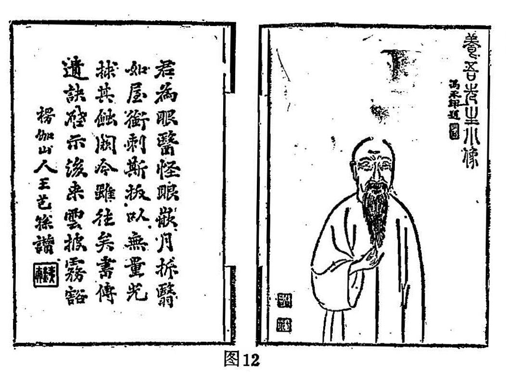
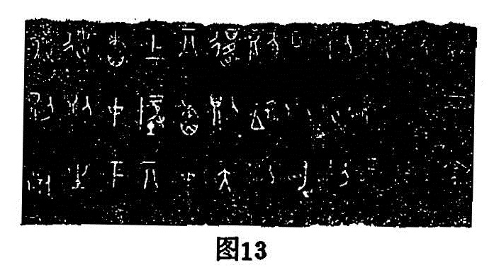
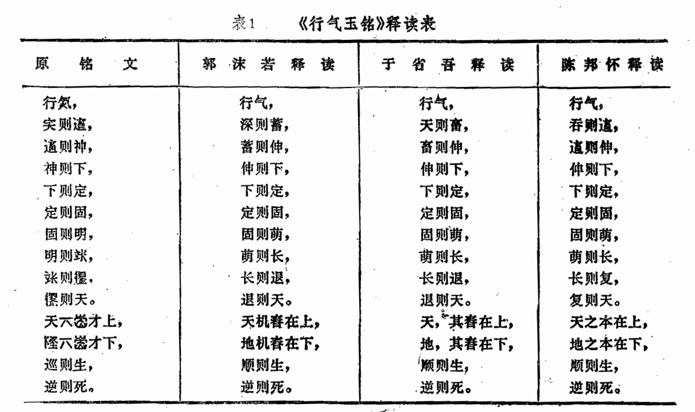
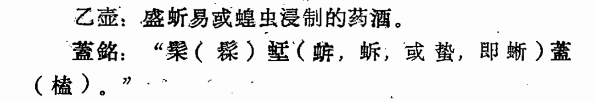

## 一、著作体例

（一）论述

也可以叫陈述。《说文》：“论，议也。”段注：“凡言语循其理、得其宜谓之论。”《尚书·周官》：“论道经邦”。蔡传：“论者，讲明之谓。”《说文》：“述，循也。”《礼记·乐记》：“识礼乐之文者能述。”郑注：“述谓训其义也。”孔安国《尚书序》：“述职方以除九丘。”孔颖达疏：“显而明之曰述。”总之，把自己所要说的问题、思想、观点、道理讲说明白，就是论述。

属于论述体的医籍最多，如汉·张仲景《伤寒论》、《金匮要略方论》（其他不可为例）、隋·巢元方《诸病源候论》、宋·庞安常《伤寒总病论》、宋·许叔微《伤寒发微论》、宋·郭雍《伤寒补亡论》、金·刘完素《素问要旨论》、金·成无己《伤寒明理论》、金·李杲《脾胃论》、元·朱震亨《格致馀论》、元·丘处机《摄生消息论》、元·王珪《泰定养生主论》、明·李中梓《颐生微论》、明·吴有性《温疫论》、清·徐大椿《医学源流论》、清·孔毓礼《痢疾论》、清·叶天士《温热论》、清·随霖《羊毛瘟论》、清·邵登瀛《温毒病论》、清·邹汉璜《寒疫论》、清·王孟英《霍乱论》、清·田宗汉《医寄伏阴论》、清·雷丰《时病论》等。

更多的医籍虽然是论述体，但不名为“论”，如晋·王叔和《脉经》、旧题齐·褚澄《褚氏遗书》、金·刘完素《素问玄机原病式》、明·王纶《明医杂著》、明·赵养蔡《医贯》、清·高士宗《医学真传》等等，多不胜举。这类作品，通常都注重理论与新知的阐发，具有较高的学术意义与价值。

（二）问答

亦称“问对”、“问难”。此种文体起源甚古，春秋战国之际便广为流行，如《黄帝内经》就是以问答文体写成。他如题秦越人《黄帝八十一难经》（亦称《黄帝八十一问》）、宋·朱肱《伤寒百问》、宋·齐仲甫《女科百问》、明·赵良仁《丹溪药要或问》、明·汪机《针灸问对》、明·鲁伯嗣《婴童百问》、明·傅懋光等《医学疑问》、清·王子固《眼科百问》、清·陈虬《瘟疫霍乱问答》、清·高鼎汾《医学问对》、清·梁玉瑜《医学问答》、清·曹存心《琉球百问》等等。也有的是以问答体写成的，但并不叫问答，除上述《黄帝内经》外，例如晋·皇甫谧《针灸甲乙经》、宋·郭稽中《产育宝庆集》、宋·旧题葆光道人《眼科龙木总论》、旧题唐·孙思邈《银海精微》、清·张叡《医学阶梯》、清·高鼎汾《医学课儿策》等。这类作品，由于采用一问一答的体裁，通常都是针对性强、叙述事物特别具体、零碎。因而整体的概括性、系统性较差。

（三）辨说

《说文》：“辦，判也。”（辦即辨）《荀子·正名》：“辨说也者，不异实名，以喻动静之道也。”杨倞注：“动静。是非也。”又云：“辨者，明两端也。”就是说“辨”指判别是非。

辨说体和论述体不同的是，它注重剖晰判别、明确是非，和单纯舒发己见、平铺直叙有异。如金·李杲《内外伤辨惑论》、明·吴球《诸证辨疑录》、明·童养学《伤寒六书纂要辨疑》、清·李延昰《脉诀汇辨》、清·张志聪《侣山堂类辨》、清·许豫和《小儿诸热辨》、清·章穆《调疾饮食辨》、清·唐戴庭《温疫析疑》、清·张学醇《医学辨正》等。在医籍中，自明·方有执《伤寒论条辨》问世后，后世医家争相仿效。本来“条辨”是一种注释文体，多是前人之书，后人辨注。而后来也出现自著自注的作品却也名“条辨”。较早的有清·刘渊《医学纂要灵机条辨》。其后有清·杨璿《伤寒温疫条辨》、清·吴瑭《温病条辨》影响最大，其它还有清·郭传铃《癫狂条辨》、清·陆子贤《六因条辨》、清·陈葆善《白喉条辨》等。（此处仅指自著自注，辨注前人著作者有不少名为“条辨”，不在此例，见下节）。

有些作品属“辨说”体，亦不以“辨”名书，如金·张从政《儒门事亲》、明·王履《医经溯洄集》、明·张介宾《质疑录》、清·章楠**《医门棒喝》**等。

（四）方药

《左传·昭公二十九年》：“夫物物有其官，官修其方”。杜注：“方，法术。”《急就篇》：“灸刺和药逐去邪”。颜之推注：“草木金石、鸟兽虫鱼之类，堪愈疾也，总名为药。”《申鉴·俗嫌》：“药者，疗也，所以治病也。”故《文心雕龙》将“方”作为一种体例，这是中医文献所特有。各种治疗方法、技术、药物，如针灸、按摩、方剂、本草等文献，皆属此类文体体例。大体都有一个固定格式，如：名称——主治——方术——用法——附说；或名称——部位——主治——方法——附说。

**名称**：包括穴位名（例如合谷、三里等）、手法名（例如双凤展翅、苍龙摆尾等）、方术名（例如桂枝汤、地黄丸、银翘散、至宝丹等；也包括“治某某方”、吹鼻方、擦洗方、导引法、刀割法等等）、药物名（例人参、甘草等，各种《本草》书皆属此）等。

**主治：**包括病名（如痘疹、疟疾、肠痈等〉、证名（如血不归经、肾不纳气等）、症名（如呕吐、咳嗽、头痛等）、功用（如活血化瘀、温补脾胃、清热解毒）等。

**方术：**包括方药组成、制作方法、施术方技、具体操做（如导引、手法、炮制等等）。

**用法：**包括服法、剂量、时间、次数、禁忌等。

**附说：**包括方解、加减、评议、附注、附方、考证等。

“方药”体例的文献，包罗甚广，如方书方论（例如《太平圣惠方》、《圣济总录》、《太平惠民和剂局方》、宋·许叔微《普济本事方》、宋·洪遵《洪氏集验方》、明·朱橚《普济方》、明·龚廷贤《鲁府禁方》、清·鲍相璈《验方新编》等，多不胜举）、针灸书（例如宋·王惟一《铜人腧穴针灸图经》、宋·王执中《针灸资生经》、亡名氏《循经考穴编》等、推拿书（例如明·龚云林《小儿推拿秘旨》、明·周于蕃《小儿推拿秘诀》、清·张振鋆《厘正按摩要术》等）。《本草》书已众所周知，不例举。

（五）医案

医案古称“诊籍”，早在先秦，已经创其法制。《周礼·天官》载有医师、医士之职，并说：“凡民之有疾病者，分而治之，死终则书其所以，而入于医师。”又说：“凡邦之有疾病者、疮疡者造焉，则使医分而治之。终则稽其医事，以制其食。”所谓“书其所以“，即今之病誌。《史记·扁鹊仓公列传》首记仓公案例，名曰“诊籍”。后世医家或称医案，或称脉案，或称治验，或称方案，明清以来，专著渐多。今存者，不下数百部之多。仓公《诊籍》，经太史公笔之于书，成为后世医家效法的典范。此一文体为医家所独有，文史家向未论及。医案体例，务在诩实，言必中病，文必循理，详则不落繁芜，略则不流疏陋。

医案文体，常因人因病而异，其行文格式，我把它又分为史笔、文笔、医笔、随笔、稗笔、俗笔。

所谓“史笔”者，如二十四史中之名医列传，其中多载医案，其文重在写史记事而略于具体的方药。例如《史记·扁鹊仓公列传》：

“齐郎中令循病，众医皆以为蹷中，而刺之。臣意。诊之曰：涌疝也，令人不得前后溲。循曰：不得前后溲三日矣。臣意饮以火齐汤，一饮得前后溲，再饮大溲，三饮而疾愈。病得之内。所以知循病者，切其脉时，右口气急，脉无藏气，右口脉大而数。数者，中下热而涌，左为下，右为上，皆无五藏应，故曰涌疝。中热，故溺赤也。”

所谓“文笔”着，皆文学家之手笔，其重在文章辞藻，事以文传，略与史笔同。例如元·宋濂《宋学士文集·赠医师周汉卿》序：

略曰：“周君之医精甚，他固不能知。姑即士君子所常道者言之：括苍蒋仲良，左目为马所蹄，其睛突出，悬如桃。群工相顾曰：是系络既损，法当眢！周君笑不答，以神膏封之，越三日，目如初。华川陈明远，患瞽者十龄，百药屡尝而不见效，自分为残人。周君视之曰：是翳虽在内，尚可治。用针从眥入睛背，掩其翳下之，目欻然辨五色，陈以为神！”

有的医学家，同时也是文学家，如清·薛雪，即是如此。他的《扫叶庄医案》（作者藏嘉庆十一年精抄稿本）尝以文笔之法书写医案。

如：“蒋：骨小肉脆，定非松柏之姿；脉数经停，已现虚劳之候。先天既弱而水亏，壮火复炽而金燥。岁气一週，一损岂容再损；秋风乍薦，阴伤难免归阴。证具如前，药惟补北；非关说梦，聊以解嘲。生地、沙参、地骨皮、麦冬、金石斛、生鳖甲。”

案如骈文，四六对仗，辞藻风雅，如读骚赋。但是由于言近意远，文简事繁，多用典雅取譬之词，对于初学者，增加了理解上的困难。

所谓“医笔”者，案文出自医家手笔，注重案情分析、阐述理法，意在临证纪实、总结经验，以为前车之鉴，后事之师。例如明·赵良仁《丹溪药要或问·疟》：

“一富人年壮而病疟，自卯足寒，至酉方热，至寅初乃休，一日一夜，止醒一时。因而思之，必因入房而感寒所致。乃问之：九月暴寒，夜半有盗，急起，不及着衣，当时足即冷，十日后而疟作。盖足阳明与冲脉和，而宗筋会于气冲。若房劳太甚，则足阳明冲脉之气皆夺于所用，故寒邪乘虚而入，舍于二经所会之足跗上，于是二经之阳气益损，而不能营于经络，故病卒不得休也。用参、术以大补之，附子行经散寒而取汗。数日不得汗，病仍如前。因想足跗之道远，药力难及。乃用苍术、川芎、桃枝煎汤，以高桶盛之，扶坐浸足至膝，一食顷，以连日所服之药饮之，其汗通身大出，病即已。”

所谓“随笔”者，案文出自医家之手，然皆临证信笔书笺，非有意述作，意在临时疏方，略记案情以备复诊，或交付患者便其取药，或门人侍诊随手记录，后学集而成册，梓行传世。这类医案，多是详于方药而略于病情说理，如清·叶天士《临证指南医案》即属此类。例如：

“洪，四十，内风逆，头晕：经霜桑叶一钱，炒黄甘菊花炭一钱，生左牡蛎三钱，黑穞豆皮三钱，徽州黑芝麻二钱，茯神一钱半。”（见《临证指南医案·眩晕》）

所谓“稗笔”者，案文出自文人小说家笔记杂著，多属传说野史、街谈巷议，意在传奇，故作喧染。此类医案多真假参半，不可全信，不能完全做为医学文献资料去看。如清·高士奇《牧斋遗事》：

“北城外多败屋，居民多停棺其中；（俞）嘉言偶见一棺似新厝者，而底缝中流血若滴。惊问旁邻，则曰：顷，某邻妇死，厝棺于此。嘉言急觅其人，为语之曰：汝妇未死。凡人死者血黝，生者血鲜，吾见汝妇棺底，血流甚鲜，可启棺速救也。盖妇，实以临产昏迷一日夜，夫以为死，故殡焉。闻俞言，遂启棺。诊妇脉未绝，于心胸间针之，针未起而下已呱呱作声！儿产，妇亦起矣。夫乃负妇、抱儿而归。”

此案虽言之也有切近医理之处，如辨生死血色，然恐未必确有其事。他如神奇迷信之说，更勿论了。

所谓“俗笔”者，有意做作，故神其技，或讬辞于达官名宦，或寄语于梦幻神仙，非关医理，芜语连篇。此类医案，真伪参差，文体格调，有类说稗，读者当慎加分晰，择善而从。

中医古籍中之医案，文体虽然大略类似，但格式不一，与今之医案多不相同。明·韩飞霞、吴崑以及清·俞昌等力倡统一医案格式，但是未能被医家普遍应用。

（六）札录

札录，亦可称随笔、笔记。《说文》：“札，牒也。”段注:“长大者曰椠，薄小者曰札、曰牒。”引申为小文、短语，栉次编辑。《释名·释书契》：“札者，栉也，编之如栉齿相比也。”属这类的作品，皆短小**精悍**之文，内容复杂，雅俗不拘。中医文献中多赘“说”、“录”、“言”、“话”、“谈”、“笔“、“记”、“语”等。

**说：**如宋·张杲《医说》、明·俞弁《续医说》、明·周恭《医说续编》、明·冯时可《上池杂说》等。

**录：**如明·黄承昊《折肱漫录》、**明·陈嘉璴《慎斋师口授记录》**、清·王泰林《西溪书屋夜话录》等。

**言：**如清·徐大椿《慎疾刍言》、清·程云来《医暇卮言》、清·莫枚士《研经言》、清·徐延祚《医医琐言》、清·黄炽华《医学刍言》、明·裴一中《裴子言医》等。

**话：**如清·魏之琇《柳州医话》、清·俞廷举《金台医话》、清·计南《客尘医话》、清·史典《顾体医话》、清·王孟英《潜斋医话》、清·张鲁峰《馤塘医话》、清·赵晴初《存存斋医话稿》、清·陆以湉《冷庐医话》、清·毛对山《对山医话》等。

**谈：**如明·陈嘉璴《医家秘奧笔谈》、清·杨希闵《盱客医谈》、清·宋钧衡《杏苑丛谭》、民国·许松如《诊余脞谈》等。

**笔：**如清·王秉衡《重庆堂随笔》、清·顾淳庆《学医随笔》、清·陆懋修《随笔所到》、清·朱恩《困学随笔》、清·周学海《读医随笔》等。

**记：**如清·尤怡《医学读书记》、清·许豫和《怡堂散记》、清·连自华《有恒杂记》、清·田晋藩《田晋藩日记》等。

**语：**如明·胡慎柔《胡慎柔要语》、清·陆懋修《医林琐语》等。

札录体裁的著作，也有不名医说、医话、笔记等等的，如明·戴原礼《金匮钩玄》（亦名《推求师意》）、明·盛寅《医经秘旨》、清·曹庭栋《老老恒言》等。

（七**）传志**

在医籍中，传志体不多，大都属于医史，文献书目之类，如传记体有明·李濂《医史》、清·王宏翰《古今医史》。其他如明·徐春甫《历代圣贤名医姓氏》、明·熊均《历代名医考》、明·李梃《历代医学姓氏》、明·聂尚恒《历代医学姓氏》、清·蒋廷锡《医术名流列传》等也都是传记体，但皆非专著，都是附刊在各自的医学著作之中（依次见载于《古今医统大全》、《名方类证医书大全》、《医学入门》、《医学汇涵》、《古今图书集成医部全录》）。

属于史志体的有明·朱儒《太医院志》、明·殷仲春《医藏书目》、清·曹禾《医学读书志》等。

（八）图谱

图指图像，谱指表簿。《释名·释典艺》：“谱者，布也，列见其事也。”钮树玉《说文新附考》卷一:“谱，通作暜，或作表……”按韦昭辨《释名》云：“主簿者，主诸簿书；簿，普也，关谱诸事也。“又曰：“表与谱，音义并同。”通常图谱，都是有图有说，在医籍中仅仅有图表而无解说者，极为罕见。除近现代外，在中医古籍中所见到的都是图说、表说之类。所不同的是图表重于说解、或图说并重，至于作品中间或有插图附表者，不在此例。在中医古籍中，系统而全部载有图谱者，数量也很大，许多学科均有这类体裁的作品，兹举如下：

**诊断**：如伪讬王叔和《人元脉影归指图说》、元·杜本增订《敖氏伤寒金镜录》、清·张登《伤寒舌鉴》、清·何愚等《舌图辨证》等。

**伤寒：**如元·吴恕《伤寒活人指掌图》、清·包诚《伤寒审症表》等。

**妇儿：**如古《产经》（今存于«医心方》中）、清·陈世凯《小儿推拿广意》、清·吴学损集**《**痘疹图像善本》等。

**外科：**如旧题宋·窦汉卿《疮疡经验全书》、明·申斗垣《外科启玄》、清·高文晋《外科图说》、清·叶氏《七十四种疔疮图说》等。

**五官：**如旧题孙思邈《银海精微》、明·袁学渊《秘传眼科七十二证全书》、清·张宗良、吴氏《咽喉秘集》、清·包永泰《喉科指掌》等。

**针灸：**如亡名氏《黄帝明堂灸经》、元·滑寿《十四经发挥》、明·赵文炳《铜人明堂之图》、清·钱镜湖《脏腑正伏侧人明堂图》等。

**养生：**如旧题用晦子《万寿仙书》、清·曹若水《万育仙书》（下卷实翻刻《万寿仙书》、清·潘霨《内功图说》）等。

**本草：**如宋·唐慎微《经史证类大观本草》、宋·王介《履巉岩本草》（今存之最精的彩绘珍品）、明·赵文淑《本草图谱》（此为女画家彩绘珍品）、明·朱橚《救荒本草》、明·鲍山《野菜博录》（此书载图合用阴刻、阳刻刀法，刻绘具臻上乘）、明·刘文泰等《本草品汇精要》（明内府藏彩绘图）、明·李时珍《本草纲目》（金陵版）、明·李中立《本草原始》（此书所绘皆生药饮片图）、清·吴其濬《植物名实图考》、亡名氏《南方草木状图》（有图无说、水墨手绘珍品）、清·德丰《草药图经》（多古方未有、本草未收者）等。按本草书中具图者，不下三十余种，多刻绘不精，或辗转翻刻，没有重要参考价值。以上所举，并是重要图谱参考文献。

（九）辞书

中医仅近现代才有辞书、字书。古籍中（文史哲通用综合辞书不在这里介绍），本有《音义》这类工具书，如唐·王冰《素问音训並音义》、唐·兰先生《素问音释》、唐·杨玄操《素问释音》、《八十一难音义》。《针经音》、《黄帝三部灸经音义》、《明堂音义》、宋·席延赏《黄帝针经音义》。在《本草》中，最早的有六朝梁·陶弘景《本草夹注音》、姚最《本草音义》。其后有唐·苏敬《新修本草音》、唐·仁谞《新修本草音义》、唐·甄立言、李含光《本草音义》、唐·杨立操《本草音注》、唐·梅彪《石药尔雅》等。以上各书，除王冰《素问音训并音义》附载今传之王冰注《素问》中以外，仅存《石药尔雅》，其他皆亡佚。后世仅见清·陆懋修《内经难字音义》。《音义》这类书和现代的辞书不完全相同，释义比较简单，注音概用反切或直音。兹举数条如下：

王冰注《素问·三部九候论》：“歃，所甲切，饮血也。”《素问·热论》：“怫，音弗；谵，之阎切，多言也。”

《石药尔雅》：“楸木耳，一名金商芝”；“蝦蟆皮，一名龙子单衣”。

《内经难字音义》：“《灵枢·九针十二原》：腧，伤迂切，本作俞，亦作输。《素问·欬论》；治藏者，治其俞。注引《灵枢》：脉之所注为俞；本经作腧。《素问·奇病论》：治之以胆募。注:胸腹曰募，背脊曰俞。按：五藏各有井、荥、俞、经、合五穴，谓之五俞。六府各有井、荥、俞、原、经、合六穴，谓之六俞。”陆氏已是近代，具有清代考据学派的风格了。

（十）诗词

诗有五言、七言以及长律。五绝七绝，规定是四句一首；五律七律是八句一首，长律有多少句就不等了。词有各种格式，每句字数多少不等，故又称“长短句”。诗和词，都要求有严格的音韵格律。在古医籍中以诗词体为体裁的作品很多，如清·张望《古今医诗》、清·翁藻《医诗》等，多不胜举。由于受到内容的限制，在医籍中往往名曰诗，实际并不具诗的严格韵律与意境要求。据我所见，真正较好的医诗，要算明·梁大川《经穴撮要歌括》较好了（为什么叫歌而不叫诗，下节讲到）。现录数首，以见其例，并聊为欣赏。文载《医学入门》。

**六腑井荥俞原经合歌**

窍阴别后恨相牵，几侠谿临泣杜鹃；

怀抱丘墟情未毕，烦君阳辅寄陵泉。

（上足少阳胆）

关衝桃李掖门栽，中渚阳池次第开；

花落支沟香满涧，一天井字蝶飞来。

（上手少阳三焦）

**五脏井荥俞经合歌**

云霞烟锁大敦兮，笑指行间路太迷；

野寺中封无道人，曲泉还有老僧归。

（上足厥阴肝）

中衝孤雁撤云霄，几度劳劳只自寥；

更有大陵边间使，衝阳曲泽莫招摇。

（上手厥阴心包）

**血气灌注十二经昼夜周而复始歌**

晓程中府马蹄忙，怀抱思量出少商；

极目商阳从此去，加鞭一直上迎香。

自承泣别两微茫，忙昔分携厉兑乡；

归隐白云专卖粟，大包量尽小包量。

在医籍中完全用词的文体写成的著作极为罕见，但在道教内丹即气功书中，很多以词写成的作品，如吕洞宾《沁园春》。在中医书中据我所见，以清·黄镜庭《目经大成》用词较多，且写的也较好，书中“十二因、八十一证”全有诗词，词的曲排名称很多，我们这仅举数例以见一般：

**阴阳圈七十四**　调寄《长相思》

君火煎，相火煎，火退风轮现两圈，阴阳一样圆。

心悬悬，意悬悬，何日瞳神快朗然，披云见九天。

视惑　调寄《西江月》

今日预愁明日，一年营计百年。头皮断送有谁怜？落得昏花惑见。

风月青楼佳趣，膏腴烟神仙。式歌且舞兴豪然，不久冰轮有变。

暴风客热二　调寄《柳梢青》

乾清坤宁，何来客气，能犯书生。

夜雨青灯，晓风残月，身在空庭。

一时寒热交併，睑胀处眵泪飘零。

点翳于珠，涅丹入璧，急切难平。

无因而因十二　调寄《捣练子》

嗜慾少，世情疏。性气温和饮食宜。

日月风霜皆不出，恹恹哑病耐人思。

囱疟七　调寄《菩萨蛮》

无痰无食不成疟，风寒外感仍能作。惟火秋金，邪魔入却深。

脾寒气瘁，疟往还下痢。反复陷春阳，阴霾目减光。

（十一）歌谣

诗，也可以叫歌。《国语·鲁语下》：“歌所以詠诗也。”所以在医籍中有以诗为体裁的也称作歌，如清·汪昂《汤头歌》。《尔雅·释乐》：“徒歌谓之谣。”徒歌，拿今天的话说，就是没配乐器、仅仅是人们的清唱就叫谣。故郝懿行疏曰：“谣谓无丝竹之类，独歌之。”又《初学记·十五》：“有章句曰歌，无章句曰谣。”又《诗·魏风·园有桃》：“我歌且谣”。毛传；“曲合乐曰歌”。故后世常歌曲连语，凡有谱可唱者，统称歌曲。在医籍中，多数都是徒歌或没有章句固定格式的谣体。如清·蒋示吉《医宗说约》、清·龙之章《蠢子医》等就是这种体裁写成的。我们略举两节以示大意。

《医宗说约·哮》：

“喉中为甚水鸡声，哮症原来痰病浸；若得吐痰并发散，远离厚味药方灵。白果麻黄苏子芩，款冬半夏宜为君；桑皮杏仁皆钱半，三碗水煎二碗存；食后徐徐温嚥下，更能定喘法如神。”

又《医宗说约·狐惑》：

“狐惑症，是虫病。狐虫食肛下唇疮，面色乍白乍赤黑，恶闻食气眠默默，舌白齿晦甚杀人。黄连犀角汤为的。”

《蠢子医·学医真诠》：

“学医第一看药性，有了药性心有定。某药入某经，某药治某病。或是温，或是凉，与某症相称；或是补，或是泻，与某症相应。各药各有温凉补泻理，各经各有寒热虚实情。看得到时药分明，此中早已有把柄。学了药性学脉理，学了脉理方有用。某经是真虚，某经是真实，用某药相应。某经是真寒，某经是真热，用某药相称。各经各有虚实寒热理，各药各有温凉寒热性。看得到时脉分明，任凭病来如明镜，有了明镜有把柄，一下笔时便入圣。不靠汤头歌，不任人家命，病端虽夹杂，病脉总清净。药方虽变更，药性总周正。君臣佐使无参差，便是医中之捷径。即有天师再临凡，亦难寻找方中病。

（十二）骈俪

因屈原作《离骚》，后世多仿效其体，称为“骚体”，它是词赋的古宗。《文心雕龙》说：“然其文辞丽雅，为词赋之宗。”后世演变为赋，也称骈体文，它是相对于散文而说的。古有“骈四俪六”之说，故也称骈俪体、四六文。就是说骚赋都要求用韵，并且要四、六对仗工整。在医籍中用骚体的极少，用赋体的甚多。如宋·刘元宾《脉赋》、题金·李杲《药性赋》、金·何若愚《流注指微针赋》、金·窦汉卿《标幽赋》、《流注通玄指要赋》、明·席弘《席弘赋》、清·吴尚先《理瀹骈文》等。有的书不名赋或骈文，实也是以赋体写成的。大抵赋体中医文献，都是为便于记忆，或为初学入门而作。药赋、针灸赋是大家所熟悉的。兹节两段病赋，略以示意。

《证治针经·眩晕》：

“诸风掉眩，皆属于肝；风阳上冒，昏仆无端。有中虚亦有下虚，或夹火而或夹痰。火盛兮，清少阳而即愈；痰多者，理阳明而始安。中虚兼用人参，茯苓为合；下虚必从肝治，潜阳镇摄宜参。乃若治痰须与健中，熄风可以缓晕；肝风内沸而津铄，滋润阴液无愆。络脉中热而水虚，后本先标莫紊；如其阴虚阳升，烦劳即发。天天地冬，五味茯神山萸，牛膝远志牡蛎磁石龟甲。或枸杞柏子仁与穞豆黑芝麻，暨淡菜胶、龟胶而建莲药。又或年高气衰，水枯风动；上实下虚，头晕跗肿。附子都气丸入天冬建莲，腽肭佐凉方足重。抑夫眩晕属乎外因，每多一时暴逆；寒则掣疼，风则汗出，湿则如裹，暑则闷热。暴怒则血苑厥巅，得补而炽晕欲绝。龙胆、芦荟蜀漆、代赭石，赤芍黄连丹皮，五味子，牡蛎龙骨入猪胆汁。妇女及失意之人，宜兼舒郁；烦渴兼弦数实之脉，尽用清凉。大黄末用茶调，丹溪之法须誌；蓄血症从下夺，士材之案无忘。”

《理瀹骈文》：

“医者，意也；瀹者，疗也。医不能活人，虽熟读金匮石室之书无益也；药不能中病，虽广收橘井杏林之品无当也。在昔《集验》之论伤寒，则曰伤寒症候难辨，慎勿轻听人言；妄投汤药，《济众》之论瘟疫，则曰瘟疫不拘于胗，古方今多不验，弗药无妨。又如养葵所著，嵩厓所辑，谓夫咳嗽吐衄未必成瘵也，服四物知柏之类不已则瘵成矣；胸腹痞满未必成胀也，服山查神曲之类不已则胀成矣。面浮胕肿未必成水也，服泄气渗利之类不已则水成矣；气滞痞塞未必成噎也，服青皮枳壳之类不已则噎成矣。”

（十三）赞颂

赞又作讚。《文心雕龙·颂讚》：“然本其为义，事生奖叹，所以古来篇体，促而不广，必结言于四字之句，盤桓乎数韵之辞，约举以尽情，昭灼以送文，此其体也。”就是说赞要求简练的四字韵文，尽情昭著。古来“颂”和赞常连类相称，所不同的是颂主要是赞美，也不要求四字一句，其文体近似赋。赞则有褒有贬、评议论述均都包括。故赞又分“杂赞”、“哀赞”、“史赞”三种。《文体明辨》说：“一曰杂赞：意专褒美，若诸集所载人物、文章、书画诸赞是也；二曰哀赞：哀人之没而述德以赞之是也；三曰史赞：词兼褒贬，若《史记索隐》，东汉、晋《书》诸赞是也。”

在医籍中赞颂多是在一书的卷首来称颂作者赠文题像之类。完全以赞体文写成的著作不多，常见的杂赞体著作有清·叶志诜《神农本草经赞》，史赞体写在书首的像赞如《孙氏医案》、《银海精微》等，均可见到。兹节录两段以见例。

《神农本草经赞》：

甘草：“春仲秋仲，蠲吉除疴；名符甘美，义致中和；草木芜秽，乳石偏颇；虽固必解，国老皤皤（音pó）”

独活：“面风独立，顾盼中摇；蚕头奋簇，鞭节垂梢；护关紫艳，缘栈黄娇；石擘埌沃，易叶同条。”

麻黄：“雄雌类辨，根杂赤黄；暖无积雪，轻自浮阳；护营通卫，减热含凉；推行尼止，理妙难量。”

《孙氏医案》孙东宿像赞：

“炯然其眸，飘然其髯；是常入龙宫而探石函也，隆冬不寒。曰三秀草，沧海可田，思邈不老。　吴郡太史检庵徐显卿题。”（此是偶插入十字句变例）。

又如《银海指南》顾锡（字养吾）像赞，见图12（未作标点，读者已知赞文体，自不难读）。

（君為眼醫，怪眼嵌月。拆翳如屋，銜刺斯拔。以無量光，求其蝕闕。今雖往矣，書傳遺訣。啓示後來，云披霧豁。　楞伽山人王芑孫讚）

（十四）箴铭

箴，亦作针，比喻针砭治疾，用于常诫勿忘而防患未然；也有规训的意思。箴体文，要求用韵，一般是四字排句。

铭，古代多是刻书在器物上，如刻在金石上叫铭金、铭石；书写的叫铭书，其文字总称铭文。《礼记·祭统》：“铭者，自名也。”郑玄注：“铭谓书之，刻之以识事也。”《文心雕龙·铭箴》说：“箴全禦过，故资确切；铭兼褒讚，故体贵弘润。其取事也，必覆以辨；其摛文也，必简而深；此其大要也。“铭的文体，主要是韵文，也可以是短语、散文。

由于箴铭文体的限制，在医籍中不可能有长篇大著，多是精悍短文的作品。就其内容来说，《文体明辨》分“官箴”、“私箴”，铭分“警戒”、“祝颂”二类。从中医文献来看，铭文还分“记事”类。箴铭示例如下：

明·龚信《古今医鉴》箴（节录其二）：

“明医箴”：

“今之明医，心存仁义；博览群书，精通道艺；洞晓阴阳，明知运气；药辨温凉，脉分表里；治用补泻，病审实虚；因病制方，对证投剂；妙法在心，活变不滞；不衒虚名，惟期博济；不计其功，不谋其利；不论贫富，药施一例；起死回生，恩同天地；如此明医，芳垂万世！”

“庸医箴”：

“今之庸医，衒奇立异；不学经书，不通字义；妄自矜誇，以欺当世；争趋豪门，不速自至；时献苞苴，问病为意，自逞以能，百般贡谀；病家不审，模糊处治；不察病源，不分虚实；不畏生死，孟浪一时；忽然病变，急自散去；误人性命，希图微利；如此庸医，可耻可忌！”

现知存世最早的养生铭，当属战国时期的《行气玉铭》，它是一个玉琢的十二面体，全銘共四十五个字，其拓片如图13（右起上下读）：

此铭的释文与训解，各位专家的考证意见还不完全一致，兹将郭沫若、于省吾、陈邦怀三家释文综合列如表1。

表1《行气玉铭》释读表

| 原铭文         | 郭沫若释读   | 于省吾释读     | 陈邦怀释读   |
| -------------- | ------------ | -------------- | ------------ |
| 行氮，         | 行气，       | 行气，         | 行气，       |
| 宎则遹，       | 深则蓄，     | 天则畜，       | 吞则遹，     |
| 遹则神，       | 蓄则伸，     | 畜则伸，       | 遹则伸，     |
| 神则下，       | 伸则下，     | 伸则下，       | 伸则下，     |
| 下则定，       | 下则定，     | 下则定，       | 下则定，     |
| 定则固，       | 定则固，     | 定则固，       | 定则固，     |
| 固则明，       | 固则萌，     | 固则萌，       | 固则萌，     |
| 明则（立长）， | 萌则长，     | 萌则长，       | 萌则长，     |
| （立长）则退， | 长则退，     | 长则退，       | 长则复，     |
| **？则天。**       | 退则天。     | 退则天。       | 复则天。     |
| **天？？才上，**   | 天机春在上， | 天，其春在上， | 天之本在上， |
| **？？？才下，**   | 地机春在下， | 地，其春在下， | 地之本在下， |
| 巡则生，       | 顺则生，     | 顺则生，       | 顺则生，     |
| 逆则死。       | 逆则死。     | 逆则死。       | 逆则死。     |

其次还有西汉中山靖王刘胜（公元前154〜113年）墓出的二个错金铜药酒壶，壶盖壶身都有纤细金银丝锒嵌的“鸟虫书”铭文，其摹本如图14。

各位专家对铭文的释读也存分岐，兹据周策纵先生释读如下：

甲壶：盛黄芩浸制的药酒。

蓋銘：“有言三：甫（镈）金鮇（或鯠），为菳蓋（榼），错书之（古音鯠、之为韵）。”

身銘：“蓋（榼围四叕（缀），牺（挱）尊成壶。盛兄（况）盛味，于心佳都。揜（餍）于口味，充闰（润）血膚。延年去病，万年有馀。”（壶、都、膚、余为韵）

乙壶：盛蚚易或蝗虫浸制的药酒。

蓋銘：“髤（髹）[⿱虷土]（[⿰虫𢇛]，蚸，或蛰，即蜥）蓋（榼）。”

身銘：与甲壶同，仅略去“万年有余“一句。

还有汉代的铜镜也有与医有关的铭文，这里不再列举。以上皆古老难懂，后世也有不少养生铭，兹举一例示意。

旧题唐·孙思邈《孙真人养生铭》（引自清·尤乘《寿世青编》）：

“怒甚偏伤气，思多太损神；神疲心易役，气弱病来侵；勿使悲欢极，常令饮食均；再三防夜醉，第一戒晨嗔；亥寝鸣天鼓，晨兴漱玉津；妖邪难犯己，精气自全身；若要无诸病，常当节五辛；安神宜悦乐，惜气保和纯；寿夭休论命，修行在本人；若能遵此理，平地可朝真。”

以上战国《行气玉铭》、刘胜药壶铭，就属于记事类的铭文，《孙真人养生铭》是属于警戒类的铭文。至于祝颂类铭文，又有生人和死人之分。死人刻于金石，埋于墓藏，称为墓铭，因率在文集中附于“墓志“之后，人们常连称“墓志铭”。举例如下：

宋·吕诲《医铭》（引自《图书集成医部全录》）。

“晋人武泰，通医术，守臣献状，补太医正，还乡里，创起应圣侯庙，艺既成，又将广懋来学，其志有足称者。予谪官于是，迁守蒲中。既行，丐文以显于庙，因作《医铭》，嘉乃意勤，遂成其志。知予言有以滋其善也。铭曰：

六气五行，人禀而生；三部九候，纳诸和平。昔称绝技，湔肠涤胃；辅以砭石，因之决溃。察脉之原，当于未然；不攻而胜，庶几十全。愈世之病，如持国柄；常使众邪，不得干正。能尽己意，膏肓必起；苟利于艺，毫厘千里。泰也有为，心不忘师；义利之重，慎乎所治。”（此是生人祝颂铭）

元·宋濂《故倪府君（维德）墓碣铭》（引自《宋学士文集·翰苑续集》）：

“（墓志略）铭曰：医者之学，《素问》为宗；犹儒治经，专门是攻。寒暑温凉，升降浮沉；或逆或顺，制治最深。随时立方，始与疾同；正气既攄，邪沴乃融。粗工蚩蚩，守一不移；执中无权，罔契其机。群昏方酣，苟不力扶；冥冥夜行，摘植索塗。三家者兴，上窥本原；如揭日月，照耀天门；伊谁承之，作世范模：东则有朱，西则有倪。”（此是死人铭文）

以上所述，都是著作体例。“辞书”一节以上，皆属散文体，“诗词”一节以下，皆属韵文体。
