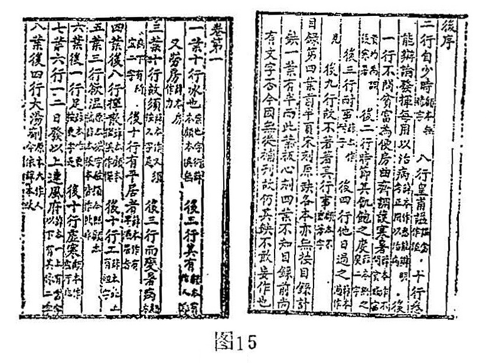
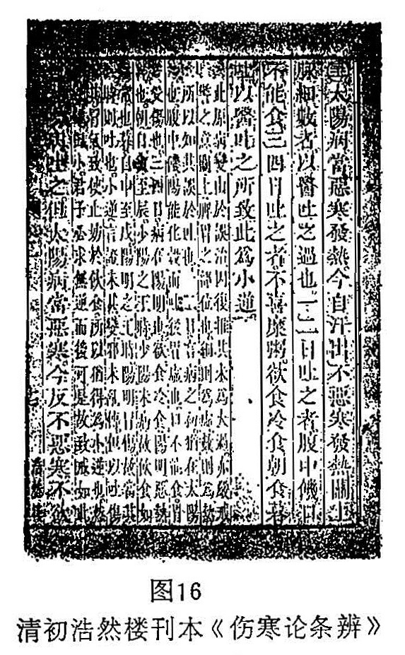

## 二、注释体例

所谓注，《说文》：“注，灌也。”引申为疏通、引导、解释、述说。《集韵》：“註，述也，解也。”按註，本作注，《说文》注字段玉裁註：“按汉唐宋人《经》注之字，无有作註者，明人始改注为註，大非古义也。古惟註记，字从言。”又曰“《通俗文》云：记物曰註。《广雅》：註，识也。古起居註，用此字，与注释字别。

所谓释，《说文》：“释，解也。”引申为解说、阐明。注释、注解，都是一个意思。注释体，是指前人的著作，后人为了明瞭前人的文字、义理而加以说明、考证、讲解的一种作品体例。

在古代文史哲典籍中，注解前人著作的名目很多，体裁不同，有“传”、“故”、“微”、“训”、“说”、“记”、“解”、“注”、“笺”、“疏”等等。黄以周《儆季杂著·史说略》说：“汉儒注《经》，各守义例。故、训、传、说，体裁不同，读《艺文志》尤可考见。”在医籍中就没有这多的名目了，如“传”、“故”（只有清·郑文焯《医故》，还与古义有异）、“微”（只有近人张骥《医古微》）都极乎没有。有的名同义异，有的名异义同。例如明·董铉《五运六气详解》、清·唐宗海《医易通论详解》、清·黄元御《玉楸药解》、《伤寒悬解》、伪讬徐灵胎《六经病解》、清·俞天池《痧痘集解》等等，虽名为“解”，但并不是对前人著作的一种注解体裁，而是一种医理论述的作品。有的医籍注解体裁还保存了注解体裁的古义。根据医籍的特点，分类如下：

（一）章句

句是由字组成的，章节是由句组成的。古人著述，或师传口授，或书之篇简。虽然说训诂寄于文字，义理讬于章句，但古时不像现在写书，分别章节，明确句读。《文心雕龙·章句》说：“夫设情有宅，置言有位，宅情曰章，位言曰句。故章者，明也；句者，局也。局言者，联字以分疆；明情者，总义以包体。区畛相异，而衢路交通矣。”所谓联字分疆、总义包体，就是明确句读、分章析义。在中医古籍中，大都是为一些年代久远的经典著作进行这样的注述。如清·周学海《辨脉平脉章句》（张仲景原著）、清·陈恭溥《伤寒论章句》。宋·李駉著有《黄帝八十一难经纂图句解》，虽不称章句，实亦章句的体裁。民国·孙鼎宜著有《难经章句》。须要附带说明的是：古之所谓“章句”，不能理解如今天所说的“标点”，它除了分章句读，还有解释大义要旨的内容。故沈钦韩《汉书疏证》说：“章句者，经师指括其文，敷畅其义，以相教授。”

（二）校勘

校勘古称校雠。《太平御览》卷618引汉·刘向《别录》说：“一人读书，校其上下，得谬误，为校。一人持本，一人读书，若冤家相对，为雠。”校的意思很明确，就是订正书中的文字错误。因为校书须两人相对完成，犹如仇人，故名校雠。校（读较）字在明季医籍中，因避明熹宗天启（1621〜1627）皇帝朱由校的名讳，改为较。“校勘”这一名称，到了梁代以后，才出现。《沈休文集》：“宜选史传学士、谙究流品者为左民郎、左民尚书，专共校勘。”《说文》：“勘，校也。”《玉篇》：“勘，覆定也。”是知勘和校为同一意义。现校勘巳成为专门学科。

中医文献中属于校勘这类的书籍很多，如宋代林亿等所校《素问》、《脉经》、《甲乙经》、《备急千金要方》等，书中有何错字异文，都随句注出。到了清代，校勘学得以空前地发展，校书更为精审，出现了许多校勘学名家，他们校书的方式往往不是随书注出，而是把误字异文集中在原书之后，名为“札记”、“校记”、或“校勘记”等。如清·黄丕烈所校宋刊《伤寒总病论》校勘“札记”就是这种形式，见图15。

可见这类医籍，它对原著作了加工注语，只不过它所注的仅是校勘方面的内容。凡有校勘注语、札记的医籍文献，都具有较好以至重要的版本价值。故我们将校勘作为注解文体体例的一类是适宜的。

（三）条辨

条辨是一种分条注释性的体裁，它可以说是章句的一种变体，在文史哲的古籍中，很少这种名称。其源，本自明·方有执《伤寒论条辨》（见图16），以后争相仿效，名曰“条辨”的中医著作不少，但多是自著自辨（已见前），这在文史古籍中更是罕见。只有清·程应旄《伤寒论后条辨》步武方氏，名副其实，是注释张仲景《伤寒论》的体裁。要说条辨体和一般注释有什么不同的话，就是它比较富于议论、争辨。有的医籍不名“条辨“，实亦是条辨体裁，如清·喻昌《尚论篇》。

清初浩然楼刊本《伤寒论条辨》

（四）疏证

疏，即疏通，《说文》：“疏，通也。”《广雅·释诂》：“疏，识也。”《汉书·苏武传》：“数疏光过失”。颜师古注：“疏谓条录之也。”这就是说古书字句难懂，逐条为之疏通讲解，使其明白通晓就叫疏。

证，验也、徵也。《广雅·释诂》：“证，譣也。“譣即验，《玉篇》：“证，验也。”《梁书·孔子祛传》：“高祖撰《五经讲述》及《孔子正言》，专使检阅群书，以为义证。”就是说检阅群书、博考百家，以徵验其文字义理者就叫证。

按照古之文史学家的规习，有“疏不破注”、“证必出据”的说法。具体说来，注疏只能是根据前人一家之注、一家之学，重点是对前人的原注逐字逐句逐条进行疏通讲解，不能对前家之注与学说发生矛盾。例如梁·皇侃据郑玄注作《礼记皇氏义疏》，由于有的地方皇疏与郑注相抵触，唐·孔颖达就批评皇氏“孤不守丘，叶不归根”。“证”则要求信而有徵，言必出据，书必出证。但是，在医籍中就不这样严格了。如明·缪希雍《本草经疏》、《续神农本草经疏》、清·邹澍《本经疏证》、《本经续疏》、《本经序疏要》、明·卢之颐《痎疟论疏》、明·王文禄《胎息经疏略》、清·钱临《立斋医案疏》、清·李启贤《叶案疏证》、民国·张山雷《钱氏儿科案疏》等。以上医籍，我们只能按一般疏通文义、推求医理这个意义上去理解这类书籍。另如清·吴人驹《医宗承启》，卷端题：“汉长沙太守张机仲景氏原文，清歙西逸民吴人驹灵穉氏疏衍”，类似清·尤怡《伤寒贯珠集》，是将《伤寒论》原文按“提纲”、“发表”、“渗利”、“涌吐”、“攻下“、“和解”、“救内”、“清热”、“温里”、“针灸”、“需待”、“会通”、“死证”等改编，然后提纲挈领、撮其旨要、疏通大义，距离注疏体例就更远了。

（五）衍义

衍，推演也。《广雅·释诂》：“衍，广也”；“衍，大也”。《集韵》：“衍，通作演。”所谓“衍义”者，谓推广演绎其宏旨大义也。这种文体重在引发原著之医理，而不重一字一句的考证训解。如宋·寇宗奭《本草衍义》、元·朱丹溪《本草衍义补遗》。明·赵良仁《金匮方论衍义》、清·张璐《千金方衍义》等，均是。

（六）本义

本即根本、原本，注解探究原著本来的意义，即谓之“本义”。它和衍义不同，衍义注重引申推广，本义注重揭示初义。如元·滑寿《难经本义》、清·魏荔彤《伤寒论本义》、《金匮要略方论本义》。这类文体，主要也是医理解说。有的不叫“本义“而名“释义”、“解义“，在医籍中它们和“本义“并没多大的区别，如旧题叶桂《本事方释义》、宋·吴褆《圣济经解义》（“解义”亦作“注”）。

（七）集注

集注，也称“集解”、“集释”、“集义”等。这种体裁是汇集了多家的注释，如明·汪机《脉诀刊误集解》、清·汪昂《医方集解》、清·周孝垓《金匮要略集解》、清·郑玉坛《伤寒杂病心法集解》、《幼科心法集解》。“集注”如梁·陶弘景《神农本草经集注》、宋·王惟一等《王翰林集注黄帝八十一难经》、张志聪《素问集注》、《灵枢集注》、《伤寒论集注》等。有的几家注，也是集注体，如清·郭汝聪辑《神农本草三家注》（张志聪、叶天士、陈修园）。所谓集注集解，通常都是集者按照自己的学术思想、有选择的博采节取诸家之说（前述《神农本草三家注》及《张马合注内经》等极少数例外），并不全部集录所采各家的注解。这就是说，有了某书集注本，并不能代替各家注解的单行原著。

（八）笺识

《说文》：“笺，表识书也。”《集韵》：“笺，或作牋。”笺识（读志）也是一种注释体。《毛诗·郑氏笺》孔颖达疏曰：“郑于诸经皆谓之注。此言笺者，吕沈《字林》云；笺者，表也，识也。郑以毛学审备，遵畅厥旨，所以表明毛意记识其事，故特称为笺。”后世以前人的注释之后，随文附志表记自己的一些观点、发挥、辨证、补充等等，不与前人注解相混，这种体裁叫笺识。它和“疏不破注”不同，笺识可以发表和前人注解不同的观点。不过在医籍中也不这样严格要求，往往并不是在前人注解的基础上加以笺识，如清·陈光淞《温热论笺正》、清·朱鑰《本草诗笺》、民国·张寿颐《沈氏女科辑要笺疏》等，实际和一般注释并没有什么区别。

（九）正义

正义是一种古注书体。名曰“正义”，但不能理解纠正前人的义理。恰恰相反，它强调统一旧说、宗法一家之学，不破旧注，如有引申发明，而不另立新说。其源，始于唐代命孔颖达主持官修一套《五经正义》，既是官修，就要求要以此为准、为正。在医籍中已失去“正义”的古义，如清·朱光被《金匮要略正义》、清·叶子《难经正义》，即非官修，也非宗法某家之学。

（十）其他注体

还有一些除名“注释”、“注解”（本章引言已讲述其义，此类最多，勿须赘述）外，还有许多注书体的名目，如“经释”（清·徐大椿《难经经释》）、“诠释”（清，徐大椿《内经诠释》）、“经读”（清·陈修园《神农本草经读》）、“解要”（旧题叶桂，实为姚球《本草经解要》）、“发微”（明·马莳《黄帝内经註证发微》）、“直讲”（清·高士栻《素问直讲》）、“直解”（清·高世栻《内经直解》、清·张锡驹《伤寒论直解》、清·程林《金匮要略直解》）等等，名目繁多，大抵皆为一般注书体裁，无甚新意。唯徐大椿之名“经释”，乃以《内经》释《难经》，故取名“经释”，意谓以经解经，可称一注书文体。其次，陈修园之《伤寒论》、《金匮要略》“浅註”，亦有特色，其註文破经，即註语与经文串为一体，註文与经文以字号标出，可称为“串注”文体，兹节录一段，以见其例。

《伤寒论浅註·太阳篇》：

“太阳主人身最外层，有经之为病，有气之为病。主乎外，则脉应之而浮。何以谓经？《内经》云：太阳之脉连风府，上头项，夹脊抵腰，至足，循身之背。故其为病头项强痛。何谓气？《内经》云：太阳之上，寒气主之。其病有因风而始恶寒者，有不因风而自恶寒者。虽有微甚，而总不离乎恶寒。盖人周身，八万四千毛窍，太阳外卫之气也。若病太阳之经，则彼恶寒。”
