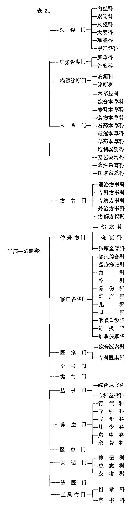
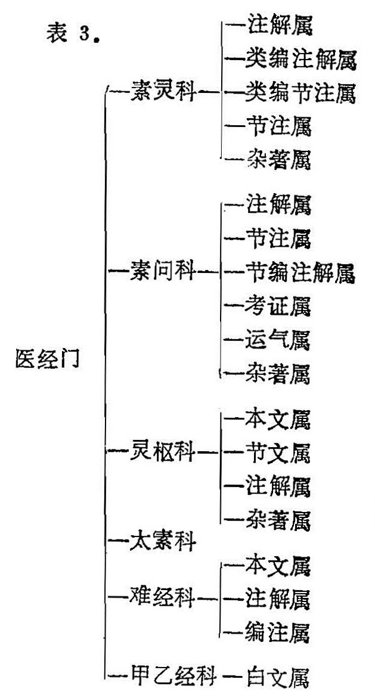
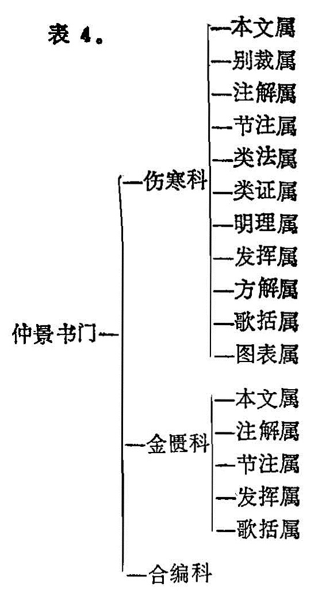
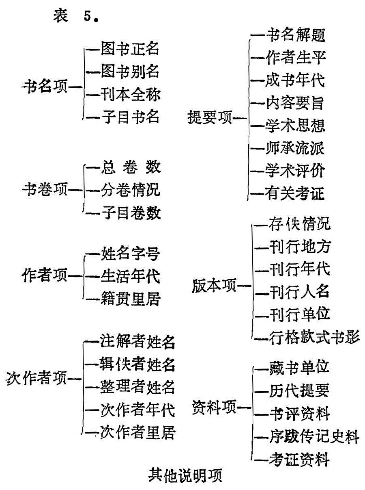
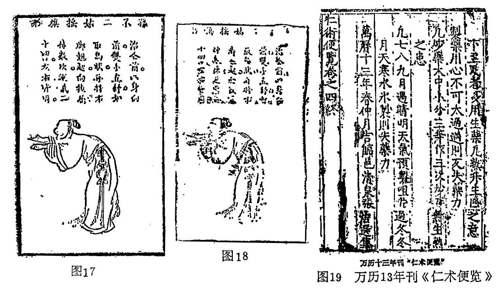

## 四、中医文献的分类

（一）分类概说

掌握中医文献的分类情况和特点，不仅有利于检索，而且对于大体了解中医学术思想体系也很有帮助。科学分类的本身，就是对事物本质的反映。我们这里所说的分类，只能是重点地围绕着实际应用、就现存的中医文献实际情况谈一些问题。当然也涉及到若干分类标准问题。现存的古今目录书对于医籍的分类十分混乱，其中最为详细、实用而比较科学的当属《中医图书联合目录》（以下简称《联目》），它是在1961年出版的。限于当时的条件，大量的条目未经核实鑑定，因而错误很多。再者，此书有目无录，许多问题还要查阅其他的目录书。其他目录书分类又是五花八门，并不与《联目》完全对号。分类分歧不大或基本一致的以及大家易于理解的，如临证内外妇儿各科、本草等，这里就不详说了，要说的是一些分类混乱、意见分歧、存在问题较多的若干类别。

根据传统习惯和中医文献的内容实际，我们为叙述方便，可分为部、类、门、科、属五个层次。

部：晋以前称“略”，如汉•刘歆把典籍分为七略，即辑略、六艺略、诸子略、诗赋略、兵书略、数术略、方技略。《汉书•艺文志》分为六略，即前七略中除辑略以下的六略。这六略所包涵的门类如下：

六艺略；（1）易 （2）书 （3）诗 （4）礼 （5）乐 （6）春秋 （7）论语 （8）孝经 （9）小学

诸子略：（1）儒 （2）道 （3）阴阳 （4）法 （5）名 （6）墨 （7）纵横 （8）杂 （9）农 （10）小说

诗赋略：（1）赋 （2）歌诗

兵书略：（1）兵权谋 （2）兵形势 （3）阴阳 （4）兵技巧

数术略：（1）天文 （2）历谱 （3）五行（4）蓍龟 （5）杂占 （6）形法

方技略：（1）医经 （2）经方 （3）房中（4）神仙

上述“略”就是典籍的大类。自晋•荀勖《晋中经簿》把六略改为甲、乙、丙、丁四部，开创了四分法系统。以后甲、乙、丙、丁改称经、史、子、集四部，部下又分类，一直沿用至近代。医籍隶属在子部，兹将《四库全书总目提要》子部列于下：

子部：（1）儒家类 （2）兵家类 （3）法家类 （4）农家类 （5）医家类 （6）天文算法类 （7）术数类 （8）艺术类 （9）谱录类 （10）杂家类 （11）类书类 （12）小说家类 （13）释家类 （14）道家类

我们所说的“部”即相当于古《七略》之略与四分法系统的部，医籍在子部。

类：相当于古目录四分法系统部之次级分类的“家”，如《四库总目》医家类。

门：门是类下小类的划分。门的划分各家不同，相当古《七略》分类法的次级分类，如医经、经方、房中、神仙等。唯七略分类太简，以后目录学家对医籍的分门逐渐详细，但各家分法很不统一。

科：门下所属的学科。如本草、内外妇儿等。科的分类，各家更是杂乱不一。

属：是根据科的内容、体裁更详细的划分。古目录书多无属的划分。现列一总表如表2：

 

上表不包括现代中医文献。关于科下分属，这里仅举医经门和临证各科门的金匮伤寒科以示例，并对检索时应注意的若干问题加以说明。

（二）医经门

中医书的医经，类似现在所说的基础理论。我们说类似，就是说不完全一致，并不是说任何一部中医基础理论书都可称得上医经。它必须是历代医家所公认的、具备一定内容的奠基性著作。关于医经的内容，班固早在《汉书•艺文志》中作了定义，他说：“医经者，原人血脉、经络、骨髓、阴阳、表里，以起百病之本、生死之分，而用度箴石、汤火所施，调和百药齐（剂）和之所宜。至齐（剂）之得，犹慈石取铁，以物相使。拙者失理，以愈为剧，以死为生。”就是说医经的内容，是推究人体的血脉、经络、骨髓、阴阳、表里，用以启示各种疾病的根本原因、死生的判断，度量针砭灸熨的施用，调配药物方剂的所宜。《汉书•艺文志》著录《黄帝内经》十八卷、《外经》三十七卷。《扁鹊内经》九卷、《外经》二十卷，《白氏内经》三十八卷、《外经》三十六卷、《旁篇》二十五卷，共医经七家二百一十六卷，今大部已亡。唯皇甫谧说：“今有《针经》九卷，《素问》九卷，二九十八卷即《内经》也。”《针经》即今之《灵枢》，皇甫谧去古未远，他的话还是可信的。班固对医经的定义和他所著录的《黄帝内经》，历来皆无疑义。

另旧题秦越人撰《黄帝八十一难经》，向亦多划入医经。但皇甫谧《黄帝三部针灸甲乙经》，书目多划入针灸科。就其实际内容，应归医经类。因为《甲乙经》是《素问》、《灵枢》的合编。仅多了少部分《明堂孔穴针灸治要》。既然承认《内经》是属于医经，《甲乙经》也不得例外。况《明堂孔穴》本来也属医经内容，《灵枢》就本名《针经》，《甲乙经》也不止是讲针灸。相反带《内经》、《素问》字样的书并不一定是医经，如刘完素《素问病机气宜保命集》、骆龙吉《内经拾遗方论》等，这是我们检索时应注意的。医经的分属如表3：

 

以上分类须要说明者如下：

1.内经科：是指包括《素问》、《灵枢》二部分。《素问》分类模式范本是以至冰注、林亿等新校正《重广补注黄帝内经素问》为标准。《灵枢》是以史崧传、元古林书堂刊或明赵府居敬堂刊《灵枢经》为标准。医籍分类，首先要确定一个各科属的模式范本，否则就没有分类的标准依据。其他各门类科属並仿此，其意义不再说明。

（1）注解属：指《素问》、《灵枢》全文的注解，模式范本如明•马莳《黄帝内经素问灵枢注证发微》，例如清•张志聪《黄帝内经素问灵枢集註》。《素问》、《灵枢》科互见，仿此，唯《素问》注解属以王冰注作模式范本。其他各科，凡言注解属，皆指全文注解。

（2）类编注解属：指《素问》、《灵枢》全文，按经文内容，以事为纲，以类相从，进行改编並加注解。此种体裁，始于《太素》，唯《太素》所据《内经》古传本非王冰、史崧本，故别立科。后继有元•罗天益《内经类编》，早佚。明•张介宾著《类经》，可为此属分类模式范本。

（3）类编节注属：指对《素问》、《灵枢》经文进行了删节加以类编注解。分类模式范本如清•李中梓《内经知要》。他如清•汪昂《素问灵枢类纂约註》、清•薛雪《医经原旨》等均属此。《素问》此属范本有明•汪机《续素问钞》。

（4）节注属：指对《素问》、《灵枢》经文进行删节注解，但未改编篇章。分类模式范本如清•姚止庵《素问灵枢经注节解》。凡言节注，均指原文有删节並加注解，如《素问》节注属分类模式范本有姚止庵《素问经注节解》，或旧题徐灵胎《内经经释》。

（5）杂著属：凡不能归入上述各属者，皆入此属，如清•罗东逸《内经博议》。

2.素问科考证属：指从小学训诂出发，对《素问》的名义、经文进行考证、训诂、校勘、章句等，分类模式范本有清•胡澎《内经素问校义》。他如清•俞越《内经辨言》（实为《读书馀录•素问篇》抽出单行而另立书名）、清•张文虎《舒艺室随笔•素问篇》、清•孙诒让《札迻•素问王冰注校》、清•于鬯《香草续校书•内经素问篇》（以上三书旧无单行，作者曾辑以上五书笺校名《素问校诂编》）並属此。

3.难经科：《难经》原本早已失传，至唐•杨玄操为之编辑注解始行于世。杨玄操本今亦失传，所传者为宋人王惟一、丁德用等《王翰林集注黄帝八十一难经》，分类即依此为模式范本。此科白文本，也多是据此集注本钞出，今有明•佚名《难经》白文一卷，载《医学集览六要》中。

难经科编注属：《王翰林集注黄帝八十一难经》各难的次序，曾引起若干学者的怀疑，认为其次序有颠倒错简，因而根据各人的理解从新编排了八十一难的部分次序。並加以注解。这类即为编注属，分类模式范本有元•滑寿《难经本义》，或清•丁锦《古本难经阐注》。

4.甲乙经科：古无全部注解本传世，只有白文本。现代方有注解本，如山东中医学院《甲乙经校释》。

（三）仲景书门

临证现称临床，这部分文献最多，临床各科的分类，可参考第一章、第三章。唯张仲景《伤寒论》、《金匮要略方论》为中医辨证论治、临证理论奠基性的、权威性的经典著作，历代研究仲景著作者，无虑数百家，已成为一种专门学问，几至成了一个学科。为此，《伤寒》、《金匮》在分类上单列一门。

仲景原著《伤寒卒病论》早已亡佚不存。今传的《伤寒论》为晋•王叔和编次，《金匮要略方论》为宋•王洙编次，后经林亿等于宋治平间校正刊行于世。我们对于《伤寒》、《金匮》的分类模式范本，只能以林亿本为标准，否则就检索无规可循，分类概念不清。其分属列如表4：

 

1.伤寒科：

（1）别裁属：别裁也可称别本。自林亿本《伤寒论》传世后，近代又发现了一些所谓古传本《伤寒论》，如康平本、康治本、桂林本、长沙本等。这些传本的条文或多或少与林亿本不同。学者认为，这些古传本虽然也有一定的学术参考价值，但大都是伪託。还有一类内容有来历，但与今本《伤寒论》编排及部分条文文字出入较大，以至完全不同。以上分类模式范本有甲、《康平伤寒论》，乙、《金匮玉函经》，丙、清•王朴庄《伤寒论注》（此书据《千金翼方•伤寒门》编次注解）。

（2）注解属：指依林本《伤寒论》全文的注解。分类模式范本有金•成无己《注解伤寒论》。例有明•赵开美《伤寒论集注》，明•张卿子《伤寒论注》，清•张志聪《伤寒论印宗》等。

（3）节注属：也可称条辨属。明•方有执以为王叔和混乱了仲景《伤寒论》的编次，並认为“伤寒例”非仲景原文，予以删除。方氏著有《伤寒论条辨》，一时风尙所及，众相仿效，或删移篇次，或更易条文，凡此之类，並归本属。此属著作很多，分类模式范本即方氏《伤寒论条辨》。例有清•喻昌《尙论篇》，清•程应旄《伤寒论后条辨》，清•汪琥《伤寒论辨证广注》，清•张璐《伤寒缵论》，清•沈目南《伤寒论六经辨证》等。

（4）类法属：指以辨证论治的大法而从新类次《伤寒论》本文，并加注解。分类模式范本有清•尤怡《伤寒贯珠集》，它是以正治法、权变法、斡旋法、救逆法、类病法、明辨法、杂治法、刺法、温法等类次原文的。例有清•吴人驹《医宗承启》。

（5）类证属：指以方证来类次《伤寒论》本文並加以注解。分类模式范本有甲、清•柯琴《伤寒论注》，它是以汤证类次本文的，如桂枝汤证、麻黄汤证、白虎汤证等。乙、模式范本有宋・宋云公《伤寒类证》或明•黄仲理《伤寒类证》，它是以证候来类次本文的，如呕吐、发热、谵语等。例有明•汪机《伤寒选录》，清•沈金鳌《伤寒论纲目》等。以方证、证候类次，均限基本上以《伤寒论》本文为主体依据，超出《伤寒论》本文的主体，虽以类证、类法、类方名书或这种形式体裁的著作，也不归本属。

（6）明理属：指以《伤寒论》的证候为纲，如发热、恶寒、呕吐、头痛、谵语、郑声、懊憹等等，进行理法的阐述发挥。它和类证属不同的是，其体裁不是编次《伤寒论》本文以及本文的注解，而是以《伤寒论》为依据，进行综述性的阐发，分类模式范本有金•成无己《伤寒明理论》。此种体裁后世仿效者很多，如清•陈尧道《伤寒辨证》，清•庞润田《证治集解》（又名《伤寒捷解》、《伤寒哲解》）。也有类似此体裁而不限于《伤寒论》本文内容另有部分补充发挥者，也归此属，如宋•许叔微《伤寒九十论》，明•陶华《伤寒明理续论》，明•李中梓《伤寒括要》，清•张璐《伤寒绪论》等。

（7）发挥属：指从不同的方式体裁、既有《伤寒论》本文的编次，又有自己的心得体会而写成的著作。这类著作有类似《伤寒论》体裁的条述体，如宋•庞安时《伤寒总病论》、宋•郭雍《伤寒补亡论》；有问答体，如宋•朱肱《南阳活人书》；有辨论体，如清•柯琴《伤寒论翼》；有类证、类法、辨论等综合性杂体，如清•吕搽村《寒伤寻源》，以及其他杂体皆归此属。

（8）方解属：指专以注解释义《伤寒论》113方的著作，分类模式范本有明•许宏《金镜内台方议》或清•柯琴《伤寒论附翼》。例有清•徐彬《伤寒一百一十三方发明》，清•徐木椿《伤寒类方》等。方解如不以《伤寒论》方为主，则归方书门方解属。

（9）歌括属：指以歌诀诗赋的体裁来阐述《伤寒论》的义理，分类模式范本有宋•许叔微《伤寒百证歌》。例有宋•通真子《伤寒括要》，宋•钱闻礼《伤寒百证歌》，宋•杨士瀛《伤寒活人总括》，清•严则菴《伤寒捷诀》等。

（10）图表属：分类模式范本有元•吴恕《伤寒活人指掌图》。例如清•徐彬《伤寒图说》，清•包诚《伤寒审证表》等。

2.金匮科：

（1）本文属：指《金匮要略方论》白文，分类模式范本有明•赵开美《仲景全书》本，或明•吴勉学《医统正脉全书》本。

（2）注解属：指对《金匮要略方论》的全文注解。最早有明•赵良仁《金匮方论衍义》，分类模式范本有清•徐彬《金匮要略论注》。例有清•高学山《高注金匮要略》。

（3）节注属：指对林亿本有删节的注解本。清初以来，注解《金匮》的医家很多，有不少学者认为自“杂疗第二十三”以后、以及各篇的附方并非仲景原文，乃林亿所增（也有的认为虽林亿所增，未必均非出于仲景），因而删除不注。分类模式范本有清·程林《金匮要略直解》。例有清·尤怡《金匮心典》，清·陈修园《金匮要略浅注》等，注解者只有二十二篇（全书二十五篇）。也有删节同时并稍移易篇次者，如清·沈明宗《金匮要略编注》。

（4）发挥属：指对《金匮要略》从不同的角度、体裁进行阐述发挥，分类模式范本有清·黄元御《金匮悬解》。例有清·沈灵犀《读金匮要略大意》等。有的医籍虽名“金匮”，但与《金匮要略》并无直接的联系，如明·戴元礼《金匮钩玄》，清・尤怡《金匮翼》等，不归此属。

（5）歌括属：指以歌括体裁叙述《金匮要略》方或证，现仅见方歌书，如清·陈修园《金匮方歌括》，清·戴心田《金匮汤头歌》等。

3.合编科：合编科指《伤寒》、《金匮》合编，或二书条文从新编次，或二书原本分注合刊，皆归此属。因仲景《伤寒杂病论》早佚，有的学者企图恢复此书的原貌。当然，事实上是很困难的。尽管这样，还是出现一些这样的辑著，如清·曹家珍编注《伤寒杂病论》，清·胡嗣超编辑《伤寒杂病论》，清·汪宗沂《杂病论辑逸》等。

（四）方书门

无论古代与现代书目，对于方书的分类都较混乱，一是概念不清；二是著录失之过宽。医学古称方技，如果我们以方技这个意义上理解“方”，那么除医经类等几乎所有的医书都可称方书或经方。后世书目在分类上虽有所改进，但仍较粗疏，很多并非单纯的方书也归入方书（如《国史经籍志》）或归入经方（如《宋以前医籍考》）。有的有方无论，也一股脑归入方论（如《中国医籍考》）。《中医联目》的分类已有显著的进步，但仍是分类概念不清，失之过宽，方书与综合性医书界限不明。例如将宋·陈言《三因极一病证方论》分入“综合性医书”门，但是宋·严用和《济生方》，以及宋·史堪《史载之方》分入“方书”门。《四库全书总目提要》说：“《吴澄集》有《易简归一序》，称严子礼剽陈氏《三因》之论，而附以经验之药”。又云“论序称论治凡八十，制方凡四百，总为十卷”。今观《济生方》确与《提要》所言合。说明《济生方》与《三因方》内容体裁基本一样，都是方论并重，自然不宜分入两门。《史载之方》更是论重于方，如“为医总论”洋洋达三千五百余言，自与单纯方书不类。这类书理应划归临证各科门诸病通治科。我们认为”方书”类，应是仅有治疗方药而无辨证理法的医籍，只要有论（不包括方解），不论简繁详略，皆归临床相应的各科属。这样，不仅分类概念明确，分类也较切合实际。

（五）临证各科门

本门有关临证如内、外、妇、儿各科比较明确，不烦详说。唯临证综合科须加说明。所谓“临证综合”，指书中内容不止论述一科，其中不少属于古之大方脉科，在第一章“以科别命名”一节中已作过说明。有一部分超出大方脉的范围。临证综合科，目录书分类名称不一，前已提及如《中国医籍考》与《宋以前医籍考》一律归入方论或经方，其他目录书，有的称“证治”，有的称“病总”，有的称“杂病方论”，《中医联目》称”综合性医书”。

这类医籍的体例庞杂、内容也不划一，它们的共同特点（也可以说是分类一般标准）是：第一、具备多学科内容；第二、全书统一分卷；第三、有论有方；第四、各科无独立的书名；第五、方论必须有自己的观点或论述。例如孙思邈《备急千金要方》、《千金翼方》，金·刘完素《素问病机气宜保命集》，元·李杲《兰室秘藏》、元·罗天益《卫生宝鉴》，明·刘纯《玉机微义》，明·龚廷贤《万病回春》、《寿世保元》，清·张璐《张氏医通》，清·程国彭《医学心悟》等等。歌赋属如明·李梃《医学入门》，清·蒋仲芳《医宗说约》，清·董西园《医级》，清·陈修园《医学三字经》等等均为此科。

（六）全书门

医学全书与临证综合性医书，古目录书多不分别。从中医文献的实际情况来看，两者有不少内容类似，在概念上并无本质上的差别，但有量的区分。全书门的划分，有利于文献的检索实用。全书的分类标准是：第一、全书统一分卷，篇帙较大；第二、具备各学科的内容；第三、各科有独立的书名，但不独立成书；第四、必须有自己的观点或论述。分类模式范本有明·徐春甫《古今医统大全》一百卷。全书分福、寿、康、宁四集，每集十册，以“富贵荣华客，清闲自在仙；鹏程九万里，鹤算八千年；玉质成飞步，朱颜永驻延；平安无量劫，静默有真源。”四十字编号。兹将各卷书名列如下：

卷1《历世圣贤名医姓氏》，卷2《内经要旨》，卷3《翼医通考》，卷4《内经脉候》，卷5《运气易览》，卷6《经穴发明》，卷7《针灸直指》，卷8〜79《病机治法》，卷80〜81《外科理例》，卷82〜83《妇科心镜》，卷84《螽斯广育》，卷85《胎产须知》，卷86〜87《老老馀编》，卷88〜90《幼幼类集》，卷91《痘疹泄秘》，卷92《奇病续抄》，卷93《经验秘方》，卷94《本草集要》，卷96《本草御荒》，卷97《法制备录》，卷98《通用诸方》，卷99〜100《养生余录》。

例如张介宾《景岳全书》也为此属。卷1〜3《传忠录》，卷4〜6《脉神章》，卷7〜8《伤寒典》，卷9～37《杂证谟》，卷。38〜39《妇人规》，卷40〜41《小儿则》，卷42〜45《痘疹诠》，卷46〜47《外科钤》，卷48〜49《本草正》，卷50《古方八略》，卷51《新方八阵》，卷52〜60《古方八阵》，卷61《妇人规古方》，卷62《小儿则古方》，卷63《痘疹诠古方》，卷64《外外科钤古方》。

（七）类书门

类书的分类标准是：第一、统一分卷，多为巨帙；第二、分汨别类，但无独立的门类书名；第三、全部是前人文献资料的照录汇编，无编者的观点论述；第四、所录文献资料大都注明出·处。以上可见，类书和全书最大的区别是汇编还是著述，二者具有本质的不同。类书分类的模式范本有清·陈梦雷等《古今图书集成医部全录》（”医部全录”本名“医药典”）。其他如唐·王秦《外台秘要》，明·朱槦《普济方》，外国医家如日本丹波.康赖《医心方》，朝鲜金礼蒙等《医方类聚》等，并属类书。由于这类书汇录了大量原始文献，并注明了出处，因而对于校勘、辑佚、研究参考等，都具有非常重要的文献价值。

（八）丛书门

丛书的分类标准是：第一、各子目图书独立分卷；第二、各-子目图书有独立的书名；第三、各子目的图书可以是不同人的著作，也可以是同一人的著作；第四、多数不是同一时间成书。上述可见，丛书与综合性医书、全书、类书都是不同的。丛书有汇刻或汇编多人的著作，也有汇刻一人的著作。分类模式范本，多-家汇刻有明·吴勉学《古今医统正脉全书》，收入上古自《内经》以至明人医籍44种。他如《刘河间三六书》、《东垣十书》、《薛氏医案》、《陈修园医书四十八种》等，均属此类。

一家丛书，分类模式范本有明·王肯堂《六科证治准绳》。例如明·万密斋《万密斋医学全书》，清·沈金鳌《沈氏尊生书》，清·黄元御《黄氏医书八种》等，均属此类。

以上，我们讲了一部分中医文献的门科属的分类，虽然不是全部中医文献的分类，大家通过上述举例，可以举一反三，以此类推。上述主要是想向我们提示：

第一、中医文献内容丰富多彩，体裁各式各样。上述初步给了我们一个全部中医文献分类的纲领，大家可以根据自己的需要，有目的的、从不同的角度、类别来选择检索适合自己参考的文献。

第二、以往的目录书还没有一个详细的、规范化的统一分类，有了上述一个大体纲领，在检索到一部中医典籍时，可以很快识别属于那类的文献，从而决择是否自己所需要的参考内容类别。

第三、上述分类的纲领，也是反映中医学术的文献特色，它使我们鸟瞰了全部古代中医学术的研究系统与领域。因为文献就是知识的载体，不同文献的分类，也就是反映不同知识结构形式的分类。

五、目录书的检索

有了以上的初步了解，就可以进一步查阅目录了。查阅图书目录的目的，大约有二种情况：

第一，自己有确定的具体文献需要，按目索书，比较简单。只要到图书馆检索书目卡片即得。所存在的问题是该馆不藏此书，可进一步查阅《中医联合图书目录》，已可基本了解到该书何处有馆藏。现在要讲的是利用《中医联目》时，应该注意的几个问题：

（1）《中医联目》是在1961年出版的。当时因时间仓促、人力有限，未能对所收图书逐一核实鉴定，因而各著录项的错误很多。概括言之：有误著书名者，有作者名字别号颠倒者；有错著成书年代者；有错著版本者；有分类错误者。尤其是版本项，错误最多，不遑枚举。

（2）《中医联目》所收图书均是现存者，虽已囊括十之七八，但遗漏者也不少。不仅公家各图书馆收集不全，而且私人藏书除思补山房、栖芬室外，全部未能征集。因此，它并不代表我国现存的全部中医图书。

（3）《中医联目》出版已时隔二十余年，新版尚未问世。其间单位变更不知凡几，尤其是“四害”横行期间，文化典籍损失，难以胜计。故此《中医联目》所著录的图书，现在是否存世，未可遽定。馆藏单位亦或有变更。

（4）《中医联目》的版本项，有许多图书版本多述数十，它并不是我们都需要的，也不是任选一本皆可。我们读书，当求善本，因而需要者仅是其中的一本或几本。何以知道那是善本？这就须要进一步地考察了。初学者不妨选择刊刻年代最早的刻印本，但这并不是最好、最科学的办法。

第二种情况是定题博览，就是说为了研究某个专题，须要广泛蒐集文献资料。这类情况比较复杂，要视什么性质的专题。首先要根据中医文献的命名特点、内容体例、分类情况（这些我们：在上面都已讲过）来估计一下在哪些文献中可能存在自己所需要的资料。然后分类运用目录书以及有关的工具书进行检索，这样就大大缩减了检索范围，节省时间，提高工作效率，而不是盲目的大海捞针。下面我们就讲怎样查目录。以及目录能给我们提供什么知识、信息。

（一）著录项

每种目录都有著录项。著录项就是有关该书的知识、信息项目。根据不同的目录书，所提供的著录项有详有略、有多有少。概括起来，列如表5。

表5并不表示目录书的著录顺序和形式规范，也不是所有的目录书都有这些著录项。上面我们已经讲过，古之目录书原无一定规范。通常著录项略如以上顺序。如以书名为主要款目而编制的目录叫“以书类人”；也有以人为主要款目而编制的目录叫“以人类书”。如《旧唐书·经籍志》就是”以书类人”，首书名卷数，次人名以小字注出。而《新唐书·艺文志》就是“以人类书”，即先人名后书名、卷数。各著录项的内容，下面作一些讲述。

（二）书名项

书名项看来很简单，对于中医古籍来说就不那么简单。

1.同名异书：同名异书的情况很多，如明·龚居中有《红炉点雪》，明·陆岳、清·叶向春也有《红炉点雪》。《医镜》就有宋·卢昶、明·蒋达美、许兆祯、蒋仪等四人的著作同名。如算上清人吕越、石圻之、顾靖远、何寿彭、江涵暾、罗克藻、石斗辉、谢宏绪、周廷燮等九人的《医镜》，共有十三部医书都叫《医镜》。假使书目未著录作者，你就弄不清是谁的著作，如《医藏书目·秘密函》：“《红炉点雪》一百三十二论。”未著作者，这就须要考证。按《医藏书目》著于明，自然排除了叶向春的著作。又查龚居中《红炉点雪》，本名《痰火点雪》，共四卷，细目仅九十一论，而不是一百三十二论，说明不是《医藏书目》所著录的《红炉点雪》，剩下的只有是陆岳的《红炉点雪》了。以上是比较简单的例子：有许多是更为复杂的情况，这是要引起注意的。

2.同书异名：同书异名的情况也很多。如上述《痰火点雪》就又名《红炉点雪》。又如《金匮钩玄》，最初叫《丹溪语录》，约十年后更名《丹溪药要》，经戴原礼补注而名《金匮钩玄》，复又改名《平治荟萃》及《师友渊源》（见明·程充《丹溪心法》序与卢和《丹溪纂要》例言）。明嘉靖间汪机将其又更名为《推求师意》（见《汪石山医书八种》）。

另一种情况是伪书或剽窃，例如清·邓赞夫的《目科正宗》，就是剽窃其师黄庭镜的《目科大成》。清·沈李龙的《食物本草会纂》完全是剽窃明·施永图《神方医旨食物本草》的。这种情况，虽然书名不同、作者不同，但实际上是同一部、同一内容的书。其他改头换面，略易篇节文字而另立书名、窃为己有的也屡见不鲜。

现在对于古籍书目，由于不瞭解古籍的情况，有日趋简略的情况，著录书名不题全称，以致大大压缩了书名项的信息量。所谓刊本全称，是指书名前后的修饰语，如名冠名尾。它的意义已在第二章讲过了，这也是书名项内客应注意的问题。

（三）书卷项

在目录书中，同一部书未必著录相同的卷数，而卷数本身就向我们提示了版本或其他信息。卷数不同，有以下情况。

1.记录分卷标准不同：有的中医古籍，除正文分卷外，还有首卷、附卷。如明·李梃《医学入门》，原分七卷，首一卷，《中国医籍考》著八卷，《四部总录医药编》著录七卷，唯《中医联目》著录七卷首一卷。前二者，一是连首卷计算在内，一是未把首卷计算在内。

还有的医籍，每卷又有上中下之分，可以说分卷之中又有分卷。如清·黄朝坊《金匮启钥》，《中医联目》著录总三十七卷（其中《痘科》六卷误著九卷）。《贩书偶记续编》著录总三十五卷，其中《金匮启钥》十四卷（杂病、伤寒、温病部分）注明卷十分三卷，卷十四分二卷，如把分卷中之分卷都计在内，就是十七卷了。

2.古原本分卷不同：按宋以前未发明印刷术时，皆用简帛、纸张传抄图书。六朝隋唐有所谓卷子本，一捲即一卷。由于各人用卷长短不齐，分卷就可能不一。如晋·葛洪《肘后救卒方》和梁·陶弘景《补阙肘后百一方》，据序言说原来都是三卷。可是《隋书·经籍志》著录“《肘后方》六卷·葛洪撰；梁二卷。陶弘景《补阙肘后百一方》九卷，亡。”《旧唐书·经籍志》著录“《肘后救卒方》四卷，葛洪撰”。《新唐书··艺文志》著录“葛洪《肘后救卒方》六卷”。今传葛洪撰《肘后备急方》八卷。这三卷、四卷、六卷、九卷、八卷等的不同，就提示了存在着不同的传本。

3。同书后人以意分卷：如《素问》、《灵枢》，本来都是九卷。《素问》至王冰、《灵枢》至史崧才各分为二十四卷。明赵府居敬堂刊刻时各分为十二卷。马莳、张志聪又各分为九卷。其实二十四卷、十二卷、九卷等经文、篇目次第都一样，都是来自王冰、史崧同一个祖本。这种情况，虽然卷数不一，但并不反映经文内容以及王冰注内容的增减，也不完全反映经文的版本系统。但对考察版本有一定参考价值。

（四）作者项

作者项在各目录书中的著录也不划一，有著录姓名字号者，有仅著录字号而不著名字者，因此有的目录所著的作者姓名，并不一定是他的名字，也可能是字、号、别号等，这要注意分辨。如名字著录错误，有的情况就复杂了，须加以深入地考证才能清楚。

如清·钱谦益《绛云楼书目》著录有《戴复庵方书》。据其师钱曾《读书敏求记》载：“戴原礼《证治要诀》十二卷。复庵受文皇（指明永乐皇帝）宠顾，供奉之余，著为此书。”可证钱谦益所说的《戴复庵方书》就是戴原礼《证治要诀》。如果我们相信戴原礼叫戴复庵就错了。按明·李濂《医史》、王汝玉《太医院使戴公墓志》等，具载戴思恭，字原礼（以字行）。《浦阳建溪戴氏宗谱》载戴原礼号肃斋，根本没有戴复庵这个名号。原来钱曾是因《证治要诀》中有“戴复庵云”字样而误会，戴复庵当是另一人（宋·戴壻，号复庵？）。

作者的籍贯里居，绝大部分目录书都是著录的旧地名、古地名。有少地名很复杂，要想弄清相当现代的什么地方，比考证人名还困难。如明·刘纯《医经小学》自题“吴陵”人，连《地名大辞典》正文也未收吴陵一辞，只有《泰州志》有明确记载：“泰州初为海陵县，后分为一州一县，州名吴州，县名吴陵。”当今江苏泰县、如皋一带。像张从政《金史》作考城人，考城本春秋时戴国，故他自号戴人。李杲本古东垣人，故自号东垣老人，东垣县本秦置，《元史》题镇人，唐置，当今河北正定。考城、镇州、东垣现都不存在，而目录书还是写作考城、镇人的。《晋书》说皇甫谧“安定朝（音zhú）那人”，目录书也是这样著录的，但朝那相当今日何处？还在争论。以上说明籍贯·里居也很复杂，不容忽视。

（五）次作者项

指注解、辑佚以及参与者等。整理者包括校、订、补、编、集、刊等等，在第二章我们已讲过。多数目录书对次作者不注意详细著录。实际上本著录项很有重要参考价值。例如：

1.考师承：在清·沈目南《医征》参阅姓氏有”业师石楷”，于是我们得知沈目南是石楷的弟子（石楷，清初名医，撰有《伤寒五法》、《证治百问》、《新方八法》，并校刊张景岳《质疑录》、吴又可《瘟疫论》等）。又如清·张璐《张氏医通》，参阅姓字中有61人，其中不少同仁学友如陈治、马元仪、尤生洲、汪琥、汪缰功等皆一代名医，并有著作传世。同时知道张璐子诞光的门人丁振公、丁繡原；飞畴的门人王禹九。

2.正人名：如《医藏书目》著录“《医学统宗》，何东文撰”。按明·刘浴德《伤寒三秘·气候歌》首题“吴陵刘纯宗厚甫歌括，海陵一阳何东文选甫补正”。刘浴德在“小引”中说：“海陵文选何子，补而正之。载在《医学统宗》，可考而知也。”可证《医学统宗》的作者为刘纯的同郡何东、字文选，号一阳，并非何东文，《医藏书目》显然失误。

3.知家世：《伤寒全生集》（见第二章）卷端题名，知叶夭士曾孙名鐘，字肇康；玄孙名潮，字青来。前述《目经大成》，今中医古籍出版社新排点校本失载卷端参与者与作者姓名：“平昌慎斋魏定国鉴定，卢汀不尘子黄庭镜燕台氏笔乘，上邑族弟香泉必智学源参阅，男鉏非在田省畊原订，孙玉峰瑛怀校刊，受业门人胡鹏南腾霄、族叔文标庭树同校”。从中我们不仅知其师承，也同时知家世。以上可见次作者项的重要。

（六）提要项

一些目录书对于提要写的详略不一，这是目录书最重要的内容。所谓“辨彰学术，考镜源流”，在很大的程度上，决定于我们对这部分内容掌握了解的多少。提要写的较好的，当推《四库全书总目提要》，兹录则以供揣摩。

“《伤寒注论》十卷，附《伤寒明理论》三卷，《论方》一卷（内府藏本）：《伤寒论》十卷，汉·张机撰，晋·王叔和编，金·成无己注。《明理论》三卷、《论方》则无己所自撰，以发明机说者也。叔和，高平人，官太医令。无己，聊摄人，生于宋嘉祐、治平间。后聊摄地入于金，遂为金人，至海陵王正隆丙子，年九十余尚存，见开禧元年历阳张孝忠跋。中明吴勉学刻此书，题曰宋人，误也。《伤寒论》前有宋·高保衡、奇、林亿等校上序，称‘开宝中节度使高继冲曾编录进上，其文理舛错，未能考正。国家诏儒臣校正医书，先定仲景《伤寒论》十卷，总二十二篇，合三百九十七法，除重复，定有一百一十三方。（案：一十三，原本误作一十二，今改正。）今请颁行。’又称：自仲景于今八百余年，惟王叔和能学之云云。而明·方有执作《伤寒论条辨》，则诋叔和所编与无己所注，多所改易窜乱，并序例一篇，为叔和伪讬而删之。国朝喻昌作《尚论篇》，于叔和编次之舛、序例之谬，及无己所注、林亿等所校之失，攻击尤详，皆重为考定，自谓复长沙之旧本。其书盛行于世，而王氏、成氏之书遂微。然叔和一代君医，又去古未远，其学当有所受。无己于斯一帙，研究终身，亦必深有所得，似未可概从屏斥，尽以为非。夫朱子改《大学》为一经，《十传》分《中庸》为三十三章，于学者不为无裨。必谓孔门之旧本如是，则终无确证可凭也。今《大学》、《中庸》列朱子之本于学官，亦列郑玄本于学官，原不偏废，又乌可以后人重定此书，遂废王氏、成氏之本乎！无己所作《明理论》凡五十篇，又《方论》二十篇，于君臣佐使之义，阐发尤明。严器之序，称无己撰述伤寒，义皆前人未经道者，旨在定体分形析证，若同而异者明之，似是而非者辨之。释战慄有内外之诊，论烦躁有阴阳之别，谵语郑声令虚实之灼知，四逆与厥使浅深之类明云云，其推挹甚至。张孝忠跋，亦称无己此集，自北而南。先以绍兴庚戌得《伤寒论注》十卷于医士王光廷家，后守荆门又于襄阳访得《明理论》四卷，因为刊版于郴山，则在当时，固已深重其书矣。”

“《内外伤辨惑论》三卷（江苏巡抚采进本），金·李杲撰。杲，字明之，自号东垣老人，真定人。尝以纳赀得官，监济源税。案：元·砚坚作《东垣老人传》，称杲以辛亥年卒，年七十二，则当生于世宗大定二十年庚子，金亡时年五十五，入元十七年乃终。故旧本亦或题元人，而《元史》亦载入方技传也。初，杲母婴疾，为众医杂治死，迄莫知为何证。杲自伤不知医理，遂捐千金从易州张元素学，尽得其法，而名乃出于元素上，卓为医家大宗。是编发明内伤之证有类外感，辨别阴阳寒热、有余不足，而大旨总以脾胃为主。故特制补中益气汤，专治饮食劳倦，虚人感冒，法取补土生全、升清降浊，得阴阳生化之旨，其阐发医理至为深微。前有自序，题丁未岁，序中称此论束之高阁十六年。以长历推之，其书盖出于金哀宗之正大九年辛卯也。”

“《医壘元戎》十二卷（兵部侍郎纪昀家藏本），元·王好古撰。好古，字进之，赵州人，官本州教授。据好古所作《此事难知》序，盖其学出于李杲。然此书海藏黄耆汤条下，称杲为东垣李明之先生，而易老大羌活汤条下，称先师洁古老人。则好古实受业张元素，殆如赵匡、陆淳，同受《春秋》于啖助，而淳又从匡讲问欤？自跋称‘是书已成于辛卯（金哀宗正六十八年），至丁酉春（元灭金之第四年）为人阴取之，元稿已绝，更无余本。予职州庠，杜门养拙，齑盐之暇，无可用心，想像始终，十得七八，试书首尾，仅得复完。’前有自序，亦题丁酉岁，盖初成于金末，而重辑于元初也。其书以十二经为纲，皆首以伤寒，附以杂证。大旨祖长沙绪论，而参以东垣、易水之法，亦颇用《和剂局方》，与丹溪门径小异。然如半硫丸条下注云，此丸古时用，今时气薄不用。则斟酌变通，亦未始不详且慎矣。其曰《医壘元戎》者，自序谓用药若临阵用兵也。此本为嘉靖癸卯辽东巡抚右都御史余姚顾遂所刻，万历癸巳两淮盐运使鄞县屠本畯又重刻之，体例颇为参差。盖书帕之本，往往移易其旧式，今无原本可校，亦姑仍屠本录之焉。”

“《局方发挥》一卷（江苏巡抚采进本），元·朱震亨撰。以《和剂局方》不载病源，止于各方下条列证候，立法简便而未能变通，因一一为之辨论。大旨专为辟温补、戒燥热而作。张介宾《景岳全书》云《局方》一书，宋神宗（案：此《方》成于徽宗之时，介宾以为神宗，殊为舛误，谨附订于此。）诏天下高医奏进而成，虽其中或有过于粉饰者，神效之方亦必不少，岂可轻议。其意颇不以震亨为然。考震亨之学，出于宋内官罗知悌，知悌之学，距河间刘完素仅隔一传。完素主于泻火，震亨则主于滋阴，虽一攻其有余、其剂峻利；一补其不足，其剂和平，而大旨不离其渊源。故于《局方》香窜燥烈诸药，谆谆致辨。明以来沿其波者，往往以黄柏、知母戕伤元气，介宾鉴其末流，故惟以益火为宗，掊击刘、朱，不遗余力。其以冰雪凛冽为不和，以天晴日暖为和，取譬固是。然清风凉雨，亦不能谓之不和；铄石流金，亦不能强谓之和。各明一义而忘其各执一偏，其病实相等也。故介宾之说不可不知，而震亨是编，亦未可竟废”

以上可以略知所谓辨章学术、考镜源流之旨趣，提要之纲纪。今时见未读其书或未领悟其内容要旨精义，而浅哙图书提奚书评，如云某某”遵古而不泥于古”、”主张辨论治、四诊合参”等泛泛水辞，较之《四库提要》，何啻夭壤！不言而喻，《四库提要》也不是说尽善尽美了，馆臣舛误疏漏之处还是木少的，为此余嘉锡先生曾著《四库提要辨证》，惟医家类只及十之一二。以今夭的目录学眼光来看，《四库提要》之体例，尚不能满足现代学术发展的需要，况其所录提要，正目医书97部，1816卷；存目医书94部，682卷，不及现存医籍百之二三。因此，我们还须要查阅其他许多目录书，才能解决问题。

（七）版本项

版本的著录，在于向读者提供图书存亡的情况、善本的线索、版本的款式，以便指导读者选择善本，或供校勘学者、版本学者进行版本系统的考察与版本鉴定之依据。但多数目录书尚无这方面的完善著录，因而须要数种目录书相互参阅，方能获得完整的资料。如有的只著录刊本年代而无行格款式，无法对其进一步核实。通常，未有版本特征的著录和专家鉴定，或是版本专家的目录书专著，多数是不可遽信的。

版本项对于我们选择善本是很重要的参考资料。什么是善本？现在专家们的意见还不太一致，收藏家有收藏家的标准，版本学家与不同专业的学者也都有各自的标准或看法。我们这里不去展开讨论。从实际阅读参考出发，结合中医专业，我们的标准建：

第一、传世足本：足本就是全书完整无缺，无残脱删削、漏字夺句、少序缺跋等。清·张之洞就定了”足本”这条标准。但是有些医籍就不能这样要求，如齐·龚庆宣《刘涓子鬼遗方》，原本十卷，早亡。今传世的最好宋刻本只有五卷，残缺严重，但这是我们能见到的最好刊本了，我们不能说这不是善本。我们只能要求在这个传世的宋本基础上，不能再有脱漏删削，就算是足本。《中医联目》载《刘涓予鬼遗方》有十六个版本如下：

①宋刻本

②清嘉庆五年庚申（1800）刻本

③日本文化九年壬申（1812）抄本

④清嘉庆间桐川顾氏刻本

⑤《读书画斋丛书》本

⑥清末南陵徐乃昌影摹宋本重刻本

⑦清抄本（翁同书跋）”

⑧影宋精抄本

⑨民国间海虞瞿氏铁琴铜剑楼影宋本

⑩湖南唐氏抄本

⑪日本抄本

⑫《三三医书》本

⑬《中国医书大成》本

⑭《丛书集成》（据《读书画斋丛书》及《平津馆丛书》本铅印）

⑮1956年人民卫生出版社据仿宋刻本影印

⑯待鉴定本

以上①属最好。已是国家重要文物，一般读者难得见。⑥⑧⑨都是影宋本，影宋本和真宋本从实用价值上没有什么区别。⑮是影印⑥的，就是说有了人民卫生出版社的影印徐乃昌影摹宋本，等于有了徐本，有了徐本，就基本等于有了宋本，其他各本也就无须参考了。⑮就是我们所说的传世足本之一。我们说“足本”是相对的，因加“传世”二字。类似《刘涓子鬼遗方》的情况不少，如葛洪《肘后备急方》、《新修本草》、。杨上善《太素》、《黄帝内经明堂》等等。

第二、刊印精晰：光是传世足本，尚不足以称最善，还要刊刻印刷精细清晰。过去木版印刷不能持久，印刷数百部以至千部尚好，再印多了就字迹走1形以至模糊不清。因刻槽变浅，上墨难匀，稍不精心，便墨多漫槽，字黑一团；墨少则字迹笔划残断不清。因此刻本以原刻初印本较好。刊本不好，不仅残缺字句，还可能发生误解，如《仁术便览》的作者名子就出现了错误。1959年我曾著文考证（见《辽宁医学杂志（3）：53，1959），兹摘要如下：

按《临邑县志·艺文志》载有《仁术便览》四卷，并云张洁著。商务印书馆说《明史·艺文志》载有此书，撰者作张洁。查《明史·艺文志》并未载有此书。可是商务印书馆根据王重民先生《善本医籍经眼录》改作张浩撰、并误题书序名字。王氏云：“《仁术便览》四卷（明万历间刻本，九行，十八字。见图19），卷末题云：万历十三年春仲月吉临邑清泉张浩选集。检《临邑县志》不载浩的事迹，艺文志虽有是书目，然误浩为洁，盖其事迹湮没者久矣。”可见王氏之所以认为《仁术便览》的作者是张浩而不是张洁，主要是根据书末那行题字。其实那行题字正是张洁而不是张浩。原因是那行题字的张字，正好有一道板裂，张字旁的弓字下端一勾，恰巧印在洁字旁的氵上，于是洁字便很象浩。其次，吉字是从氵从吉，吉字第一笔长，第三笔短。浩字从氵从告，告字第二笔短，第四笔长，这也是作洁而非作浩的有力证。据（见图，注意张字下、洁字上一道板裂，并错界栏）。由于印板并差，书中不少漫漶不清之字。见表6。近人民卫生出版社重新点校订补排印此书，并改正了作者名字，也可说是《仁术便览》的善本了。但《中国善本书目》（样稿）仍沿旧误。

| 页   | 行   | 商务本                                                 | 原刊本                                              |
| ---- | ---- | ------------------------------------------------------ | --------------------------------------------------- |
| 3    | 6—7  | 一切风气攻口……口口口口口口口口口口口口口口             | 一切风气攻注……宜先服此药疏通气道然后进以风药        |
| 7    | 7    | 童便煮乌药口钱                                         | 童便煮乌药一钱                                      |
| 43   | 14   | 苍术口两                                               | 苍术二两                                            |
| 62   | 6    | 口口疮                                                 | 赤口疮②                                             |
| 62   | 9    | 口口疮                                                 | 白口疮③                                             |
| 88   | 4    | 上口清痰饮……头面口麻                                   | 上麻清痰饮……头面亦麻                                |
| 88   | 7    | 苍术白术口口口……口口红花                               | 苍术白术少佐熟…桃仁红花                             |
| 177  | 5    | 贝母口口  百郃七分……楂                                 | 贝母去心七分  百部七分……柤                          |
| 231  | 6    | 此是痰隔中口气滞…煎渣口探吐之                          | 此是痰隔中焦气滞……煎渣服探吐之                      |
| 231  | 8    | 口口口口小便必难……为不口口口口口口口口口口口口口口不通 | 鼻头黄色小便必难…….为不小便蒲黄汤治心胃有热小便不通 |
| 258  | 2    | 甲长口肉                                               | 甲长浸肉                                            |
| 258  | 3    | 如有白口                                               | 如有白泡                                            |
| 342  | 8    | 柏子仁水浸口蒸                                         | 柏子仁水浸略蒸                                      |

第三、精校精注，有些医籍虽是原刻初印（包括影印）本，但由于种种原因，原本夺衍错简、书讹笔误、刻印粗陋等，还是难以避免的。后人对其详加校勘、精审注释，于是就纠正了原本错误，提高了原本的价值。从这个意义上说，不一定刊刻年代最早的就是善本。如《灵枢经》，今存明赵府居敬堂刻本（人民卫生出版社有影印本）；1963年刘衡如据元刻本及有关参考书进行了校勘排印出版，虽然不能代替明本（因是简化字），但对于阅读实用，反比明本更好。又如张洁古《医学启源》，今存有明嘉靖十一年安正堂刻本，1978年任应秋据另一明刻本及有关参考书进行了校勘（任氏误认嘉靖本为成化本，误认另一明刻本为元刻本），阅读实用比安正堂本更好。因安正堂本就是一个刻印不精的本子。

所谓精校精注，不能单看书牌。古今都有一些书坊书局粗制滥造，而书牌却大肆宣“校正足本”、”精校无讹”等等，实际上是劣品。精校精注必须是经通晓校勘、版本与训诂的专家校注才有意义。一些古之校勘学名家所校之书就更为重要。

第四、古刊古抄：古刊古抄，清代目录学家如张之洞、丁丙曾用“旧刊旧抄”这一术语。实际上也是指古刊古抄，如宋元明版以及其抄本，包括一些稿本。他们都是清人，他们所说的旧，也就是我们今天所说的古。尤其是在旧中华民国期间，一些书局的石印本、铅排本，品质低劣，充斥市场，我们说“古”，就有排除这些的含义。

一般说刊本越早，越接近原貌。越是反复翻刻，自然也就错误越多。在无更好精校精注本的情况下，仍以最早刊本为佳。另是要看刊本，包括抄本是根据的什么祖本、底本，如孙思邈《千金方》，我国现存不少明刊，但却没有日本永嘉二年（1849）江户医学影宋本为善，因为它所用的底本，比明刊本更早。至唐以前的卷子抄本，不论抄写的精与不精、残与不残，都是一纸千金了。现在也刊行了不少点校本，有好有差，校刊了原来的错误，有的又出现了新的错误。古人说“校书如秋风扫落叶”，因此说今本（除影印本）还不能完全代替古本。

以上我们所提的四条标准，可供选择善本、利用版本项的参考。

（八）资料项

资料项见于汇录式目录书，如冈西为人《宋以前医籍考》、丹波元胤《中国医籍考》、丁福保《四部总录医药编》、郭霭春《中国分省医籍考》、清·瞿镛《铁琴铜剑楼宋元版书影识语》等。

往往一部医籍，单从一家提要对其内容旨趣的瞭解还很不够。尤其是有许多医籍向来没有提要书录的，资料项就更为重要。在资料项给我们提供的序跋凡例及有关评论考证等等，或是汇录各家的提要，使我们根据这些原始资料，互相比较、互相补充，从而得到更多的知识信息。

我们在前面包经讲过，作者自己的序言凡例，就是更好、更为详细的内容提要，也常常是目录学家撰写提要赖以取资的重要素材。当然不是唯一的取资素材，因为作者自己，有些难免主观因素和过于粉饰之处。