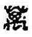
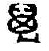
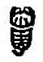
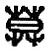

## 二、训诂的步骤方法

（一）识文字

阅读中医古籍，当然涉及多方面的知识，但首先要识字。字不识则辞不达，辞不达则义不明，义不明则理不通。识字既易又难。何以言之呢？有些字查查字书就可以解决了，所以说识字易。但有些字查查字书，也不那么简单地可以解决，甚至专家也可能弄错。字识了，对它的形音义也就瞭解了大半。这里须要说明的是繁体字的概念：繁体字，是指相对于古代当时的简化字而言，不能理解为我们现代所说的“简化字”。古字书对简化字多称作“某省”、“某，某之省”。例如：（按古简体、繁体与现代简化字排列）

冬=終≠终 内=納≠纳 胃=謂≠谓

合=答≠苔 无=撫≠抚 吾=寤≠（⿱宀⿰丬吾）

兑=鋭≠锐 化=貨≠货 母=貫≠贯

凡=風≠风 區=傴≠伛 厲=癘≠疠

文字的历史，是由简到繁、由繁到简，辨证地发展。下面我讲几点初学常遇的识字问题。

1.惑僻字：惑谓惑疑，古称“或作某”，或即惑。僻谓生僻。一般惑僻字，查阅现代工具书如《中华大字典》、《辞源》、《辞海》等就可以解决。但有些中医古籍出现的惑僻字，以至工具书也查不到。这不仅对于初学者是个问题，对于专家也是很麻烦的事情。且不说最古的医籍，就以唐宋医籍而说，如宋•庞安时《伤寒总病论•少阴证》（据影宋版）：“少阴病，恶寒而自𠡶”；“少阴病，恶寒而𠡶”。这里的“𠡶”字，一般常见字书均查无此字。这就是惑僻字。汉字形声并重，声寄乎形，形寄乎义，凡是在字书查不到的字，或字形众说纷纭，就要注意，不可轻易放过。

前述“𠡶”字条文，系引仲景《伤寒论》。查影宋本晋•王叔和《脉经》、翻宋本仲景《伤寒论》此条文并作“踡”。按今传之《伤寒论》、《脉经》并是林亿校本。林校《伤寒论》是在宋元祐三年（1058），庞著《伤寒总病论》是在宋元符三年（1100），庞不能不见到林校本。庞氏与苏东坡、黄庭坚等过从甚密，是位儒医名家，难道能写错字吗？考《说文》无踡字，有卷字，通作卷。《说文•卫部》：“卷，厀曲也，从卪，𢍏声。”

汉魏间券或作“𠡶”，《庄子•应帝王》：“学道不勌”， 勌即劵。反之卷亦可书作𠡶。卷、劵（今通作倦）为正字，𠡶、勌为古别体。至晋•顾野王《玉篇》方出现“踡”字，即古卷字之后起字，别书作㓬。殆庞氏在北宋时得见古本《伤寒论》，未经林亿校改者也。上述说明“𠡶”不误。

又如“㿠”字，最早见于宋•钱乙《小儿药证直诀》。在该书“肾虚”证说：“儿本虚怯，由胎气不成，则神不足，目中白睛多，其颅即解，面色㿠白，此皆难养。”其他在“胃气不和”、“ 胃虚冷” 、“虫痛”、“解颅”、“冯承务子”一案、“地黄丸”条等六处都曾提到。以后中医文献和现代中医教材中也常见到此辞，但都未加考释。查宋以前以后字书，皆无此字。㿠考，当为晄字之讹。古“日”偏旁，俗书常讹作“白”。如“的”，本来从日不从白。《说文•日部》：“的，明也，从日，勺声。”段注：“旳者，白之明也，故俗字作的。”不单是“旳”讹作“的”，其他如暤、晥等，俗均讹作皞、皖。《六书故》：“皞从白，日之讹也。”《集韵》：“皖，明貌，或从日。”以上可证㿠，当作晄，亦即晃。《说文》：“晄，明也，从日，光声。”段注：“晃者，动之明也。凡光必动；会意兼形声也。”据此，所谓“面色晄白”者，义为面色虚浮而亮白。今临床常见浮肿患者，皮色白而发亮，此正是虚象之征。

有些医籍虽然成书甚古，但刊刻较晚，惑僻字更是多见而且复杂了。例如：《素问•刺腰痛论》曰：“目䀮䀮然，时遗溲。”本篇下文及“脉解篇”又作“目𥉂𥉂然”。《灵枢•经脉》篇和“杂病”所写与“刺腰痛论”同。按汉世字书无此二字。至宋•宋祁等《集韵》始收𥉂字，云同䀮。明•杨慎《古音转注略》有䀮字，云同贸。明•张自烈《正字通》则说䀮为䀮之讹。实则䀮或作𥉂，即今之“盲”字。《说文•目部》“盲，目无牟子也。”篆文书作盳。盳之偏旁亡，古书或作芒，马王堆出土《相马经》云：“进退而不良者何也？是不能灭芒数死生者也。”这里灭亡书作“灭芒”。芒亦可借作荒，如马王堆出土《春秋事语》：“乐者芒芒”；《经法》：“〔阴窃〕者土地芒”。以上芒皆为荒。故盳然，亦可书作𥇀然、𥉂然。《太素》正作“𥇀”。 䀮则为𥉂之讹省，䀮则又为䀮之讹。是则《内经》之𥉂、䀮，并应作盳即今盲。《释名•释疾病》：“盲，茫也，茫茫无所见也。”结合《说文》所云，《经》所谓“目盲盲然”，形容目失明貌。

以上举例、说明迂到惑僻字，不可轻易武断或因循旧说，须追索文献资料，究诘本末，只靠现行的一般工具书就不行了。

2.古今字：什么是古今字？段玉裁说：“古今人用字不同，谓之古今字。”又说：“凡读《经》者，不可不知古今字。古今无定时，周为古则汉为今，汉为古则晋宋为今，随时异用者，谓之古今字。”（上见《说文》今、谊二字段注）段氏是就文字的使用方面，亦即从训诂学角度来定义古今字的，而不是从文字的起源先后，亦即文字学的角度来定义古今字的。现代小学家对古今字的定义，还没有一个统一的认识和确切的定义。事实上，古今字的情况比较复杂，是个在理论上有待解决的问题。

例如：王冰注《素问•四气调神大论》中的“夜卧早起”、“早卧早起”、“早卧晚起”，在杨上善《太素•顺养》中此段经文的“早”并作蚤。按蚤通早，《礼记•月令》孟春纪“草木蚤落”，郑玄注：“蚤，音早。”其下“煖气早来”，早又不作蚤。说明在秦汉早和蚤互通并用。今人金德建考证，认为蚤是古文，早是今文。据此，王冰本《素问》用的是今字，《太素》用的是古字。可是，《礼记》郑玄注所谓的今已是汉代，王冰是唐人，况且汉代就早、蚤并用，怎能说王冰本《素问》的早，一定晚于蚤呢？如从文字学的角度看，也难定早、蚤谁是先后。《说文》两字均收，日部：“早，晨也，从日在甲上。”虫部：“蚤，齧人跳虫也”。可见早是本字，蚤是借字，早应先于蚤。足见古今字给读者、学者带来的麻烦。从文献学实用的角度出发，我们规定：凡古医籍中出现的与近代繁体字形异义同的字，我们都叫古今字，包括通假字，不包括异体字、俗字。

在古医籍中经常见到古今字，情况相当复杂。从训诂学的理论上对它分类，还有待研究。大体有以下几种情况：

（1）表示博雅，故用古字：如明•杨士奇《玉机微义》序：“奉命填抚陕西，躬勤蚤莫，苏息彫弊，民用向安”；“若诸家治法不倍于此者，亦旁采而附益之”。这二段文字就用了填、蚤、莫、倍四个古今字。填通镇，《汉书•高帝纪》：“填国家，吾不如萧何”。颜师古注：“填，与镇同，安也。”又如《汉书》镇夷、镇戎、镇星等，镇并作填。蚤莫即早暮。《诗•小雅•采薇》：“岁亦莫止”，郑玄笺：“莫，晚也。”释文：“本或作暮。”银雀山汉墓竹简《孙膑兵法》日暮作日莫，如“日莫路远”。《说文》：“倍，反也。”今通作背。《礼记•缁衣》：“信以结之，则民不倍”；银雀山汉墓竹简《孙子兵法》：“倍丘勿迎”，倍并训背。其实在明代，这些字已不通行，杨士奇不过是为了表示博雅，故意使用了这些古今字。再如清•黄庭镜《目经大成•勿药元诠》“大智大勇”写作“大知大勇”，亦属此类。

（2）当时风尚，随众就俗：一个时代有一个时代的风尚，有的古今字是当时风尙、众约俗成，著书人并非故炫博雅，所谓时势使然。

如元•王好古《汤液本草》序：“《医垒元戎》、《阴证略例》、《癍论萃英》、《钱氏补遗》等书安樂之法，《汤液本草》统之。”考“安樂”，即案藥。《史记•秦始皇纪》：“安士息民”，唐•司马贞《索隐》曰：“贾谊《书》，安作案。”案亦通按，马王堆医帛书《五十二病方》：“止血出者，燔发，以安其痏。”安即按。《说文》：“按，下也”。樂通藥，《诗•陈风•衡门》：“泌泌洋洋，可以樂飢”。毛注：“魯、韩樂作疗。”郑玄笺：“飢人见之，可饮以𤻲飢。”是则，郑训樂为𤻲。《五十二病方•干骚方》：“节（即）炙裹樂”，樂即药。《说文》：“𤻲，治也，从疒樂声，或从尞。”《孔子家语•正论》：“不如吾所闻而藥之”，注：“藥，疗也。”与《素问•骨空论》：“数刺其俞而药之”药义同。可证古樂、𤻲、療、藥音同义通。“安樂”即按藥，犹言下药、用药、遣药。王好古也非故意炫古，宋金元医家习此用字，如金•张元素釐正的《张仲景五藏论》：“又不识病，以情臆度，多安藥味，譬之猎兔，未探其窟，广发人马，空地遮围”。宋•刘昉《幼幼新书》卷十“天钓”引《茅先生》论：“与服安藥”，安藥亦即安樂、按药，知非王好古一人如此，实为时习使然。

（3）传本不同，承袭旧貌：在古医籍中，由于传本不同，各自见到的文字本有差异。

如《难经•十六难》：元•吕复校本滑寿《难经本义》“四肢满闭，淋溲便难”，《王翰林集注黄帝八十一难经》本“淋”作癃。宋•丁德用《补注难经》（1607）注曰：“淋溲难者，足厥阴上系舌本，下环阴器，故淋溲便难也。”宋•虞庶《虞注难经》（1067）注曰：“癃溲，谓小府涩也；便难，大府所注难也。”从注文得知，滑寿《难经本义》作“淋”，同丁德用本；《集注难经》作“癃”，同虞庶本。按：淋、癃、古今字也。秦汉古音、淋林痲临与癃隆泷陆，都是双声，它们之间都可通假。癃古又作𤸇，《太素•经脉》：“遗溺闭𤸇”，杨上善注：“𤸇篆文痲字，此经淋病也，音隆。”《释名•释疾病》：“痲，懔也，小便难，懔懔然也。”《楚辞•严忌哀时命》：“冠崔嵬而切云兮，剑淋漓而从横”；《楚辞•离骚》：“带长鋏之陆离兮，冠切云之崔嵬”；淋漓作陆离。《论衡•自纪》：“笔泷漉（即𣶇）而雨集”，淋漓作泷漉。《荀子•疆国》：“踰常山乃有临虑”，杨倞注：“《汉书•地理志》临虑县。”《史记•孝景帝纪》：“丁卯，封长公主子为隆虑侯。”《续汉书•郡国志》：“河内郡林虑，故隆虑，殤帝改。”殤帝即刘隆（106），就是说因避他的名讳，以同音字林虑改成隆虑的名称。上述可证古字淋、痲、林、临、癃、隆、泷、陆并同音通借。汉初史游《急就篇》（公元前48〜33）有“虐瘚瘀痲温、笃癃衰废迎医匠”，参之《释名》，说明古痲是今淋本字，癃是借字，癃本训疲废之疾，故《急就篇》以病类相近者分别列出。

又如《幼幼新书》卷九“慢惊风”引《茅先生》论：“若服热不退”；又卷十“惊钓噤”引《吉氏家传》：“朱砂膏”：“或久服惊气”。“服”借作伏，服、伏古今字。《书•康诰》：罪人黜伏”；《书•吕刑》：“五罚不服”；《说文通训定声》说：“伏，假借为服”。《荀子•性恶》：“伏术为学”，杨倞：“伏术，服膺于术。”可证“服热不退”即“伏热不退；“久服惊气”亦即“久伏惊气”。

上述情况在医籍中甚为多见，因为所据底本如此，引录时仍承袭旧貌，故而出现一书同义异字现象。

（4）以讹乱真，字无定法：医籍和文史之《经》、《传》有些不同。《经》、《传》一字一句，皆历经官私学者考校，虽然也存在古今异字、转注通假，终有家法可循。而医家文史修养水平不齐，且时见一些著作，行文用字、传抄刊刻均不甚讲究，信笔写来上版，並无一定规范。或由经济条件所限，委之工匠，无力求精，或致讹误，却反合古今用字通假之例。我们所谓的“真”，即是符合训诂通假例律的真。这就更增加了情况的复杂性。

例如《素问•四气调神大论》“圣人行之，愚者佩之”，宋・方导《方氏家藏集要方》（1197）作“圣人行之，愚者背之”，按“佩”通背，佩、背古今字。王冰注本《素问》及唐卷子本《太素》并作“佩之”，方导作“背之”，显是方氏通晓古训而改为今字。这种情况还算是较好辨别的。有的情况就复杂，例如：王冰注本《素问•阴阳别论》“二阳之病发心脾”，金•张子和《儒门事亲•二阳病》作“二阳之病发心痹”（据千顷堂翻吴勉学刊本）。按此处经文本应作“痹”（考见后），脾、痹古今字，《太素》正作“痹”。是否张子和见过《太素》？如见过，更增加脾作痹的合理性与真实性。洽巧《儒门事亲•扁鹊华佗察声色定生死诀要》注文，就引用了一大段《太素》，似乎张子和见过《太素》。脾作痹，既合训诂之例，又合经文本义，他反映了经文的真实。然而对《儒门事亲》的作者来说，这的确是个讹字。张子和确是按脾字解说的，如说“心受之则血不流，故女子不月；脾受之则味不化，故男子少精”。《太素》早在南宋时已亡，事实上张子和也未见过《太素》，那段引《太素》的注文，是转录林亿校正《脉经》的注语。这样，讹传倒反映了真实。这种情况，医籍中见到的很多，如《本草纲目》（金陵本）女萎主治条“痹胃虚乏，男子小便频数、失精”，此也是以痹讹脾。又羊肝附方：“青羊肝，主治病后呕逆，作生痰食，不过三次则愈。”此以痰讹淡，按痰、淡古今字，古痰通作淡，然实是讹字。近人还将上述讹例收入《中医古籍通借字古今字例释》作为实例，这也成了以讹乱真了。

又如《幼幼新书》卷九“惊风”引《张氏家传》𥐥皂圆：“及去风痰、痢胸次，常服永无痰疾。”按痢、利古今字。《中华大字典》说“古无痢之名词”，实不确。如希麟《续一切经音义》卷六：“《切韵》：痢，病也。顾野王云：泻，痢也。《说文》云：从疒，利声”。是知《说文》已收痢字（今大徐本《说文》脱）。痢字又见于汉《曹全碑》，唯秦汉古籍多用利而不用痢，如《内经》、《伤寒》、《金匮》。“胸次”即胸中，《庄子·田子方》：“喜怒哀乐，不入于胸次”；释文：“李云：次，中也。”故“痢胸次”犹言“利胸中”，《张氏家传》“胸次”显是用《庄子》的典，而痢假利也合通假之例，《鬼遗方》卷三“大黄汤”下“快痢为度”，亦痢假利。是“痢胸次”，实当作“利胸次”。

为什么会出现这种“以讹乱真”的现象？因为古字十之八九，同音均可通假。古人抄书或书写上版，时或一人持稿朗读，一人听写，依声属字，字或讹而音实同，故多可通假。

3.异体字：从理论上讲，异体字是相对于正体字说的。但什么是正体字呢？我们很难给它下一个确切地定义。我们只能原则的说：正体字就是在历史的当时，被大家承认而通行的规范字。因此，有别于这些规范字的字形、而同字、同义的字就叫异体字。不过，这样说法对于大多数阅读古籍的人，并无实际的意义。因为文字语言一直都在不断地变化，古代历朝都难以规范、控制这种变化，这里不去详细的论述。我们规定：凡相对于近代通行的繁体字的同义、同字、不同形的字，都叫异体字，包括文字学、训诂学所说的别字或俗字，不包括通假字。

在医籍中异体字很多，难以胜举，如影宋本《刘涓子鬼遗方》：黑铅写作黑鈆，硇砂写作𥐻砂，刺写作㓨，肉写作宎，叶写作𦰧。影宋本《伤寒总病论》：总病写作緫病，沿习写作㳂习，脱营写作脫营，当归写作当㱕，唯作雌，葱作萒。明•吴勉学刊本《格致馀论》：朱震享作朱震畗，彦修作彦脩，兮作芍，美作羙，投作投。大量的异体字，大约有以下几种情况：

（1）使用古本字：如时作旹、宜作宐、躬作躳、蛇作虵、佗作他、脉作脈、法作灋。宁作寗。

（2）使用古籀字：如肉作宍、歸作㱕、脉作衇。

（3）古原就并行而承袭的字：如烟和煙、刺和㓨、蚓和螾、饰和饬、洒和灑。

（4）使用汉隸字：如坐作𡋐、從作従、定作㝎、弘作𪪺、留作㽞、充作𠑽、葱作兖、员作貟、桑作桒、虎作乯、邊作邉、所作㪽。

（5）使用魏晋六朝以来的别字：如经作经、麦作夌、摠作惣、縂作緫、體作躰、體作骵、趣作𠮋。

（6）使用简化字：如棗作枣、留作畄、變作变、後作浚、樓作楼、壯作壮、麤作麄。

（7）使用佛道惯用字：如氣作炁、妙作玅、婆作㜑、淫作婬、丘作𠀈。

（8）使用俗字：如脣作唇、怪作恠、泪作淚，兮作𠔃、台作𦥄。

（9）使用避讳字：如葉作𦰧、世作卅、泄作𣳘、昬作昏、民作民、（以上为避唐太宗李世民讳）旦作旦（避唐睿宗李旦讳），恒作恒（避宋钦宗赵桓讳）、真作真、貞作貞（避宋仁宗赵祯讳）、玄作玄（避宋太祖的始祖玄朗或清康熙玄晔讳）弘作弘（避宋太祖父弘殷或清乾隆弘曆讳）、丘作丘（避孔子讳）因避讳而字形异构或缺笔属此，易字不属此。

4.讳改字：历代由于避讳而改用另一字而代替原字的情况很多，不识讳改之字，时而引起误解，如《太素》因避唐太祖李渊讳，改太渊穴名为太泉穴，改丙为景。因避李世民讳，改泄为洩、改李世勣为李𪟝。因避唐高宗李治讳，改《伤寒论》等治中丸为理中丸。因避宋太祖始祖玄朗讳，改《伤寒论》等玄武汤为真武汤。因避唐高宗太子李弘或宋太祖父赵弘殷、或清乾隆弘曆讳，改陶弘景为陶宏景。因避赵弘殷讳，改《经效产宝》作者咎殷为咎商。因避宋太祖赵匡胤祖赵敬讳，改咎殷《食医心镜》（镜与敬同音）为《食医心鑑》、改苏敬为苏恭。为避汉惠帝刘盈讳，改《素问》“不知持盈”为“不知持满”。因避汉文帝刘恒或宋真宗赵恒讳，改中药恒山为常山。因避唐代宗李豫讳，改中药署豫为山药。医籍中还有一些这类情况，不再枚举。

（二）通音韵

文字训诂之学，至清代出现了一个划时代的鼎盛时期，人才济济、硕果纍纍。清儒之所以取得这样的巨大成就，其中很主要的原因是在音韵方面有了突破性地发展，得力于因声求义这把钥匙。文字训诂和音韵有十分密切的关系，黄侃说：“《说文》义训只居十分之一二，而声训则居十之七八。故凡‘也’字上之说解、字与声音有关者，皆不可忽略。总之以义训者，苟取以相明，惟声训乃真正之训诂。”以至说音韵即训诂，足见小学家对音韵重视的程度。

音韵分上古音、中古音、近古音、现代音。和医籍关系密切者，主要是上古音、中古音。作为中医药专业人员，特别是初学者，通晓古音韵学是比较困难的。但我们可以查阅一些工具书，利用音韵学一些现成的结论与成果，来作为我们阅读古医籍的手段还是可以做到的。我们这里讲一些应用例。

1.因声求义：训诂学强调因声求义非常重要。读音不正，则可字义差误。凡字读音可疑者，也不能轻易放过，宜探求究竟，方能字义明了。

例如：《灵枢•口问》：“人之亸者，何气使然？”《诸病源候论》有“风亸曳候”，谓“肢体弛缓不收摄也。”《甲乙经》作“軃”，《太素》作“掸”。今音为duǒ，训垂下貌，本自宋•陈彭年《广韵》。又读tuǒ。按唐以前字书无亸字。我原来疑其为惮之声假，即今瘫字，这是不确切的。今之瘫，古为“偏枯”。《病源》虽将亸收入风门，而《灵枢•口问》却用于病因病机上，说的是胃不实而使脉虚，筋脉懈惰，在此基础上行阴用力（强力行房）而致不能复元，筋脉更为懈惰，这和中风偏枯是不同的，相当古之“瘅”病。《说文》：“瘅，劳病也。”该字通惮，《尔雅•释诂》：“瘅，劳也。劳来强事，谓翦篲勤也。”释文云：“瘅，丁贺反，本或作惮，音同。”郝懿行《义疏》谓“强事”之强，犹劝也，勉也。《考工记•梓人》有“强饮强食”。故强力为之谓劳，积劳成病谓瘅，与《灵枢》义正合。《太素》作掸者，惮之假也；《灵枢》作亸者，瘅之訛也。据此，字宜作瘅，读dán，而读duǒ、tuǒ，并训垂下貌，均误。

《诸病源候论•风亸曳候》所说之亸，同今字的瘫痪之瘫。古无瘫痪二字，至宋•丁度《集韵》始收痶痪二字。瘫痪，本应作惮缓，《说文》：“惮，忌难也，一曰难也；从心，单声。”难即艰难，《庄子•说剑》：“瞋目而语难”，释文曰：“语难：如字，艰难也。”艰难亦犹困苦，《左哀公十二年传》： “今吴不行礼于卫，而藩其君，舍以难之。”杜予注：“难，困苦也。”故难引申为中风引起的手足活动艰难困苦之风疾。《诗•小雅•大东》：“哀我惮人”，惮字毛《传》、鲁《诗》均亦作瘅，《广韵》：“瘅，风在手足病也。”声音缓慢松弛也称惮缓，《礼记•乐记》：“其声啴以缓”， 啴通惮。《史记•乐书》：“啴缓慢易（弛）”盖风疾不仅手足失用，语言亦多兼謇涩，故孳乳以惮缓名风疾。惮、瘅、啴，亦假作𤺺，如《诗•小雅•板》：“下民卒瘅”，《礼记•缁衣》作“下民卒𤺺”；《书•毕命》“彰善啴（惮）恶”，《礼记•缁衣》作“章善𤺺恶”。是以《龙龛手鑑》云：“𤺺，多旱反，病也。”𤺺又假作痶，缓又假作𤹹，同书云：“痶，他典反，𤹹病也。”；“𤹹，他短反，痶𤹹也。”明•张自烈《正字通》如又假作瘫痪。啴缓，《列子•力命》“啴咺憋憋”缓又假作咺；《文选•洞箫赋》“啴唌逸豫”缓又假作唌。总上所述，从音韵上证明古之惮缓的演化之迹，即瘅缓、啴缓、𤺺缓、掸缓、軃缓、亸缓、啴亘、啴唌、痶𤹹，并同声相假，最后转化为今之瘫痪。軃、亸、痶、𤹹、皆六朝以来之俗别字，而瘫痪更为后起之字了。惮缓以至瘫痪，即音韵学所谓的叠韵辞，就是说它们的声母不同，但韵部相同。惮、瘅等字古音都是定母、元韵，读若dán；缓、咺等字古音是匣母或晓母，也都是元韵，读若xuǎn，今读huǎn（注意标音后边的an）。因而也证明亸、軃也应是元韵，不能是定母或端母侯韵，即duo或tuo。

又如《素问•生气通天论》：“因于寒，欲如运枢”。按：运枢，全元起本原作连枢。今唐写卷子本杨上善《太素》也作连枢。足证运枢二字古本原作连枢。历来注家皆未详细弄清连枢的意义，至于误写成运枢，更是莫知所谓了。按连枢，读如连娄。本来是古双声辞方言。《方言》说：“㘓哰、謰謱，拏也。东齐周晋之鄙曰㘓哰，㘓哰亦通语也。南楚曰謰謱，或谓之支注，或谓之𧮪諕，转语也。拏，杨州、会稽语也，或谓惹，或谓之䛳。”郭璞注说：“謰謱，上音连，下力口反。”《说文•辵部》又作连遱。《玉篇•口部》作嗹喽。《淮南子•原道训》作连嵝。高诱注又作离嵝。连枢即是謰謱。古连、謰、嗹、㘓、离并是来母、元韵（读若lian）：古枢、哰、謱、嵝、并来母、侯韵（读若lou）。连枢以至嗹喽，即音韵学所说的双声辞，就是说它们的声母相同，但韵部不同（注意标音前边的 l）。说连枢、连喽、㘓哰都一样，本是取音不取字。连枢是牵引委曲的意思。《方言》说謰謱，拏也。《说文》：“拏，牵引也。”又《淮南子•原道训》：“终身运枯形于连嵝列埒之门。”高诱注：“连嵝犹离嵝也，委曲之类。”按寒主收引，《至真要大论》说：“诸寒收引，皆属于肾。”故此处经文说“因于寒，欲如连枢”，即因于寒，则数若牵引委曲。欲，数也，《礼记•玉藻》；“疾趋则欲发”，郑玄注：“欲，或为数。”《说文通训定声》：“欲，假借为数。”

2.因声证义：有些字辞，可以通过音训而证明其义意。

如《灵枢•根结》：“一日一夜五十营”。按：营，今读作营养、军营的营。营字本应读作还。单纯是读音的错误问题到不大，问题是因为误读，在营字的意义上还发生许多误解。如马莳，训营为度、为运。按《管子•君臣》篇说：“兼上下以环其私”。王念孙《读书杂志》曰：“环之言营也，谓兼上下以营其私也。营与环，古同声而通用。《韩子•五蠹》篇曰：古者苍颉之作书也，自环者谓之私。《说文》厶《私》字解引作自营为私。《韩子•人主》篇：当途之臣，得势檀事，以环其私。谓自营其私也。环字亦作还。《管子•至数》篇曰：大夫自还而不尽忠。谓自营也。《秦策》曰：公孙鞅尽公不还私。谓不营私也。”

戴望《管子校正》说：“《荀子•臣道》篇：朋党比周，以环主图私为务。环主，谓营惑其主也。《成相》篇：比周还主党与施。还与环同。《春秋•文十四年》：有星孛入于北斗。《谷梁传》曰：其曰入北斗，斗有环域也。环域即营域。环与营同义，故环绕即营绕，环卫即营卫。又《齐风•还》篇：子之还兮。《汉书•地理志》还作营，亦同声而借用也。”

又考《尔雅•释丘》；“水出其左曰营丘。”郝氏《义疏》：“《诗正义》以为水所营绕，故曰营丘。”营绕即还绕。《史记•黄帝纪》：“以师兵为营卫”。营卫即环卫。《公羊传•庄二十五年》：“以朱丝营社”。营社即环社。《说文》：“营，帀居也。”段注：“币居者，谓环绕而居。如市营曰阛，军垒曰营皆是也。”钮树玉《说文新附考》说：“阛即营之别体。”又孙星衍辑《苍颉篇》说：“古阛，只作营，营阛声近。”故《老子》“魂魄”亦作营魄，营为魂之音假。以上可证五十营即五十环。后《营气》篇说：“专精者，行于经随，常营无已。”常营无已，即常环无已。五十营的营字，马莳训度、训运，皆误。五十营即五十环。

还、环古读曰旋。如《素问•脉要精微论》：“其耎而散者，当消，环自己”。按：王冰注说：“诸脉耎散，皆为气实血虚也。消，谓消散。环，谓环周，言其经气如环之周，当其火王自消散也。”王注不确。细寻经文，所言脉诊凡说其耎而散者之后，全是接着说应当发生什么疾病。如“其耎而散者，当病灌汗”；“其耎散色泽者，当病溢饮”；“其耎而散者，当病食痹”；“其耎而散者，当病少血”。依彼例此，“当消”即当病消疾，绝非消散之消。

环自己的环字，当作旋字。环、还、旋古通。《汉书•董仲舒传》：“此皆可使还至而立有效者也。”颜师古说：“还，读曰旋。旋，迅也。”《国语•晋语》：“骊姬使奄楚以环释言。”以环释言，即以还释言。《山海经•北山经》：“归山有兽名曰䮝，善还。”郭注：“还音旋。”据此，环自己即旋自己，即是说很快就会自愈。王冰不识上古音读，致令注解也未妥当。

以上营读还、环读旋，就是上古音韵，王冰读环为huan，即是按中古音韵读的。古今音韵不同，往往用字也异，以今音释古读，就可能发生误解。

又如：《素问•五藏生成论》：“徇蒙招尤”。王冰注：“徇，疾也；蒙，不明也；言目暴疾而不明。招，谓掉也，摇掉不定也。尤，甚也，目疾不明，首掉尤甚，谓暴病也。”王冰训徇是据《说文》：“侚，疾也。”侚或作徇。这里王冰未注意到“徇蒙”、“招尤”都是连緜字。连緜字的特点，从音韵学上说，不是双声便是叠韵；从训诂学上说，两个字不能分开为训，它是作为一个辞来出现的，并且常常是因声託义，或用本字，或用借字，同声相假，不拘形迹。徇、眴古音并为邪母真韵，例得通假。眴通眩，《文选•杨雄•剧秦美新》：“臣常有颠眴病”，注曰：“眴与眩，古字通。”眴又假作恂，《列子•黄帝》：“今汝沐然有恂目之志”，宋•陈景元释文曰：“何承天《纂要》云：吴人呼瞬目为恂目。”瞬亦通眴，秦恩复曰：“恂，当作眴。”眴、眩古并读若yūn（音晕，今读眴为xùn，读眩为xuán），眴蒙、眩蒙，犹言目昏旋晕。《太素•色脉诊》杨上善注：“徇蒙，谓眩冒也。”蒙冒双声，例得通借，张仲景《伤寒论》就用作眩冒，眩蒙即眩冒，杨注是正确的。以上是从音韵上析证徇蒙即眩蒙、眩蒙即眩冒，从《经》与《伤寒论》的共同的医理上也是一致的，都是说的少阳证象的表现，这里不详述。

“招尤”也是连緜字，王训尤为甚，自然失之。杨上善注谓：“招尤，谓目招摇、头动战尤也；尤音宥。”元•滑寿《素问钞》说义同杨，云“招尤应作招摇，谓头振掉而不定也”。俞樾、孙诒让、于鬯等已指出王注之非，唯俞等也未得《经》义之实。王冰训释既不合训诂学之理，也不合医学之理，《经》文未言“头”，且大凡眩蒙之病禁怕或不发生头摇。招尤也可称踔尤、逴骚、悼骚、桌苕，皆音近。《说文》：“逴，远也。从辶，卓声。一曰蹇也，读若桌苕之桌。”朱士端《说文校本》说：“桌苕即逴骚，同音通假。”《方言》：“逴、骚、悼，蹇也。吴楚偏蹇曰骚，齐楚晋曰逴。”郭璞注：“蹇，跛者行，𧿒踔也。”

《广雅•释训》：“𧿒踔，无常也。”又“释诂”曰：“逴、骚、（九卓）、蹇也。”《说文》：“尣（即尤），（九皮）曲胫也。从大，象偏曲之形。”古音尢为章母宵韵，读若zhāo；逴、踔、卓透母药韵，读若tiǎo。尤，匣母之韵或余母幽韵，读若xiǎo；骚，心母幽韵，读若sāo；苕，定母宵韵，读若diáo。尤、骚、苕以上述之逴、踔、桌、招，并不属于一个韵部，但它们都可以通借通押（注意标音ao），这种韵部不同而可通借的，音韵学叫作通转，如药、宵；幽、宵。以上说明招尤以至逴骚，乃叠韵连緜辞，为古通语，不是头振掉不定，而是足跛行不定之貌。王冰、杨上善、滑寿的训解都是不确切的。

3.因声决疑：有些医籍中的名物术语，虽经历代医家注释，但众说纷纭，使我们无所适从。有的通过音韵的通假分析求证，可以使疑惑得以解决。

如《素问•刺禁论》：“刺气街，中脉血不出，为肿鼠僕，”唐•王冰注：“今刺之而血不出，则血脉气并聚于中，故内结为肿，如伏鼠之形也。”林亿等新校正云：“按别本僕，一作鼷。‘气府论’注：气街，在脐下横骨两端鼠鼷上一寸也。”检今本《素问•气府论》注，确作鼠鼷。《甲乙经》卷五第一上，字作“鼠𪖈”《诸病源候论•附骨疽候》字作“鼠𦡧”，《医心方》作“鼠𪖊”。到底是鼠僕、鼠鼷、鼠𦡧、鼠𪖈哪个对？

按仆为復之假，《春秋•昭公七年左传》：“吾先君文王，作僕区之法”。汉•杜预注：“僕，隐也、”隐亦伏也，故王冰训僕为伏。我们这一推论，得到出土文物的证实。马王堆汉墓帛书《五十二病方•穨》：“穨者及股癕（壅），鼠复（復）者，口中指蚤二〔七〕，必廖。”按腹癕 ，言股阴隈曲之处，癕通壅，《史记•司马相如传》：“批岩冲壅”。唐•张守节《正义》：“壅，隈曲也。”鼠复，即鼠復、鼠覆、鼠𥨍，古復、覆、𥨍通，复为復之省。《集韵》：“𥨍，通作復。”《说文•穴部》：“𥨍，地室也。”《广雅•释室》：“𥨍，窟也。”引申有潜伏之意，《史记•乐书》：“復乱以饰归”。《正义》曰： “復者，伏也。”頹疝潜入股阴之处，如鼠伏窟，故名鼠復。盖指腹股沟裂孔疝状。古无轻唇音，復、伏、僕，皆是并母屋韵，读音若bù。至于𪖊、𦡧、𪖈、𦢂，乃是六朝俗写假字。六朝僕，俗体作𢖃（见魏《司空王诵墓志》），或作𢖃（见齐《叱列延庆妻尔珠元静墓志》），故偏旁或作菐，或作業。唐以后又误为鼠鼷、鼠蹊。自鼠鼷行而鼠僕而鼠復晦。是则，王冰所见与皇甫，巢氏本作鼠僕，后世不识，以致讹传。实则，本字应作鼠伏，初为一种症状的象形描写，后世又引申为解部位的名称，今或又讹作鼠蹊。

在音韵学上，古人所用的反切上一个字叫作声纽。上述僕、伏异字同音，就是因为古今声纽不同的原因。

又如《神农本草经》石龙芮，云“一名魯果能”。《太平御览》卷九九三地椹条：“一名石龙芮，一名食果能。”到底应作魯果能还是食果能？按石、食古纽为禅、船（即声母），古音石的读音近柘（zhè），食近彻（chè今转读吃）。龙、果古纽为来、见，龙音读近萝（luó）。芮、能古纽日、泥，芮音读若耐（nài），能读近哪（né）。声纽禅、船；耒、见；日、泥；纽有不同，但古音类近，可以通假，音韵学叫声类通转。据此，石龙芮、食果能，本是音类相同，一声之转。作魯果能是不对了，魯当是讹误。石龙芮为什么又叫食果能，我们也清楚了，原来是一音之假。如用今天的音读，就不知其意了，也难定谁是谁非。

4.因声订阙：在古医籍中，有些是用韵文写的。但由于年代久远，夺漏错简之处是经常见到的，也是在所难免的。既然是韵文，就有可能运用音韵学的手段和规律，去订阙补佚。

例如《素问•方盛衰论》：“诊有十度：度人脉、度藏、度肉、度筋、度俞、度阴阳气、尽，人病自具”。按：此段经文脱误较多。度阴阳气、尽，人病自具，言不成句，文不成义。前说诊有十度，核之实不足十度。且本篇经文皆以四字韵文排句成段。既然此段《经》文是以韵文写成，我们从“人病自具”一句，知道它的韵脚。具，古音群母候韵，音近救（jiǔ）。文中只有俞字，古余母侯韵，那么它一定是韵脚。前已言之，《经文》不足十度，自然少了什么。文中提到藏、俞，而未提到府、经，这是不合乎常理的，《内经》常是藏府、经俞连语。可见它缺了府、经二字。府，古帮母侯韵（音近补bu），经，古见母耕韵，府字当是韵脚。这样，我们试补缀全段《经》文如下：“度人度脉，度藏度府；度肉度筋，度经度俞；度阴度阳，人病自具。脉动无常，散阴颇阳；脉脱不具，诊无常形；诊必上下，度民君卿；受师不卒，使术不明；不察逆从，是为妄形；持雌失雄，弃阴附阳；不知并合，诊故不明；传之后世，反论自章。”尽字，气字，是衍文还是另有脱简留下的残文，姑且不定。文中行读háng，卿读xiàng，明读méng。前段韵协府、俞、具；后段韵协阳、行、卿、明、行、明、章。

又按：“散阴颇阳”王冰注：“是阴散而阳颇调理也。”颇，字书无调理的意思。颇，应训倾、训偏，散阴颇阳，即阴散阳倾。王冰未察颇字的古训，望文生义。岂有阴散了，阳还能调理的道理呢？“具”谓依据，自具，即有依据，不具，即无依据。是说阴散阳顷，脉动就无常了；脉脱了就无法依靠脉象的依据，诊病就要相机行事而无定规。

又如《甲乙经•九针九变十二节五刺五邪第二》一段《经》文，历来认为难读。刘衡如根据《太素•五邪刺》、《灵枢•刺节真邪》互勘；又分析到它是七言韵文，有的注语（⿰扌䦨）入《经》文，因而纂乱难读。他把注语括出，阙误的字又作了补正，于是整理出规正的七言韵文，确是好懂好读的多了。兹录如下，以供揣摩。

“曰：刺有五邪，何谓五邪？曰：病有持痈者，有大者，有小者，有热者，有寒者，是谓五邪。

凡刺痈邪（用铍针）无迎陇，

易俗移性不得脓；

越道更行去其乡，

不安处所乃散亡；（诸阴阳迂痈所者，取其俞，泻也）

凡刺大邪（用锋针）曰以小，

泄夺（其）有余（乃益虚）标其道；

针干其邪（于）肌肉亲，

视之无有反其真；（刺诸阳分肉之间）

凡刺小邪（用员针）曰以大，

补（益）其不足乃无害；

视其所在迎之界，

远近尽至不得外；

侵而行之乃自贵，（剌分肉之间）

凡刺热邪（用镵针）越而沧；

出游不归乃无病，

为开道乎辟门户，

使邪得出病乃巳；

凡刺寒邪（用毫针）曰以温，

徐往疾去致其神；

门户己闲气不分，

虚实得调真气存。”

注：括号中原作《经》文，今作注文。干字乃据《太素》补。零字据《灵枢》补。反其真据《灵枢》校改，原作“乃自直道”。有些地方还有待考证。

（三）明义训

我们上面讲了通音韵，它主要说的音训，本节讲义训。所谓义训，就是解说古语古字和今语今字的概念义意对应的互训，而不管它和音韵上的关系。不过，在大多数场合遇到的，还是或多或少与音韵有一定的联系。

1.本义、假借义、引申义：义有本义、假借义、引申义。所谓本义，就是字的形、音、义三者完全相当。如果只有声音相当，而和字的形、义无关者，谓之假借义。如果声音相当，意义有相依的关系，但和字形无关，谓之引申义。引申义，清代小学家有的认为即是转注。

例如：常不得蔽。《灵枢•刺节真邪》：“故饮食不节，喜怒不时。津液内溢，乃下留于睾，血道不通，日大不体，俯仰不便，趋翔不能，此荥然有水，不上不下。铍石所取，形不可匿，常不得蔽，故命曰去爪。”《说文》云：“常，下𢂽也；从巾，尙声。”又说：“常，或从衣，帴𢂽也。”《说文》衣部云：“下㡟曰帴。”《释名•释衣服》云：“下曰裳，裳，障也，所以自障蔽也。”是古常即裳，并指下衣也。经言“常不得蔽”，即裳不得蔽，谓睾丸日大不休，下衣犹不能障蔽其形。常是形声字，从巾（或从衣）、尙声；它的本义是以巾障蔽下体的障，形、音、义全都相当，这就是常字的本义。人体的下部自古以来，都要时时障蔽，后世因袭其义，转用作经常的常。常、障、裳并阳韵音近。而经常的常义，又是从裳义孳乳来的，但已不作衣裳的常义讲，它的音与裳相当，义是由裳孳乳来的，但字形已无关了（本义之常已作裳），这就是引申义。又如中药棠梨，《诗•小雅•常棣），常棣即棠梨，是又棠作常，二字只有声音相近，和常字的本义与字形完全无关了，这就是假借义。《灵枢》“常不得蔽”用的是本义，马莳、张志聪并训常为经常之常，就是说用引申义训本义，当然就错了。古文字语言的本义，有的保留下来，有的废而不用了。常字就属于本义废用，马莳、张志聪疏于训诂，故致误解。

对于中医药工作者，在阅读古医籍时，难以一字一句穷源析流，去辨别何者为本义。如本义已废、而相沿已久以引申义、假借义来代替本义，即或不知本义，大体也是不会理解错的。如气字（不是简化字），古多作氣。《说文•气部）：“气，云气也；象形，凡气之属皆从气。”《说文•米部》：“氣，馈客芻米也；从米，气声。”芻米即今语牲畜吃的草料，古客人来了赠送草料是一种礼节，这是氣的本义。但此义早废，见到医籍中的氣虚、元氣等，谁也不会理解错，都作气理解的。但是有少部分本义未废的就不行。不过医籍遇到最多的还是假借义、引申义。由于本义、假借义、引申义辨微析异比较困难，非初学者一时可通，故下面我们着重讲一些主要的义训方法。

2.因形索义：汉字“六书”中关于形体，许慎《说文•序》曰：“一曰指事：指事者，视而可识，察而可见，上下是也；二曰象形：象形者，画成其物，随物诘诎，日月是也；三曰形声：形声者，以事为名，取譬相成，江河是也；四曰会意：会意者，比类合谊，以见指㧑，武信是也。”以上都是说的字之形体。在古医籍中，因不识字之形体而致不解其义者，也时常可以见到。

如《外台秘要》引“蠆螫方”引《肘后论》曰："此𧓽字作蠆字，所谓蜂蠆作于怀袖，贲育为之惊恐，言其小而有毒、出乎不意也。世人呼蝘蜓为蠆子，而未尝中人，乃言不可螫人”。《诸病源候论•蠆螫候》引陶隐居云：“蠆虫，方家亦不能的辨正，云是蝘蜓子，或云是小乌虫、尾有两歧者。然皆恐非也。疑则是蝎，蝎尾歧而上，故《周诗》云：彼都人士，拳发如蠆。”蠆到底是什么虫，众说纷纭。陶弘景说疑是蝎，又说蝎尾歧而上，他说对了一半。按蠆本作萬，象形。《说文•内部》：“蠆，虫也；从内，象形。”什么虫？我们一看下字便知：萬，小篆作，甲骨文作，金文作。确是蝎，唯陶说上边两歧是尾就错了。宋•袁文《甕牖閒评》确考“萬，蝎也”。（见图20）

又如吕字，也是象形，如人的脊椎节节相连。《说文•吕部》：“吕，脊骨也，象形。”医籍中常见尾闾一辞，闾本作吕，尾吕即尾脊骨，今称骶骨、尾椎。故躬，亦书作躳，弓身显吕。以上是据象形而索义。

又《武威汉代医简》82简：“莫吞十一丸，服药十日知”。莫字会意，篆文作，《说文•日部》：“莫，日且冥也；从日在草中。”段注：“且冥者，将冥也。”据形可见，日落西山，太阳的高度已将没入地平线，不及草高，不难理会已到了天晚的时候，故《说文》曰：“晚，莫也。”“莫吞十一丸”，即晚吞十一丸。

3.引征证义：引征证义，就是举出证据以明诂训之义。证有书证、物证（文物）、内证、类证，各证多交相为用。

如《素问•阴阳应象大论》：“能知七损八益，则二者可调”。七损八益，诸家议论纷纭，均未得其真谛。王冰说：“阴七可损，则海满而血自下；阳八宜益，交会而泄精。”王冰打了个含混语，一带而过。杨上善以身热、腠理闭、而粗、为之俛仰、汗不出而热、干齿、以烦悗、腹满死为八益。以身寒、汗出、身常清、数慄、而寒、寒则厥、厥则腹满死为七损。杨氏更是割裂经文，妄加臆说。

按七损八益，实际是房中术。据《玉房秘诀》引《素女经》说，男女都有七损八益。所谓七损：即一损谓绝气；二损谓溢精；三损谓脉夺；四损谓气泄；五损谓机关阙伤；六损谓百闭；七损谓血竭。所谓八益：一益曰固精；二益曰安气；三益曰利藏；四益曰强骨；五益曰调脉；六益曰畜血；七益曰益液；八益曰道体。致于七损八益的具体内容，这里不拟详述繁引。作者这一考证结论，现已由于马王堆出土的汉简《养生方》而得到完全证实。《养生方》所载七损八益与《玉房秘诀》大体相同（《文物》一九七四年第七期）。《养生方》载：“七孙（七损）：一曰闭；二曰泄；三曰渴（竭）；四曰勿，（伤？）五曰烦；六曰绝；七曰费。八益：一曰治气；二曰致沫（即唾液也）；三曰智（知）时；四曰畜气；五曰和沫；六曰窃气；七曰寺赢（持盈）；八曰定顷。”同时还记载了用八益之法。

所谓房中术，即男女交合之道，有些涉及性卫生，有些实属荒诞不经。此术大抵出于秦汉方士之流，道家颇多涉及。观《素问》所谓阴阳术数，积精全神、真人方士云云，不少杂容道家方士之说，其中涉及房中养生之术，自无足怪。

房中术为养生学家所重视。究其旨趣，要在调和阴阳、还精补脑，从而达到长生久视的目的。唐代著名医学家孙思邈也大讲此道。他说：“人年四十以下，多有放恣，四十以上，即顿觉气力一时衰退。衰退既至，众病蜂起，久而不治，逐至不治。”所以彭祖曰：“以人疗人，真得其真。故年至四十，须识房中之术。”《素问》本篇并说：“智者察同，愚者察异，愚者不足，智者有余。有余则耳目聪明，身轻体强，老者复壮，壮者益治。”《养生方》说：“故善用八益去七孙，耳目聪明，身坚轻和，阴气益强，延年益寿，居册乐长。”所谓智者，就是懂得用八益去七损之道，愚者即不懂用八益去七损之道。

至于所谓智者察同，愚者察异，历来也是聚讼纷纭。其实，不过是说用八益去七损，男女均可各行其道而达到自身获益的目的，这就是所谓察同。行八益之法，虽然是说的男性用法，愚者不知，意谓只有益于男而无益于女，这就是所谓察异。《玉房秘诀》说：“冲和子曰：养阳之家，不可令女人窃窥此术，非但无益，乃至损病。”又说：“彭祖曰：夫男子欲得大益者，得不知道之女为善。”又说：“非徒阳可养也，阴亦宜然。西王母是养阴得道者也，一与男交，而男立损病。”这对所谓察同、察异的意义，已经说的是一清二楚了。以上所引《玉房秘诀》即书证，马王堆出土的医简《养生方》就是物证，也可以说具有文物性质的书证。

又《素问•阴阳离合论》：“太阳为开，阳明为阖，少阳为枢”。按：太阳为开，《太素》作太阳为关。杨上善注：“三阳离阖，为关、阖、枢以养于身也。夫为门者具有三义：一者门关，主禁者也；膀胱足太阳脉主禁津液及于毛孔，故为关也；二者门阖，谓是门扉，主关闭也，胃足阳明脉令真气止息，复无留滞，故名为阖也；三者门枢，主转动也，胆足少阳脉筋，纲维诸骨，令其转动，故为枢也。”

萧延平认为《素问》作开是错误，应该依《太素》作太阳为关，萧说：“太阳为关，关字《甲乙经》、《素问》、《灵枢》均作开。日本钞本均作開，乃关字省文。玩杨注，门有三义，一者门关主禁者也。主禁之义，关字为长，若开字则说不去矣。再考《灵枢•根结篇》及《甲乙经•经脉根结篇》，于太阳为开之上，均有‘不知根结五藏六腑，折关败枢，开阖而走’之文。本书卷十《经脉根结》与《灵枢》、《甲乙》同。则是前以关、枢、阖三者并举，后复以为关、为阖、为枢分析言之。足证明后之为关，关字即前之‘折关’关字无疑矣。下太阴为关，于此同义，不再举。再按嘉祜本《素问》新校正云：《九墟》太阳为开作关。”

按萧氏辨开应作关，考析甚详。今再考《素问•皮部论》说："少阳之阳，名曰枢持；少阴之阴，名曰枢儒（本应作檽）；太阳之阳，名曰关枢；太阴之阴，名曰关蛰。”此也关枢并举，不说开枢、开蛰。又《灵枢•本藏》说：“卫气者，所以温分肉、充皮肤、肥腠理、司关阖者也。”又是关阖并举而不曰开阖。

诸如上述，皆可证太阳为开，应作太阳为关。历代医家，特别是《伤寒论》注家，皆相沿《素问》误文，以太阳为开而论太阳证之病理，以讹传讹，因循今至。《说文》：“关，以木横持门户也。”又：“阖，门扉也。”此为关、阖之本义。关字之所以致误成开，皆因唐人书写关字，常写作閞，门字里的弁很像开。

以上我们引萧延平考证即书证，萧引《甲乙经》、《素问》、《灵枢》又萧之书证。而萧考《素问》而引林亿新校正，是《素问》之内证。我们引《素问•皮部论》亦我之内证。引《灵枢•本藏》亦我之类证。内证言本书，外证言引文。按《太素》经文，原是依据《素问》、《灵枢》而编纂。就是说《素问》、《灵枢》虽与《太素》不同书，但同出一源，属于同类。

比类证义，即征以不同之他书古训与欲训之辞的诂训比类而明其义。

如《素问•四气调神大论》：“此春气之应，养生之道也。逆之则伤肝，夏为寒变，奉长者少。”按：奉长者少，马莳说：“奉，迎也。”马说不对。奉即助。《淮南子•说林训》：“风雨奉之。”高注：“奉，助也。”《老子•七十七章》：“损不足，奉有余”。又说："熟能有余以奉天下？”《左传•僖三十三年》：“天奉我也”。奉皆训助。奉长者少，即有助于生长者少。《灵枢•本藏》：“人之血气精神者，所以奉于生而周于性命者也。”此处奉于生和奉长者少的奉字，意义皆同。

又如《灵枢•九针十二原》：“泻曰迎之，迎之意，必持内之，放而出之，排阳得针，邪气得泄。”（据《甲乙经》订补）按“排阳得针”，马莳注说：“其泻者，始必针以纳之，终必放针以出之，排阳气以得针，则邪气自得泄矣。”张介宾说：“凡用泻者，必持内之，谓因其气来，出之疾而按之徐也，故可排开阳道以泄邪气。”张志聪说：“排阳得针者，排针而得阳气也”。马莳、二张皆不通六书训诂，望文曲说。考古排、摆互通。《说文》无摆字，古多以排或捭假摆字。《汉书•朱賈臣传》：“相推排成列，中庭拜谒”。推排即推摆。《后汉书•马融传》："摆牲狂禽”。摆牲即排牲。又《后汉书•王乔传》：“玉棺于堂前，吏人推排，终不动摇”。《文选•张协七命》：“勾爪摧，锯牙捭”。《文选•左思吴都赋》：“拉捭摧藏”。李善注：“《说文》曰：捭，两手击也。”捭即摆，《玉篇》说：“摆，同捭。”后人摆，引申为摇摆、摆动。排阳，《甲乙经》作排扬，阳、扬古通。《礼记•玉藻》：“盛气颠实扬休”。郑玄注：“扬，读为阳。”《说文》：“扬，飞举也。”又《吕氏春秋•必已》：“舟中之人，尽扬播入河中。”高注：“扬，动也。”以上可证，排阳即摆扬。排扬得针，即摆扬摇动而起针。因为针刺泻法，要摇大其穴，使邪气得泄。《素问•调经论》说：“泻实者，气盛乃内针，针与气俱内，以开其门，如刺其户，以出其疾，摇大其道，如利其路，是谓大泻。”

以上引证《老子》、《左传》、《后汉书》、《文选》等等，皆非医籍，亦非谈医而论涉“奉”或“排阳”的古训。然而其古论古训，或古传古注，足资比附演证“奉”与“排阳”之义。

4.转注申义：转注申义，亦即引申义，清代小学家也呌互训。辞义并非用其本义，而是用它的引申转训而明确其意义的。如《素问•阴阳别论》：“有不得隐曲”。按：隐曲，杨上善训大小便。王冰在本篇下文隐曲一词也训便泻。唯独此处，却训“隐蔽委曲之事”，可谓智者千虑之一失。俞樾已指出王冰之误，兹再补证如下。

考隐曲本古俗成语，也可以说曲隐。如《唐书•安禄山传》：“曲隐常疮”。曲隐即隐曲。“曲隐常疮”，即大小便处经常生疮。隐曲也可以说便曲，《云笈七签》卷四十一解秽篇说：“饮食，便曲并不得向北，便曲不得视三光。”便曲即隐曲、亦即便溺也。隐曲也可以叫曲隈，《庄子•徐无鬼》：“奎蹏曲隈、乳间股脚，自以为安室利处。”向秀注：“曲隈、股间也。”郭庆藩说：“曲隈，胯内也。凡言隈者，皆在内之名。”隐、曲、隈，都是说隐蔽的地方，因而引申为大小便。隐也训私，私即小便。《淮南子•冥览》：“渔者不争隈”。高注：“隈，曲深处。”《左传•僖二十五年》：“秦人过析隈。”杜注：“隈，隐蔽之处。”上述可见，隐曲一辞并非用其本义，而是引申其义转用作便溺。

5.假借通义：我们在以前各章节中所举的例子，有不少都是假借的内容。假借义，较多的是声假，见“通音韵”一节举例，少部分义假。兹对举义假、音假各一例，以见其区别。

义假例：《素问•生气通天论》四维相代，按：四维，王冰训筋、骨、血、肉•张志聪、汪昂并训四时。张介宾、马莳训四支。按张介宾、马莳是对的。维，本作车盖维，《说文》：“维，车盖维也。”转训作四角、四隅。《淮南子•天文训》：“东北为极德之维也。”高誘注；“四角为维也。”《素问•气交变大论》：“土不及四维”。人体四肢象四角、四隅，故借用其义以称四肢。维已通假为卫，《吕氏春秋•审时》：“四卫变疆。”高注：“四卫，四枝也。”四卫即四维，四枝即四肢。以上四维、四卫假为四肢，或四枝假为四肢，并义假。

《素问》同篇“魄汗未尽”。按：杨上善说：“魄，肺之神也。肺主皮毛腠理，人之汗者，皆是肺之魄神所营，因名魄汗。”吴昆说：“魄，阴也，阴汗不止为魄汗。”张介宾、马莳都因循杨、吴的说法，实际都大错特错了。丹波元简《素问识》说：“魄、白古通。《礼记•内则》白膜（史按：膜，原作莫）作魄膜。《淮南•修务训》云：“奉一爵酒，不知于色；挈一石之尊，则白汗交流。《战国策》鲍彪注：白汗，不缘暑而汗也。”丹波氏可谓大得经旨三昧。其未尽义处，滋再补证如下：《白虎通德论》：“伯者，白也。”别本伯作魄。又说：“魄者，迫也，犹迫然著于人也。”唐写卷子本《伍子胥变文》：“今遭落薄。”又《李陵变文》：“其时将军遭落薄”。落薄即落魄。据此，则魄汗即白汗，白汗即迫汗，如叫伯汗、薄汗亦无不可。其实《素问》本身就魄、白、薄经常互相假借。如《经脉别论》：“厥气留薄，发为白汗。”此处魄汗写作白汗。《至真要大论》：“魄汗未藏，四逆而起。”此处白汗又写作魄汗。《调经论》：“白气微泄。”此白气即迫气。《金匮•腹满寒疝宿食病脉证治》“若发则白汗出”，此白汗亦迫汗。

（四）达医理

在医籍中经常见到文辞合乎古训而不合医理，或合乎医理而不合古训。这种情况，绝大多数是由于我们未能究明其古训本义，或因讹传、或因本义早废，今已莫得其训。医学是一门应用科学，它不同于文史无关人体的生命健康。因此，我们原则上要求文理服从医理。既然古人使用语言文字皆有所本，我们讲求训诂的基本目的又是为了通达医理，故二者必须统一考虑。我们所说的“文理服从医理”是有条件的，只有确难找到训诂的根据或校勘无误的情况下，才能应用这条原则。否则，将易陷入主观武断、以今义强加于古人的流弊。在医理文理发生矛盾时，宁多作为“阙疑”。

1.从医理推求文理：有些字辞，从医理上可以提示我们它应当是如何训解。

例如《素问•至真要大论》：“欬不止而白血出者死。”

按：王冰说：“白血，谓欬出浅红色血，似肉似肺者。”马莳说：“欬血似唾，其色虽白，实谓之血。”张介宾说：“肺伤极则白血出，盖血竭于肺，乃为白涎、白液。涎液虽白，实血所化。”按诸家皆望文曲说。血本来是不可能呈白色的，而王、马、张却强不通以为通。白，古通迫，亦通魄。白血出即迫血出。《经脉别论》“发为白汗”，白汗即迫汗。本篇下文说“魄汗不藏”，魄汗也是迫汗。前“魄汗未尽”条已经详辨，因不复赘。白、迫通假互用，唐初尙如此用法。如唐孙思邈《千金方•养性》：“白汗流出，口唱皇天”。而王冰却不解白字用法，妄解经文。后人多疑《至真要大论》为王冰所伪托，只此一条可证，此篇实非王冰所伪托。至于此篇是否《素问》原有之文，那当另作别论。又白汗也称作盐汗。《淮南子•精神训》：“今夫县者揭䦆臿、负笼土，盐汗交流。”高注：“白汗咸如盐，故曰盐汗。”

又如《灵枢•厥病》：“肠中有虫瘕及蛟蛕。”按：蛟蛕二字有讹。《说文》：“蛟，龙之属也。”腹中怎么能生蛟龙？张介宾说蛟亦蛕之属。考蛕乃蚘之本字，古绝无以蛟解释为蚘虫一类的动物。《太素》蛟蛕作蛟蛂。按《尔雅•释虫》说：“蛂，蟥蛢。”郭璞注：“甲虫也，大如虎豆，绿色，今江东呼黄蛢，音瓶。”可见蛢为甲虫，而蛕为蠕虫，根本不是一类，腹中也不可能寄生甲虫。蛟、蛂皆为蚑字之讹。《一切经音义》：“蚑，虫行貌。”《说文》：“岐，行也。”所谓，蚑蛕即是蛕虫行动之貌，本是古之习用联语字。不独蛕虫可以叫蚑蛕，凡是虫动虫行之貌，皆可与蚑联语。段玉裁《说文》蚑字注说：“凡生之类者，或行、或飞、或毛、或赢、或介、者鳞，皆是也。”《文选•洞箫赋》：“岐行喘息”，李善注；“徐行也，凡生类行，皆曰蚑。”所以说蛕可以说蚑蛕，蛷可以说蚑蛷，蛲可以说蚑蛲。《众经音义》引《通俗文》说：“务求谓之蚑蛷，关西呼蛷溲为蚑蛷。”《淮南子•原道训》说：“而无好憎，泽及蚑蛲”又说：“夫举天下万物，蚑蛲贞虫，蠕动蚑作。”可证蚑蛕、蚑蛲、蚑蛷等皆古之恒语。后人不解蚑蛕是蚑蛕之误，以致讹传有蛟龙名目。《金匮要略》卷末有人食芹得蛟龙病之说，恐是后人附会，非仲景原文。

又《素问•诊要经终论》：“凡刺胸腹者，必避五藏。中心者环死，中脾者五日死，中肾者七日死，中肺者五日死，中鬲者，皆为伤中，其病虽愈，不过一岁必死。”按“环死”王冰注曰：“气行如环之一周则死也；正谓周十二辰也。”新校正云：“《刺禁论》云：一日死，其动为噫。《四时刺逆从论》同。”按：心为君主之官，最为重要，刺中心藏，何以必周十二辰方死？且经文并未言环周、周环。于理难通。孙诒让《札迻•素问王冰注校》云：“按环与还通，《仪礼•士丧礼》：布巾环幅。注云：古文环作还。盖中心死最速、还死者，顷刻死也。《史记•天官书》云：殃还至。《索隐》云：还，旋疾也。《汉书•董仲舒传》云：还至而立有效。此篇说中脾、肾、肺藏死期，与《刺禁论》不同，则此中心亦不必周一日也。彼言一日死，亦言死在一日内耳，非必周币一日也。”孙说是矣。

又如《素问•病能论》：“故人不能悬其病”。按：王冰注：“故人不能悬其病于空中也。”王注情理难通。疾病怎么还能悬于空中呢？按悬即县。古多用县而极少用悬。如马王堆出土《医书》：“县之阴燥所”。《相马经》：“县县如丝”。县为正宇，悬乃后来之字。按县，远也。《淮南子•主术训》：“其于以御兵刃，县矣。”高注“县，远也。”《南史•陆厥传》：“一人之思，迟速天悬。”悬亦训远。人不能悬其病，即人不能远其病。于鬯说悬应作（日县），反而舍本逐末了。

2.医理文理的统一：医籍训诂，既要注意医理，也要注意与文理的统一，二者不可偏废。必须根据上下文义，进行全面而统一的考证，不可孤立地去考字。因为汉字常是一字多义，不结合上下文义语言环境，往往滞碍不通。

例如：《素问•生气通天论》：“如是则内外调和，邪不能害，耳目聪明，气立如故。”又《素问•离合真邪论》：“呼尽内针，静以久留，以气至为故。”以上两“故”字，意义各别，不得作故事、故旧、缘故解。

“气立如故”当训“气立如固”，古故、固通。《史记•鲁周公世家》：“咨于固实。”《集解》引徐广说：“固实，亦作故实。”《说文》：“固，四塞也。”段注：“四塞者，无罅漏之谓。”是则，“气立如故”，意为“君子周密”“真气坚固”而无虚漏，故“内外调和，邪不能害”。

“气至为故”当训“气至为度”，或“气至为法”。《吕氏春秋•知度》：“非晋国之故”。高誘注：“故，法。”《说文》：“度，法也。”据此，"以得气为故”例，得训为“以得气为度”。古医籍常故、度互用，如《武威汉代医简》八十一简：“饮，日三，以愈为度。”而八十七简则作“涂壅上，以愈为故。”壅即痈。

例如：《素问•阴阳别论》：“二阳之病发心脾。”又《灵枢•营气》：“与太阴合，上行抵髀，从脾注心中。”按“阴阳别论”凡论阴阳经脉发病，皆先言经脉，后言发病。如“三阳发病为寒热”、“一阳发病为少气善咳”、“二阳一阴发病主惊骇背痛”、“三阴一阳发病善胀”、“三阳三阴发病为偏枯痿易”，等等。而“二阳之病发心脾”，律之以上经文，“心脾”宜为疾病而不当指脏腑。经文“发”字，并是动词，作发生解。如心脾为脏腑，则“发”字必作发于、发之、发在，方通，然此则与本节经文文例不合。《素问•痹论》，“心痹者，脉不通，烦则心下鼓，暴上气而喘，嗌干善噫，厥气上则恐。”“二阳之病发心脾”者，盖指此病（极类今所谓之冠心病）。

“上行抵髀”之“髀”字，当训解为脾。本节下文言营气循行有“上行注肾，从肾上行注心”；“上行至肝，从肝上注肺”。以此例彼，自当是“上行抵脾，从脾注心中”。证之《太素》、《甲乙经》，正作“上行至脾”。

考脾、痹、髀，古音义并通。如马王堆出土《导引图》：“引脾痛。”借为痹。“引脾痛”即“引痹痛”。敦煌唐写本《张仲景五藏论》有“脾转应痛，须访茵芋”，“脾转应痛”即髀转膺痛。《庄子•在宥》：“鸿蒙方将拊脾雀跃而游。”释文云：“脾，本又作髀。”马王堆出土《阴阳十一脉灸经》足巨阳脉：“脾不可以运”；少阳脉：“节尽痛、脾廉（痛），”两脾字并是髀。据此，“二阳之病发心脾”之脾训痹，“上行抵髀”之髀训脾，不必改字，并得文理医理两通。遇此等处，必三复其义，勿轻轻读过，务臻两得。方不致望文生义。

（五）理章句

理章句即通句读（音dòu）。训诂学家无不重视句读，《礼记•学记》：“比年入学，中年考校。一年，视离经辨志。”郑玄注：“离经，断句绝也。”有的不重视句读，认为圈圈点点，没有什么高深的学问，这是不对的。我们可以说能够理章句、通句读，训诂就通了大半。黄侃说：“今人轻视句读，以为古章句之流，此大妄也。《毛诗》既分章句，赵邠卿《孟子注》犹以章句自题，则章句亦非可轻也。古人训诂之作，即欲为通句读，盖一字之义不憭，即一句之义不明，此所以先训故于句读也。”杨树达说：“句读之事，视之若甚浅，而实则颇难。”汉•郑玄用了毕生的精力研究《礼记》经书，乃有不明瞭的句读。就医书而论，不说《内》、《难》等秦汉古医籍，就是宋元明清之医籍，因不通句读而误解书义者比比皆是。我们略举数例，以见一般。

点校本《针灸四书•窦桂芳序》略曰：“余先君汉卿公，以药与艾见重于士大夫，如雨岩吴宪与，以借补宪司官医助教之职，达斋游宪，亲为书其药室曰活济堂。至元丙子以来，余挟父术游江淮，得遇至人，授以针法，且以《子午流注》、《针经》、《窦汉卿针经指南》三书见遗，拜而受之。珍藏玩味，大有进益，且喜其姓字医术与先君同也。因是作而言曰：南北有二汉卿，姓同字同而为医亦同也。北之汉卿，得行道针法，精于八穴以愈疾，名显于世，官至太师；南之汉卿，隐居求志，惟以药与艾，推而积活人济世之阴功，由是观之则信矣。南北气质之不同，而达则为相，不达则为医，亦其志之出处有异矣。今将面授针法，已验指南之书，牛（《爱日精庐藏书志》作朱）提举所刊窦汉卿针经二本参究订误，与遗《子午流注针经》，及家世所藏《黄帝明堂灸经》，《庄季裕所集灸膏肓穴法》，四者之书，三复校正，一新板行，目是书曰《针灸四书》，乐与四方医士共宝之。”

按：“如雨岩吴宪与，以借补宪司官医助教之职，达斋游宪，亲为书其药室曰活济堂。”与当训举，属下读。“达斋游宪，亲为书其室”。游字当逗，宪字属下读。全句的意思是说：雨岩吴宪，举荐窦汉卿借补宪司衙门里的官医助教的职务。吴宪到窦汉卿书斋做客的时候，亲自题书其室曰活济堂。正确的句读应是：“如雨岩吴宪，与以借补宪司官医助教之职，达斋游，宪亲为书其药室曰活济堂。”其下“《子午流注》、《针经》”应作《子午流注针经》，“三书”应为二书，观本序下文自明。下“北之汉卿，得行道针法，精于八穴以愈疾”，得字下脱一“时”字，应如下句读：“北之汉卿，得时行道，针法精于八穴以愈疾”。

又如点校本《目经大成•李明序》：“黄子不尘，明同学弟也。天姿灵爽，博学多能。其为诗、古文词不落言筌，自成一家。向有抒愫居存草，见者每击节，想见其为人。怪帖括一道不事，事人示以疵醇嘱，然似不屑听，余尝痛责之曰：求名不务此，是犹南辕而辙也哉。争离索而处，与黄子日疏阔，方意帖括售知，悔以诗、古文词为累，不谓弃经史治岐黄，变好古之心而好术也，亦已久矣。夫以黄子之才，吾党素所推服，使善其所养，将立德立功匪异人，任驽骀如余，莫得追其后尘。顾不自爱，惜甘心降志以混迹于眼科中也，悲夫！厥后遨游名胜，颇有远名，窃疑聪明欺人，未始为异。适余病，明几丧，遇治而痊。因问果何神秘奏效乃尔，黄子逡逡谢，勿敏也，发箧得《目经》三卷，读之喟然曰：不尘子游心斯艺也，一精至此乎！余不识医，觉医之源委洞辙，若不止为专经而设。抑且罕譬快论惊心解颐，又若并忘其医书者，知非破格以耸观览，实不失好古之本色云。是集出，定争存草先传不朽，视揣摩帖括老死牖下，而湮没不彰者，相去何如黄子雅有卓见，而不为自爱也。嗟夫！天与不尘之镜，化成重离之书，将照耀于天下后世，而盲者赖以不盲。彼昏不知学，或等诸寻常方脉，至欲訾议于其间者，其为盲也，虽黄子亦无术以救之矣。”按：此序句读、校勘并多失误，几难卒读。为节省篇幅，兹从新点校如下，可资出较。

“黄子不尘，明同学弟也。天姿灵爽，博学多能。其为诗、古文词不落言筌，自成一家。向有《抒愫居存草》，见者每击节，想见其为人。怪帖括一道，不事事，人示以疵醇，然似不屑听。余尝痛责之曰：求名不务此，是犹南辕而北辙也哉。数年离索而处，与黄子日疏阔，方意帖括售知，悔以诗、古文词为累，不谓弃经史治岐黄，变好古之心而好术也，亦已久矣。夫以黄子之才，吾党素所推服，使善其所养，将立德立功匪异人，任弩骀如余，莫得追其后尘。顾不自爱惜，甘心降志以混迹于眼科中也。悲夫！厥后遨游名胜，颇有远名，窃疑聪明欺人，未始为异。适余病，明儿丧，遇治而痊。因问果何神秘奏效乃尔？黄子逡逡谢勿敏也，发箧得《目经》三卷，读之喟然曰，不尘子游心斯艺也；一精至此乎！余不识医，觉医之源委洞辙，若不止为专经而设，抑且罕譬快论、惊心解颐，又若并忘其医书者。知非破格以耸观览，实不失好古之本色云。是集出，定争《存草》先传不朽，视揣摩帖括老死牖下而湮没不彰者，相去何如？黄子雅有卓见，而不为不自爱也。嗟夫！天与不尘之镜，化成重离之书，将照耀于天下后世，而盲者赖以不盲。彼昏不知学，或等诸寻常方脉，至欲訾议于其间者，其为盲也，虽黄子亦无术以救之矣。”（加重号为校改之处）其他如冶子裘序“坠厥业，逮裘叨附诸生”误读“坠厥业逮裘，叨附诸生”。凡例“间有不胜药势”，误读“间有不胜，药势”。卷三上“小引”之“握奇不逢风后，猝遇虎豹之敌，奇正皆难策应”，误读“握奇不逢，风后猝遇……”等等。

以上并非秦汉古籍尙且如此，《内》、《难》、《甲乙》诸经之难读，可想而知。虽王冰之博学，亦难免千虑之失，句读何可小视！

如《素问•生气通天论》：“阳气者，若天与日，失其所，则折寿而不彰”。按：诸家均如上断句，皆非。由于断句的错误，训解自然就发生了误会。失其所的所字，均作处所解。古语云，如日月经天，如日之恒，天和日是不可能失其处所的。此段经文应如下断句：“阳气者，若天与日，失其所则，折寿而不彰。“则”即规则、法则的则。《管子•七法》说：“根天地之气，寒暑之和，水土之性，人民鸟兽草木之生物虽不甚多，皆均有焉，而未尝他变，谓之则。”《易•文言》：“天理不差忒者曰则。”据此，失其所则，就是大自然天与日失去正常规则的意思。

又如《素问•阴阳应象大论》：“按尺寸，观浮沉滑涩，而知病所生以治，无过以诊，则不矢矣”。按：王冰注说：“故审尺寸，观浮沉，而知病之所生以治之也。”又说：“有过无过，皆以诊知，则所主治，无误失也。”据王冰注，知道他是以“而知病所生以治，无过以诊，则不失矣”为句读的。王氏句读完全错误，因而注解也是不明确的。这段经文句读应该是：“按尺寸，观浮沉滑涩而知病所生，以治无过，以诊则不失矣。”此处“而知病所生”是承“按寸尺，观浮沉滑涩”而说的，就是说按尺寸、观浮沉滑涩，从而得知疾病的所生根源。“以治(则)无过，以诊则不失矣”是总承前段经文“善诊者，察色按脉，先别阴阳，审清浊而知部分；视喘息、听声音而知所苦；观权衡规矩而知病所主；按尺寸、观浮沉滑涩而知病所生。”而言的。就是说，依据上述诊断方法和得到的结果，以之治疗则不会发生过错，以之诊断则不会发生失误。

又如《灵枢•四时气》：“覩其色，察其，以知其散复者。”按：察其二字，文不成义。《太素》作察其目，当从之补。马莳、张志聪等以“察其以”三字断句，谬之千里了。

综上举例所述，发生句读错误的常见主要原因，有以下几种：

(1)文史知识不足，而又未查考工具书资料。如前《针灸四书》例，“吴宪”，即姓吴的上官，旧称上官为“宪”。“宪司”即官衙。又《目经大成》例，“握奇”为兵法军阵的名子，世传有兵书《握奇经》，旧託风后所著。“握奇不逢风后，猝遇虎豹之敌，奇正皆难策应”，喻意虽有好的八阵方剂，不逢见好医生去运用，突然遇到危重之病，也难左右逢源地来辨证施治，以上如“宪”、“握奇”、“风后”等，并非难解之辞，多由初学失于检索所致。

(2)不明训诂，未通文义：如前举“与”训举；“逮”训及至；“叨附”即忝附，乃自谦之词；“不胜”即承受不了等，以致文义未明，随意句读。

(3)未据上下文义，统考文理医理：如“失其所则”、“以治无过，以诊则不失”等，以致误读。

(4)失于校勘，文有讹夺：如前举《针灸四书•序》“得时行道”夺时字、“二书”误为三书。《目经大成•香泉序》“杜绝受祸之原，固非第为其祖之书计也”，固误为因，遂误以“杜绝受祸之原因”断句。

(5)缺乏古文文法基础：如《目经大成•李序》“不事事”、“逡逡(退却)谢勿敏也”等。

 ------

电子版注：

1、原书有“安藥亦即安樂、按药知非王好古一人如此”字样，根据语义，电子版在“按药”后面加逗号。

2、原书有“一日难也”，考应为“一曰难也”，电子版已改。